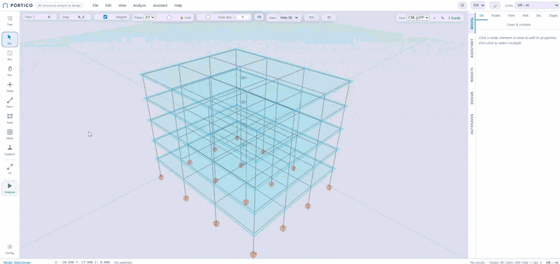
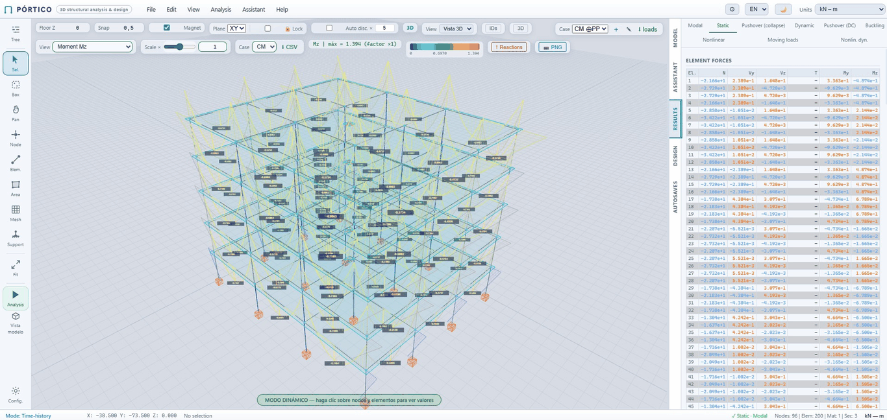
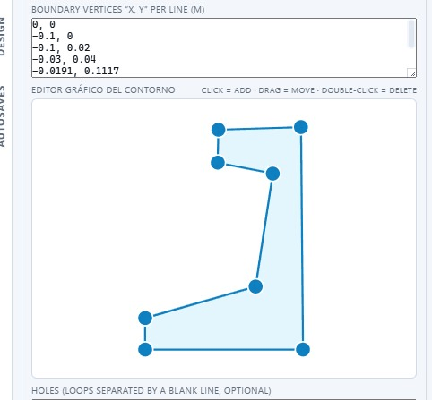
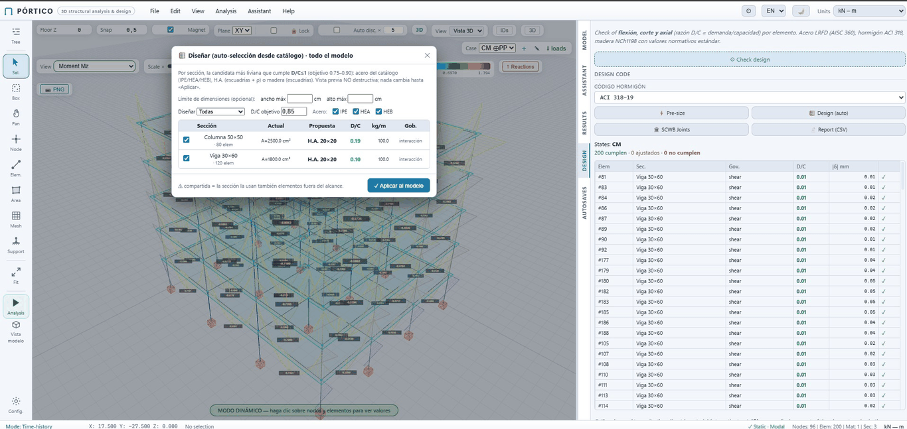

# PORTICO — Análisis y Diseño Estructural 3D

[English](README.md) · **Español**


[](https://github.com/jpreyes/portico-core/actions/workflows/ci.yml)

### ▶ Demo en vivo: **[portico.jpreyes-c.workers.dev](https://portico.jpreyes-c.workers.dev)**



**portico-core** es el núcleo **open source (AGPL-3.0)** de PORTICO: una herramienta de
elementos finitos para análisis y diseño estructural 3D en el navegador.

Modela barras y áreas; corre análisis estático, modal, de espectro de respuesta, P-Δ,
pandeo, no lineal, pushover y time-history; verifica el diseño contra varias normas; y
dibuja esfuerzos, deformadas y formas modales. Todo corre del lado del cliente — sin
instalar, sin build step, sin bundler, sin framework; solo un navegador moderno
(Chrome, Edge, Firefox).

Es la base reutilizable del producto Pro **portico** (portico-core + el solver C++/WASM
**Nodex**) y de otras herramientas derivadas.

---

## Capacidades

- **Modelado:** barras 3D Timoshenko (12 GDL) y elementos de área (membrana/placa/cáscara);
  mallado libre y mapeado.
- **Apoyos y conexiones:** empotrado/rótula, resortes, liberaciones, links, cachos rígidos,
  diafragmas rígidos y masas nodales.
- **Cargas:** nodales, distribuidas uniformes y trapeciales, térmicas y peso propio; casos
  y combinaciones.
- **Análisis:** estático, modal, espectro de respuesta (CQC/SRSS), P-Δ, pandeo lineal,
  no lineal (cables, gran rotación), pushover y time-history.
- **Diseño multinorma:** acero (AISC/EC3/NCh), hormigón (ACI/EC2), madera y aluminio (EC9),
  con auto-diseño, reporte y verificación de derivas.
- **Interoperabilidad:** formato `.s3d` (JSON), importación CSV, IFC/BIM y asistente IA
  para generar modelos desde texto (endpoint LLM *trae-tu-propio-servicio*).
- **Normativa agnóstica + presets:** el core trae tablas de **ejemplo** genéricas (cargas,
  espectro, parámetros de diseño); la normativa real de cada país es un **preset opt-in**
  en [`presets/`](presets/) que se copia sobre `assistant/`. Incluye `presets/chile/` (NCh).

> Los resultados de diseño son orientativos y requieren la revisión y el criterio de un
> ingeniero calculista. Verifique siempre contra una solución analítica o software de
> referencia antes de usarlo en proyectos reales.

---

## Verificación

El solver se contrasta contra soluciones cerradas y benchmarks publicados, no solo
"corre". La suite cubre **18 casos documentados** — frecuencias modales de voladizo y
cuerda tensa, los autovalores del pórtico de Bathe–Wilson, tensiones de Lamé en cilindro
de pared gruesa, patch tests de placa, una membrana de Allman, asentamiento de apoyo
prescrito, etapas constructivas, líneas de influencia — más un chequeo de equilibrio
global (ΣReacciones = ΣCargas) en cada modelo.

Cada caso vive en [`docs/verifications/`](docs/verifications/) con su modelo y la
referencia contra la que se compara. Corre la batería tú mismo:

```bash
node test_plate.mjs        # un caso
for f in test_*.mjs; do node "$f"; done   # todos
```

---

## Capturas de pantalla

| Visor y análisis 3D | Calculadora de sección (viga pretensada) | Verificación de diseño (D/C) |
|:---:|:---:|:---:|
|  |  |  |

---

## Cómo abrir la aplicación

**Opción A — Servidor local (recomendado):**

```bash
# En la carpeta del proyecto:
python serve.py        # puerto 8765 por defecto; admite: python serve.py 9000
```

Luego abrir **http://localhost:8765** en el navegador.

> `serve.py` es un servidor estático sin caché con los MIME correctos (UTF-8, `.webmanifest`).
> Como alternativa: `python -m http.server 8765`.
> En Windows puede usar el símbolo del sistema o PowerShell. Python 3 viene preinstalado en la mayoría de los equipos; si no, descargarlo desde python.org.

**Opción B — Demo en vivo (sin instalar nada):**

Abrir **[portico.jpreyes-c.workers.dev](https://portico.jpreyes-c.workers.dev)** directamente en el navegador. Es la misma app, desplegada como sitio estático.

---

## Convención de coordenadas

El programa usa el mismo sistema que SAP2000 y ETABS:

| Eje | Dirección |
|-----|-----------|
| **X** | Este – Oeste |
| **Y** | Norte – Sur |
| **Z** | Vertical (arriba) |

---

## Interfaz de usuario

```
┌─────────────────────────────────────────────────────────────┐
│  Menú:  Archivo  Editar  Vista  Análisis         Unidades   │
├──────┬──────────────────────────────────────┬───────────────┤
│      │                                      │               │
│ Herr │           Ventana 3D                 │  Panel dcha.  │
│ amie │                                      │  Sel. / Mat.  │
│ ntas │   (rotar: botón dcho. ratón)         │  Sec. / Diaf. │
│      │   (zoom:  rueda)                     │               │
│      │   (pan:   botón medio)               │               │
├──────┴──────────────────────────────────────┴───────────────┤
│  Modo: Seleccionar  │  Coords  │  Selección  │  Modelo      │
└─────────────────────────────────────────────────────────────┘
```

### Barra de herramientas (izquierda)

| Botón | Tecla | Acción |
|-------|-------|--------|
| Sel. | `S` | Seleccionar nodos y elementos |
| Nodo | `N` | Crear nodo haciendo clic en la grilla |
| Elem. | `E` | Crear elemento (clic en nodo origen → nodo destino) |
| Apoyo | `R` | Asignar restricciones a un nodo |
| Ext. | `Home` | Ajustar zoom a todo el modelo |
| ▶ | `F5` | Ejecutar análisis estático |

---

## Construcción del modelo

### 1. Definir materiales

En el panel derecho, pestaña **Mat.**:
- Clic en **＋ Agregar Material**
- Ingresar: nombre, E (módulo de elasticidad), G (módulo de corte), ν (Poisson), ρ (densidad)

Ejemplo Hormigón G30 (kN-m):

| E | G | ν | ρ |
|---|---|---|---|
| 28 700 000 | 11 960 000 | 0.20 | 2.5 |

### 2. Definir secciones

Pestaña **Sec.** → **＋ Agregar Sección**  
Ingresar propiedades geométricas numéricas:

| Propiedad | Descripción |
|-----------|-------------|
| A | Área de la sección [m²] |
| Iz | Momento de inercia respecto a z [m⁴] |
| Iy | Momento de inercia respecto a y [m⁴] |
| J | Constante de torsión [m⁴] |
| Avy | Área de cortante en y (= κy × A) [m²] |
| Avz | Área de cortante en z (= κz × A) [m²] |

**Columna 30×30 cm** (ejemplo):
`A=0.09, Iz=6.75e-4, Iy=6.75e-4, J=1.13e-4, Avy=0.075, Avz=0.075`

**Viga 30×50 cm** (ejemplo):
`A=0.15, Iz=3.125e-3, Iy=5.625e-4, J=1.30e-4, Avy=0.125, Avz=0.075`

### 3. Crear nodos

Activar modo **Nodo** (`N`).  
Usar el campo **Z piso** (esquina superior izquierda) para definir el nivel de inserción.  
Hacer clic en la grilla para crear el nodo en esa posición.

> El campo **Snap** controla el tamaño de la grilla de ajuste (default 0.5 m).

### 4. Crear elementos

Activar modo **Elem.** (`E`).  
Clic en el **nodo de inicio** → clic en el **nodo de destino**.  
El programa asigna automáticamente el primer material y sección disponibles; luego se editan en el panel.

> Presionar `Esc` para cancelar la creación a mitad de camino.

### 5. Asignar apoyos

Activar modo **Apoyo** (`R`) y hacer clic en el nodo.  
En el panel aparecerán los 6 grados de libertad (✓ = restringido):

| DOF | Significado |
|-----|-------------|
| Ux, Uy, Uz | Traslaciones |
| Rx, Ry, Rz | Rotaciones |

Botones rápidos:
- **Empotrado** → todos los 6 DOF restringidos (color rojo)
- **Pin** → solo traslaciones restringidas (color naranja)
- **Libre** → sin restricciones (color azul)

---

## Cargas

Al seleccionar un **nodo** en modo Seleccionar, aparece la sección de cargas:  
Ingresar Fx, Fy, Fz, Mx, My, Mz y hacer clic en **Aplicar**.

Al seleccionar un **elemento**, se puede asignar una carga distribuida:  
Elegir dirección (globalZ, localY, etc.) e ingresar la magnitud `w` [kN/m].

Las cargas se asignan al **caso de carga activo** (selector en la esquina superior derecha de la ventana).  
Para agregar casos, clic en **＋** junto al selector.

---

## Análisis estático

**`F5`** → Ejecutar análisis (caso de carga activo)  
**Análisis → Ejecutar + Peso Propio** → suma el peso propio de los elementos

Después de ejecutar:
- El modelo muestra la **deformada** amplificada
- Usar el selector **Vista** para cambiar entre: Deformada / N / Vy / Vz / T / My / Mz
- El control **Escala** ajusta la amplificación visual
- Hacer clic en un nodo o elemento para ver los valores en el panel derecho

---

## Diafragmas rígidos

Representan losas rígidas en cada piso (movimiento en planta solidario).

**Pestaña Diaf.** en el panel derecho:

1. Clic **⚡ Auto-detectar Pisos** — agrupa nodos automáticamente por nivel Z
2. En cada diafragma, asignar:
   - **Masa m** [ton]: masa traslacional del piso
   - **Icm** [ton·m²]: momento de inercia másico respecto al CM
   - **CM (x, y)**: coordenadas del centro de masa
   - **ex, ey**: excentricidad accidental (para análisis sísmico)

El CM del piso aparece en la vista 3D como un marcador naranja.

---

## Análisis modal

**`F6`** → Análisis Modal

Al presionar F6, el programa pide el **número de modos** a extraer (default 10).

**Resultados en la ventana:**
- Selector de modo → muestra la forma deformada del modo seleccionado
- Frecuencia `f` [Hz] y período `T` [s] del modo
- **▶ Play** → anima la oscilación
- Deslizador **Vel.** → velocidad de animación
- Campo **Amp.** → amplitud visual

**Tabla de Participación** (botón en el overlay):

| Columna | Significado |
|---------|-------------|
| f [Hz] | Frecuencia natural |
| T [s] | Período natural |
| meff X (%) | Masa efectiva en dirección X |
| Acum X | Acumulado — debe llegar a ≥ 90% |

> **Criterio sísmico:** la suma de masas participantes debe ser ≥ 90% en cada dirección de análisis. Las celdas en verde indican que se alcanzó el umbral.

---

## Espectro de Respuesta (CQC / SRSS)

**`F7`** → Espectro de Respuesta  
*(Requiere haber ejecutado el análisis modal primero)*

Se abre un diálogo con los siguientes parámetros:

| Campo | Descripción |
|-------|-------------|
| Dirección sísmica | X, Y o Z |
| Combinación | **CQC** (recomendado) o SRSS |
| Amortiguamiento ζ | Fracción crítica (default 0.05 = 5%) |
| Unidades Sa | g, m/s², cm/s², ft/s² |
| Tabla espectro | Pares T [s], Sa [unidad] — una pareja por línea |

**Formato del espectro:**
```
0.00, 0.20
0.10, 0.45
0.50, 0.40
1.00, 0.28
2.00, 0.14
4.00, 0.07
```

Los resultados aparecen como envolventes (valores absolutos). Se pueden ver los diagramas de fuerzas N, V, M usando el selector de vista normal.

---

## Importar modelo desde CSV

**Archivo → Importar CSV…**

Formato de una sola tabla con columna TYPE:

```csv
TYPE,      ID,  nombre,      E,          G,        nu,    rho
MATERIAL,   1,  Concreto,    28700000,   11960000, 0.20,  2.5

TYPE,      ID,  nombre,   A,     Iz,      Iy,      J,       Avy,   Avz
SECTION,    1,  Col30,    0.09,  6.75e-4, 6.75e-4, 1.13e-4, 0.075, 0.075

TYPE,  ID,  x,    y,    z,    ux, uy, uz, rx, ry, rz
NODE,   1,  0.0,  0.0,  0.0,   1,  1,  1,  1,  1,  1
NODE,   2,  5.0,  0.0,  0.0,   1,  1,  1,  1,  1,  1
NODE,   3,  0.0,  0.0,  3.5,   0,  0,  0,  0,  0,  0
NODE,   4,  5.0,  0.0,  3.5,   0,  0,  0,  0,  0,  0

# Sin rótulas (columnas de liberación omitidas → todas en 0):
TYPE,     ID,  n1, n2, matId, secId
ELEMENT,   1,   1,  3,     1,     1
ELEMENT,   2,   2,  4,     1,     1

# Con rótulas Mz en ambos extremos (DOF r5 y r11 = rz1 y rz2):
# TYPE,    ID,  n1, n2, matId, secId, r0,r1,r2,r3,r4,r5, r6,r7,r8,r9,r10,r11
ELEMENT,   3,   3,  4,     1,     1,  0, 0, 0, 0, 0, 1,  0, 0, 0, 0,  0,  1
```

**Orden de los 12 DOFs de liberación:** `[ux1, uy1, uz1, rx1, ry1, rz1, ux2, uy2, uz2, rx2, ry2, rz2]`  
`1 = libera ese grado de libertad (rótula), 0 = fijo`

Casos habituales:
- Rótula Mz en extremo 1: columna 6 = 1 → `…, 0, 0, 0, 0, 0, 1, 0, 0, 0, 0, 0, 0`
- Rótula Mz en extremo 2: columna 12 = 1 → `…, 0, 0, 0, 0, 0, 0, 0, 0, 0, 0, 0, 1`
- Viga biarticualda (Mz en ambos): → `…, 0, 0, 0, 0, 0, 1, 0, 0, 0, 0, 0, 1`

Las columnas de liberación son **opcionales** — si se omiten, el elemento es empotrado-empotrado.

Descargar plantilla: **Archivo → Descargar Plantilla CSV**

---

## Guardar y cargar modelos

| Acción | Tecla |
|--------|-------|
| Nuevo | `Ctrl+N` |
| Abrir | `Ctrl+O` |
| Guardar | `Ctrl+S` |
| Guardar como | — |

Los archivos se guardan con extensión `.s3d` (formato JSON).

---

## Teclas de acceso rápido

| Tecla | Acción |
|-------|--------|
| `S` | Modo Seleccionar |
| `N` | Modo Nodo |
| `E` | Modo Elemento |
| `R` | Modo Apoyo |
| `F5` | Ejecutar análisis estático |
| `F6` | Análisis modal |
| `F7` | Espectro de respuesta |
| `Del` | Eliminar selección |
| `Ctrl+Z` | Deshacer |
| `Ctrl+Y` | Rehacer |
| `Home` | Zoom a extensión |
| `I` | Vista isométrica |
| `T` | Vista planta (XY) |
| `F` | Vista frontal (XZ) |
| `L` | Vista lateral (YZ) |
| `G` | Mostrar/ocultar grilla |

---

## Unidades disponibles

Seleccionables en la esquina superior derecha:

| Sistema | Fuerza | Longitud | Notas |
|---------|--------|----------|-------|
| **kN-m** | kN | m | Estándar para diseño en Chile |
| ton-m | ton | m | |
| kip-ft | kip | ft | Sistema imperial |

> El sistema de unidades afecta cómo se interpretan los valores ingresados. Mantenerlo consistente con las propiedades de materiales y secciones.

---

## Preguntas frecuentes

**¿Por qué no carga la página?**  
La aplicación requiere ser servida por HTTP. No funciona si se abre directamente como archivo (`file://`). Use `python serve.py`.

**¿El análisis me dice "modelo no estable"?**  
El modelo debe tener al menos un nodo completamente restringido (empotrado o con las tres traslaciones restringidas). Verifique que tiene apoyos asignados.

**¿El análisis modal no encuentra modos?**  
Se requiere masa en el modelo. Defina densidad (ρ) en los materiales **o** asigne masas a los diafragmas de piso.

**¿Cómo calculo Icm del piso?**  
Para un piso rectangular de dimensiones `a × b` con masa total `m`:  
`Icm = m × (a² + b²) / 12`

**¿Qué valor de ζ usar?**  
Para estructuras de hormigón armado: **5%** (ζ = 0.05).  
Para estructuras de acero: **2-3%** (ζ = 0.02–0.03).

---

## Resumen del flujo de trabajo sísmico

```
1. Definir geometría (nodos, elementos, materiales, secciones)
2. Asignar apoyos
3. Definir diafragmas de piso con masas (⚡ Auto-detectar)
4. [Opcional] Cargas de gravedad (CM, CV) y análisis estático → F5
5. Análisis modal → F6
   └─ Verificar ≥ 90% participación en X e Y
6. Espectro de respuesta → F7
   └─ Ingresar espectro, dirección X, CQC, ζ=0.05
   └─ Repetir para dirección Y
7. Exportar resultados → Análisis → Exportar...
```

---

## Licencia

Distribuido bajo **GNU Affero General Public License v3.0 (AGPL-3.0)**. Véase [`LICENSE`](LICENSE).

Copyright (C) 2026 JP Reyes.

La AGPL exige, además de las condiciones de la GPL, que si el software se ofrece como
servicio en red, se ponga a disposición de los usuarios el código fuente correspondiente.

## Convenciones del proyecto

Las convenciones de ingeniería — coordenadas Z-up (como SAP2000/ETABS), los 12 GDL de
elemento y el contrato neutral del solver — están documentadas al inicio de los módulos
correspondientes y en [`docs/EXTENDING.md`](docs/EXTENDING.md). El estado y los próximos
hitos, en [`docs/ROADMAP.md`](docs/ROADMAP.md). Para construir capas encima de core
(motores enchufables, white-label) sin forkear, ver [`docs/EXTENDING.md`](docs/EXTENDING.md).
