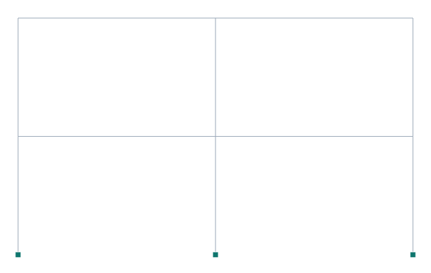
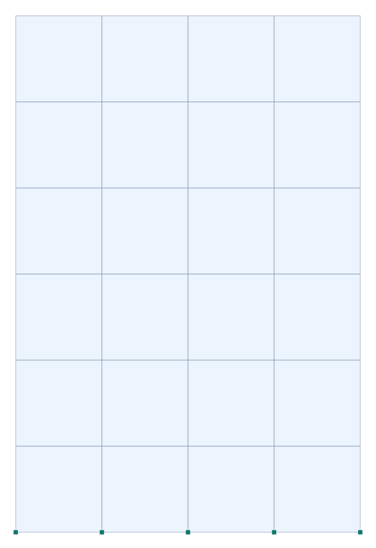
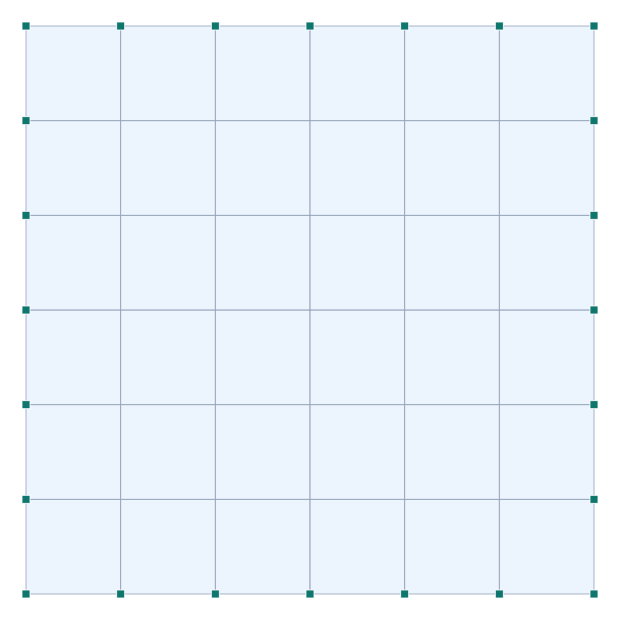
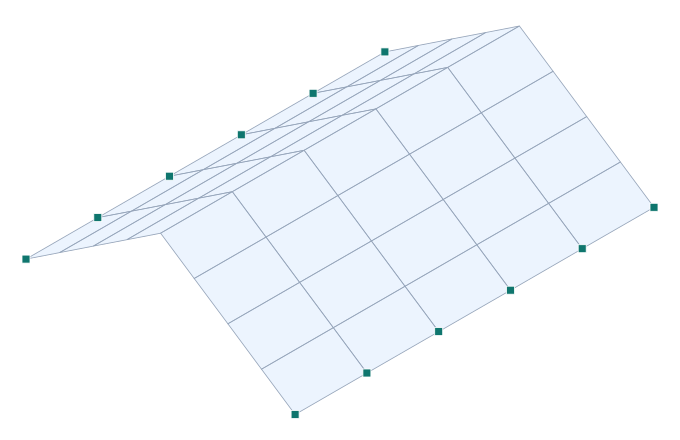

# Analysis Reference Manual

### portico-core — theory of the structural analysis engine

**portico-core · v0.2.0 · 2026-07-18**

**English** · [Español](analysis-reference.es.md)

<!-- pagebreak -->

## About this manual

This manual documents the **theory** behind the portico-core analysis engine: the element
formulations, the assembly and solution algorithms, the dynamic and nonlinear procedures, and the
design checks — **as they are actually implemented in the code**, not as a generic textbook. Every
section names the module that implements it, so the manual and the source stay in step.

It is the companion of the [Verification Manual](verification-manual.md), which contrasts the same
engine against analytical solutions, SAP2000 and OpenSees. Where this manual states *what* and *why*,
the Verification Manual shows *how well*.

portico-core is a browser-native finite-element engine (vanilla JavaScript ES modules, Three.js for
the viewport, numeric.js and an in-house banded solver for the linear algebra). The whole solver runs
client-side — there is no native kernel, no WASM, no remote backend — which is a design goal, not an
accident.

## Capabilities at a glance

This chapter is the honest, scannable answer to *"what can portico-core do, and what can it not?"* —
so you can decide whether it fits your problem before reading the theory. Every row is what the code
actually does at **v0.2.0**; the detailed caveats live in [§8 Scope and limitations](#8-scope-and-limitations).

**Legend:** ✔ available · ◐ available but simplified/partial (read the note) · ✘ not available.

### Modeling

| Capability | | Notes |
| --- | :-: | --- |
| Frame element — 3D Timoshenko (shear-flexible) | ✔ | End releases, rigid-end offsets, semi-rigid end springs, elastic (Winkler) foundation |
| Membrane — CST, Quad4, Allman drilling triangle | ✔ | Plane stress/strain; drilling DOF opt-in |
| Plate bending — MITC4 (quad), DKT (tri) | ✔ | Thin and thick (Mindlin) plates |
| Shell (membrane + plate combined) | ✔ | Composed per element (`behavior:'shell'`) |
| Truss / cable / compression-only strut | ◐ | Only in the geometric-nonlinear path (3-DOF bar); **no linear truss element, no cable sag/catenary** |
| Rigid links, couplings, rigid diaphragms | ✔ | Penalty formulation (tiny, bounded constraint error) |
| Springs — elastic, coupled/inclined, unilateral (uplift), nonlinear soil (p–y/t–z) | ✔ | |
| Solid / brick / shell-buckling elements | ✘ | No 3D continuum elements |
| Sections — numeric props or parametric shapes (I, rect, circle, CHS, RHS, U, L, T, polygon) | ✔ | Built-in property calculator (S, Z, r, J, Av, Cw) |
| Profile database — European IPE / HEA / HEB + CHS / RHS | ✔ | **American W (AISC) tables not shipped** |
| Materials — steel, concrete, timber, aluminium (isotropic linear-elastic) | ✔ | **No orthotropic / nonlinear analysis material** |
| Loads — nodal, distributed (uniform/trapezoidal; global/local/gravity/projected), thermal (member + area gradient), self-weight, tendon/prestress | ✔ | **No member point-load as a static type** (add a node); **no area pressure/face load** |
| Mass — consistent/lumped, nodal point mass + rotary inertia, ETABS-style mass source | ✔ | |
| Load cases, linear combinations, 2D / 3D modes, diaphragm CR/CM | ✔ | Single unit system (kN, m, t); **no unit-conversion engine** |

### Analysis

| Capability | | Notes |
| --- | :-: | --- |
| Linear static — load cases and combinations | ✔ | Combinations by linear superposition |
| Modal / eigenvalue | ✔ | Inverse (Stodola) iteration with deflation; mass source; participation and effective mass |
| Response spectrum — CQC or SRSS | ◐ | **One horizontal direction (X or Y) per run; no vertical Z; no 100/30 directional combination** |
| Built-in design spectrum — NCh433 / DS61 (Chile) | ✔ | **No ASCE 7 / Eurocode 8 / IBC spectrum generator** (accepts any user `[{T,Sa}]` curve) |
| Linear buckling — `(K + λ·Kg)φ = 0`, subspace iteration | ✔ | Frame flexural geometric stiffness; shell buckling only partial |
| P-Delta (second-order) | ✔ | Fixed-point tangent iteration (not Newton/arc-length) |
| Geometric nonlinear — large-displacement truss/cable, planar corotational beam, form-finding | ✔ | **Corotational beam is planar (X–Z) only; no 3D large-rotation beam** |
| Prestress / stress-stiffened (preloaded) modal | ✔ | |
| Plastic-hinge pushover — event-to-event to collapse | ✔ | Concentrated hinges (N, V, M); ductile/brittle drop; collapse = mechanism |
| Displacement-control pushover | ◐ | Arc-length on the axial (truss/cable) idealization — geometric snap-through, not a hinge pushover |
| Nonlinear time-history | ◐ | **Equivalent elastoplastic shear-building** (1 DOF/diaphragm, bilinear stories) — not fiber/distributed plasticity |
| Linear time-history — modal superposition (exact recurrence) | ✔ | Exposed in the app; not in the public API |
| Staged / sequential construction | ✔ | **Frames/bars only — areas and diaphragms ignored in staging**; no creep/shrinkage |
| Moving loads / influence lines | ✔ | Vertical loads |
| Distributed-plasticity / fiber sections, contact/gap mechanics, explicit dynamics | ✘ | Inelasticity is concentrated hinges or 1-D story springs only |

### Design checks (demand/capacity)

| Capability | | Notes |
| --- | :-: | --- |
| Steel — AISC 360-16 (LRFD/ASD) | ◐ | Yielding, E3 flexural buckling, F2/F6/F9/F10 flexure, G2 shear, H1 interaction. **No net-section rupture, torsional/flexural-torsional buckling, slender-element (E7), or torsion** |
| Steel — Eurocode 3 (EN 1993-1-1) | ◐ | Class 1–3, buckling curves, LTB, 6.3.3 interaction. **No Class-4 effective width, net section, or web shear buckling** |
| Concrete — ACI 318-19 | ◐ | Flexure, shear, **true P–M interaction (incl. biaxial)**. **Rectangular sections only; no detailing, torsion, slenderness, or punching shear** |
| Concrete — Eurocode 2 (EN 1992-1-1) | ◐ | **An alias of the ACI procedure** — not the EC2 partial factors / parabola-rectangle law |
| Aluminium — Eurocode 9 (EN 1999-1-1) | ◐ | Tension, compression, LTB, shear. **Interaction is the conservative linear sum; no auto HAZ softening** |
| Timber — NCh1198 (allowable stress) | ◐ | Bending, shear, tension, compression (Ylinen), combined. **No connections or perp-to-grain** |
| Seismic — capacity design | ◐ | **Strong-column/weak-beam only** — no overstrength force amplification, ductile detailing, or joint/connection checks |
| Serviceability — deflection & story drift | ✔ | Deflection L/limit; drift NCh433 0.002 · ASCE 7 0.02 · EC8 0.01 (compares supplied values) |
| Auto-design — profile selection from a catalog | ✔ | Picks the lightest passing profile; **not a continuous/cost optimizer** |
| Connection design, rebar detailing, member torsion check | ✘ | Out of scope |

### Interoperability, reporting and automation

| Capability | | Notes |
| --- | :-: | --- |
| Native `.s3d` (JSON) — full-fidelity round-trip | ✔ | Model + design settings; the round-trip container |
| Import/export — SAP2000, ETABS, SOFiSTiK, Abaqus/CalculiX, OpenSees, NODEX, VECTOR | ◐ | **Geometry + loads, never results.** Distributed loads and/or end releases are dropped on several exporters (each warns) |
| IFC (BIM) | ◐ | **Geometry-only both ways**; export loses Iy and J; no loads/supports/results |
| DXF / CAD vector | ✘ | No DXF interchange |
| Reporting — printable PDF, Word `.docx`, spectrum SVG | ✔ | Cover, design basis, loads, images, participation, D/C, drifts |
| CSV export — static/modal/spectral results, element & global K/M matrices, time-history | ✔ | |
| Headless public API (`js/api/portico.js`) | ✔ | Build model, run every solver, post-process, design & serviceability — scriptable in Node or the browser, no DOM |
| Extensibility — register custom analyses, design codes, IO formats | ✔ | `registerAnalysis` · `registerDesignCode` · `registerFormat` |

Where a row is ◐ or ✘, the reason is a deliberate, bounded choice — spelled out in
[§8 Scope and limitations](#8-scope-and-limitations) and, for the numbers, validated in the
[Verification Manual](verification-manual.md).

## 0. Conventions

### 0.1 Coordinate system

The model uses a **right-handed, Z-up** global frame, the same convention as SAP2000 and ETABS: `X`
and `Y` are horizontal, `Z` is vertical (gravity acts along `−Z`). The viewport maps model coordinates
to the Three.js (Y-up) scene by `model(x, y, z) → three(x, z, y)`; this mapping is a rendering detail
and never leaks into the solver, which works entirely in the Z-up model frame.

### 0.2 Nodal degrees of freedom

Each node carries **six** degrees of freedom, ordered `[ ux, uy, uz, rx, ry, rz ]` — three
translations followed by three rotations, about the global axes. A restraint fixes a DOF (1 = fixed,
0 = free). Two-dimensional models restrain the out-of-plane set — `uy, rx, rz` — so that only the
in-plane triple `ux, uz, ry` remains active.

### 0.3 Element degrees of freedom

A frame (line) element connects two nodes and therefore has **twelve** degrees of freedom, the two
nodal sets concatenated:

```
[ ux1, uy1, uz1, rx1, ry1, rz1,  ux2, uy2, uz2, rx2, ry2, rz2 ]
```

**Member releases** are a length-12 array aligned with this ordering (1 = released, 0 = continuous),
so a moment release at end *j* about the strong axis frees entry 11 before the element stiffness is
assembled (a simply-supported beam releases indices 5 and 11).

### 0.4 Sign conventions and units

Displacements and rotations follow the global axes; reactions and member forces follow the usual
right-hand rule. The engine is written in **consistent units** — it does not tag quantities with a
unit system — but its canonical set is **kN and m** (so `E`, `G` and stresses are in kN/m²), with
nodal masses in **ton** and rotational inertias in **ton·m²**. Design strengths are the one exception:
they are entered in **MPa** and converted internally (×1000) to kN/m². Every table in this manual and
in the Verification Manual states the unit of each quantity.

For the **strong/weak axis convention** the code uses **z = strong (major) axis, y = weak (minor)**.
The shear area `Avy` is paired with the strong-axis moment `Mz` (the web resists it), and `Avz` with
the weak-axis moment `My` (the flanges). Eurocode 3, whose native naming is reversed, is mapped onto
this convention internally.

### 0.5 Distributed-load directions

A distributed line load carries a direction tag:

- `gravity` / `globalZ` — global **−Z** (a positive intensity acts downward),
- `globalX`, `globalY` — along a global axis,
- `localX`, `localY`, `localZ` — along an element local axis,

and may be **trapezoidal** (`w` at the start, `w2` at the end; uniform if `w2` is omitted). Global
directions are projected onto all three element local axes, so gravity on an inclined or vertical
member produces the correct axial and transverse components. Loads are converted to work-equivalent
fixed-end forces before assembly (§2.2).

<!-- pagebreak -->

## 1. Element library

The engine assembles a global stiffness `K`, a mass matrix `M`, and — for stability and dynamics — a
geometric stiffness `Kg`, from a small library of elements: a two-node Timoshenko **frame**, a family
of triangular and quadrilateral **membrane** (plane-stress/strain) elements, two **plate-bending**
elements, their **shell** superposition, and penalty-based **links** and **rigid diaphragms**.

### 1.1 The frame element (`js/solver/timoshenko.js`)

A frame element joins two nodes with the twelve DOF of §0.3. Its local axes are built from the member
geometry: the local `x` runs from node *i* to node *j*; a reference vector (global `Z`, or global `X`
when the member is within ~2° of vertical) fixes the section orientation:

```
ex = unit(n2 − n1)
ref = |ex·Z| > 0.9994 ? X : Z          # near-vertical members switch reference
ez = unit(ex × ref)
ey = ez × ex                            # right-handed local triad
```

The 12×12 transformation `T` is the block-diagonal repetition of the 3×3 rotation `R = [ex; ey; ez]`;
the element stiffness in global axes is `Ke = Tᵀ·Ke_local·T`.

**Shear-flexible stiffness.** The bending blocks are Timoshenko — they include shear deformation —
governed by a dimensionless shear parameter in each plane:

```
Φy = 12·E·Iz / (G·Avy·L²)      fy = 1/(1 + Φy)     # strong-axis bending (about local z)
Φz = 12·E·Iy / (G·Avz·L²)      fz = 1/(1 + Φz)     # weak-axis bending (about local y)
```

When a shear area is left effectively infinite (`Avy ≤ 1e-30`) the corresponding `Φ → 0` and the block
collapses to the classical **Euler–Bernoulli** beam — a deliberate sentinel that recovers the
shear-rigid limit. With `by = 12EIz·fy/L³`, `cy = 6EIz·fy/L²`, `dy = (4+Φy)EIz·fy/L` and
`ey = (2−Φy)EIz·fy/L`, the strong-axis block on local DOF `[v1, θz1, v2, θz2]` is

```
        [  by   cy  −by   cy ]
K_XY =  [  cy   dy  −cy   ey ]
        [ −by  −cy   by  −cy ]
        [  cy   ey  −cy   dy ]
```

with axial `EA/L` and torsion `GJ/L` on their own DOF pairs. The weak-axis block is identical in form
but carries the sign flip of the `dw/dx = −θy` convention. Section **stiffness modifiers** (`sec.mod`,
e.g. an ACI-cracked `0.35·Ig` on a beam) scale the stiffness — and the axial force used for `Kg` — but
*not* the mass, so a cracked-section modal analysis keeps its true inertia.

**Consistent mass.** The element mass is the consistent (cubic-Hermite) matrix, e.g. the translation
block `ρAL/420 · [156, 22L, 54, −13L; …]`, computed from the *unmodified* section area. Torsional
inertia uses an approximate polar mass `ρ·J·L`.

**Member releases.** A release (§0.3) is applied by **static (Guyan) condensation**: partitioning the
element into retained and released DOF, the retained stiffness becomes `Kff* = Kff − Kfr·Krr⁻¹·Krf`
and the released rows/columns are zeroed. Fixed-end forces are condensed the same way, and the
released displacements are recovered afterwards so the kink at a hinge is drawn correctly. A singular
`Krr` (an over-released member) falls back to the un-condensed matrix.

**Fixed-end forces.** A distributed load is turned into work-equivalent end forces before assembly. A
trapezoidal load is split into a uniform part (`w1`) plus a triangular part (`g = w2 − w1`) whose
clamped–clamped reactions are baked in (`V1 = 3gL/20`, `V2 = 7gL/20`, `M1 = gL²/30`, `M2 = gL²/20`).

**Rigid end offsets, elastic foundation, partial fixity.** Three optional refinements share the frame
element. A **rigid end zone** (`rigidEnd {i, j}`) computes the stiffness of the flexible span
`Lf = L − oi − oj` (never letting less than 5% stay flexible) and maps it to the real nodes through
rigid-arm kinematics `u(end') = u(node) + θ×r`. A **beam on elastic (Winkler) foundation**
(`foundation {ky, kz}`) adds a consistent distributed-spring matrix. **End springs**
(`endSprings {dof: k}`) model semi-rigid connections through a condensed internal DOF — `k → ∞`
recovers a rigid connection, `k → 0` a hinge.



*Figure 1.1. A frame model: columns and beams are two-node, 12-DOF Timoshenko elements.*

### 1.2 Membrane elements (`js/solver/membrane.js`)

Membrane (plane-stress or plane-strain) elements carry in-plane forces only. Their plane constitutive
matrix is

```
plane stress:  D = E/(1−ν²) · [[1, ν, 0], [ν, 1, 0], [0, 0, (1−ν)/2]]
plane strain:  D = E/((1+ν)(1−2ν)) · [ … ]
```

and each element is formed in a local 2D frame built from its corner coordinates (`ex = unit(n1→n2)`,
`ez` normal to the facet, `ey = ez×ex`).

- **CST** — the 3-node constant-strain triangle, 2 DOF/node `[u, v]`. Its strain–displacement matrix
  `B` is constant, so `Ke = t·A·Bᵀ·D·B` in closed form. It is exact for constant-stress states (it
  passes the patch test) but stiff in bending — the shear locking studied in Verification case 3-006.
- **QUAD** — the 4-node isoparametric quadrilateral, 2 DOF/node, integrated with **2×2 Gauss**
  quadrature (`Ke = Σ t·detJ·Bᵀ·D·B`), stresses recovered at the centre.
- **Allman drilling triangle** — a 3-node triangle with an in-plane rotation added at each node, so
  **3 DOF/node `[u, v, ωz]`**. It is built from the six-node linear-strain triangle (LST) by replacing
  the mid-side translations with the corner rotations (Allman 1984):

  ```
  u_mid = ½(u_i + u_j) + ⅛(y_i − y_j)(ω_j − ω_i)
  v_mid = ½(v_i + v_j) + ⅛(x_j − x_i)(ω_j − ω_i)
  ```

  and integrated at the three side mid-points (exact for the LST). The drilling DOF lets it represent
  in-plane bending far better than the CST (the convergence in Verification case 3-006). Its one
  zero-energy mode (uniform drilling `ω1 = ω2 = ω3`) is removed by a **minimal diagonal spring** on the
  rotational DOF, scaled by `γ = 1e-3` of the mean rotational stiffness — deliberately *not* a
  Hughes–Brezzi penalty, which would couple the translations and over-stiffen bending.

Uncovered nodal DOF (for instance the drilling rotation where no drilling element frames in) are
regularized with a tiny spring (`1e-4` of a reference stiffness) so the global matrix stays
non-singular without perturbing the real response.



*Figure 1.2. A plane-stress shear wall discretized into membrane QUADs.*

### 1.3 Plate-bending elements (`js/solver/plate.js`)

Plate elements carry out-of-plane bending, with **3 DOF/node `[w, θx, θy]`** — a normal translation
and two bending rotations, chosen (`θx = ∂w/∂y`, `θy = −∂w/∂x`) so a plate node couples cleanly with
the rotational DOF of a frame or a drilling membrane. The bending constitutive matrix is
`Db = (t³/12)·Dp`.

- **MITC4** — a 4-node Mindlin–Reissner quadrilateral (thick-plate capable). Bending is integrated
  with 2×2 Gauss; the transverse shear uses the **assumed-strain (Bathe–Dvorkin) interpolation**,
  which ties the covariant shear strains at the edge mid-points and so **does not shear-lock** as the
  plate becomes thin. The shear stiffness carries the `κs = 5/6` correction.
- **DKT** — the Discrete Kirchhoff Triangle (thin-plate), integrated at the three side mid-points. Its
  `B` matrix is kept in the same `[w, θx, θy]` sign convention as MITC4 and the frames, so a triangular
  plate sharing rotational DOF with a beam or a quad couples correctly — a regression checked
  explicitly in the test suite.

Plate thermal loads produce a bending moment from the through-thickness temperature gradient
(`κ0 = α·gradT/t`), and surface stresses are recovered as `σ = ±6·M/t²`.



*Figure 1.3. A plate-bending slab discretized into MITC4 QUADs.*

### 1.4 Shell elements

A **shell** element is the direct superposition of a membrane and a plate on the same facet: the
in-plane DOF come from the membrane element and the out-of-plane DOF from the plate element, so the
node uses all six global DOF. It is selected per area by `behavior = 'shell'` (versus `'membrane'` or
`'plate'`). For stability, shells also contribute an out-of-plane **geometric stiffness** derived from
their in-plane stress state (§4.1), which is what lets the engine capture plate/shell buckling.



*Figure 1.4. A shell (membrane + plate) folded roof; each 3D QUAD facet is drawn as a mesh face.*

### 1.5 Rigid links, couplings and diaphragms (`js/solver/links.js`, `diaphragm.js`)

Kinematic constraints are imposed by the **penalty method**: for each constraint equation `g·u = 0`
the term `α·gᵀg` is added to `K`, with `α = 1e5·max(diag K)`. That factor holds the constraint to
better than 0.001% error while keeping `K` conditioned well enough that the eigensolver still behaves;
a much larger penalty (say `1e8`) would over-condition the matrix.

- **Rigid link** — the slave node follows the master as a rigid body, `u_s = u_m + θ_m×r` and
  `θ_s = θ_m`, where `r` is the lever arm; the three translational equations carry the arm. A **simple
  coupling** instead equates selected DOF with no arm.
- **Rigid diaphragm** — an in-plane rigid floor. Each slave is tied to the floor master (its **Centre
  of Rigidity**) through three equations on the in-plane DOF `[ux, uy, rz]`:

  ```
  ux_s − ux_m + dy·rz_m = 0
  uy_s − uy_m − dx·rz_m = 0
  rz_s − rz_m = 0
  ```

  The Centre of Rigidity is computed from the vertical columns of the floor (`Kx = 12·E·Iz/h³`,
  `Ky = 12·E·Iy/h³`, `x_CR = ΣKy·x / ΣKy`, …). The floor mass is distributed to its nodes by tributary
  area (from the connected floor beams), so the natural eccentricity between centre of mass and centre
  of rigidity — and any **accidental eccentricity** the user adds — emerges automatically in the
  dynamics, without an explicitly supplied rotational inertia.

### 1.6 Meshing (`js/model/mesher.js`, `mesh_map.js`, `mesh_free.js`)

Areas are meshed into the elements above automatically. A **structured block mesher** maps a
four-corner region to an `nx×ny` grid of QUAD (or CST) cells by bilinear interpolation. The
**transfinite (Coons) mesher** generalizes it to a four-sided region bounded by four edge *curves*,

```
S(u,v) = (1−v)·B(u) + v·T(u) + (1−u)·L(v) + u·R(v) − (bilinear corner term)
```

which reduces exactly to the block mesher for straight sides, so curved or polygonal walls, decks and
slabs mesh conformingly. A **free mesher** handles arbitrary simple polygons (concave L- or U-shaped
plans): ear-clipping triangulation → Delaunay (Lawson) flips → 1→4 refinement to a target size →
greedy recombination to a QUAD-dominant mesh → Laplacian smoothing. A 3D polygon is projected to its
plane, meshed and mapped back, so inclined shells mesh too. All three meshers are held to the patch
test (Verification 3-001 transfinite, 3-005 free).

<!-- pagebreak -->

## 2. Assembly and linear solution

### 2.1 Global assembly (`js/solver/assembler.js`)

Nodes are numbered in insertion order; node *i* owns global DOF `6·i … 6·i+5`. `assembleK` builds the
dense stiffness `K` and mass `M` as flat row-major `Float64Array(nDOF²)`, `nDOF = 6·nNodes`. For each
element the local stiffness (including any rigid-end zone, foundation and end springs) is
release-condensed if needed, transformed to global axes, and scattered into the two nodal DOF blocks.
Then, in order: elastic nodal supports (diagonal `springs`, or a full coupled 6×6 `springK`), area
(membrane/plate/shell) stiffness and lumped mass, **diaphragm** and **link** penalty constraints
(§1.5), diaphragm masses, nodal point masses, and the **seismic mass source** — the gravity component
of chosen load cases turned into translational mass `m = |Fz|/g` lumped equally on UX, UY, UZ
(`g = 9.80665 m/s²`).

### 2.2 Loads and fixed-end forces

`assembleF` builds the free-DOF load vector. Nodal loads enter directly. Distributed loads become
fixed-end forces (§1.1), transformed to global axes and release-condensed. A uniform temperature
change adds an axial fixed-end force `Nt = EA·α·ΔT`; a plate gradient adds a thermal moment. Self
weight is applied as a `gravity` distributed load `w = ρ·A·g` on frames, and as an equal nodal share
on areas.

**Tendon prestress.** A post-tensioning tendon is applied by the **equivalent-load (load-balancing)
method** (T. Y. Lin): a parabolic tendon of force `P` and sag `a` over a span `L` exerts a balancing
distributed load `w_eq = 8·P·a/L²` (upward when the tendon sags below the axis) plus an axial
compression `P` at the anchors. The linear solver then handles these as ordinary loads, so prestress
needs no special element (Verification 1-009).

### 2.3 The linear solve (`js/solver/static_solver.js`)

The static problem is `K_ff · u_f = F_f` over the free DOF. Two-dimensional models auto-restrain the
out-of-plane DOF (§0.2); a **prescribed support displacement** `up` (a settlement) is moved to the
right-hand side, `F_f ← F_f − K_fp·up`.

The system is solved by an explicit **LU factorization** (`num.LU` then `num.LUsolve`, not the
black-box `num.solve`) so the diagonal pivots can be inspected: the ratio of smallest to largest pivot
is a **near-singularity metric**, and a value below `1e-12` raises a warning that the model is close to
a mechanism (a non-finite solution raises a mechanism error outright). Two more sanity gauges flag an
"absurd" result — an interstorey drift over 1/20, or a displacement over 15% of the model span.

### 2.4 Supports beyond the linear case

Three support types make a single linear solve insufficient and are handled with local iteration:

- **Unilateral springs** (compression-only or tension-only) are solved by an **active-set** loop: the
  spring is assembled bilaterally, then any spring whose sign is wrong has its stiffness removed from
  the diagonal and the system is re-solved, until the active set stops changing.
- **Nonlinear soil springs** (p-y / t-z / q-z curves given as force–displacement tables) are solved by
  **Newton iteration** on the tangent, converging when the residual is below `1e-9` of the applied
  load.
- **Prescribed displacements** are handled in the right-hand side as above.

### 2.5 Reactions, member forces and diagrams (`js/solver/postprocess.js`)

Reactions are recovered as `R = K·u − F`; at elastic supports the free-DOF reaction is `−k·u` (zero
for a detached unilateral spring). Element end forces are `f = Ke_eff·(T·u) + fef`, using the same
rigid-end / foundation-aware stiffness as assembly, with the sign convention `N = −f[0]`, and so on.

Internal diagrams are built by **equilibrium integration**, exact for a trapezoidal load
`q(x) = q1 + (q2−q1)·x/L`:

```
M(x) = M0 − V0·x − ½·q1·x² − (q2−q1)·x³/(6L)
V(x) = V0 + q1·x + (q2−q1)·x²/(2L)
```

with the moment extreme located where `V(x) = 0`. The distributed intensities are carried from the
load, never inferred from the end shears, so diagrams are exact between nodes. Point displacements
along a member use cubic-Hermite interpolation plus the exact uniform-load deflection bubble. Area and
shell results give in-plane stresses (`σx, σy, τxy`, von Mises, principals), plate moments and
curvatures, and surface stresses `σ = membrane ± 6M/t²`, with optional nodal averaging.

### 2.6 Staged construction (`js/solver/staged.js`)

A structure built in stages — cantilever segments, shoring struck, props removed — does not behave
like the finished frame loaded all at once: each element is *born* into the deformed geometry of the
stage that activates it and only accumulates the forces of the stages in which it already exists. The
engine models this **incrementally and linearly**: at each stage `K` is assembled from the *active*
elements only, the stage's load increment is solved, and the displacement and force state
**accumulates** across stages. The final state therefore depends on the construction sequence, not
only on the final geometry (Verification 1-031).

### 2.7 Moving loads and influence lines (`js/solver/moving_load.js`)

A load train (a truck or an axle set) travels along a *lane* over the structure. For each position the
static problem is solved and a chosen response is recorded, yielding an **influence line** — the
response to a moving *unit* load as a function of its position, `R(s)` — and, for the full train swept
over every position, an **envelope** of maxima and minima used for traffic design. For a simple beam
the influence line of the left reaction is `1 − x/L` and that of the mid-span moment is a triangle
peaking at `L/4` (Verification 1-030).

<!-- pagebreak -->

## 3. Dynamics

### 3.1 Modal analysis (`js/solver/modal_solver.js`)

The free-vibration problem is the generalized eigenproblem `K·φ = ω²·M·φ`, solved for the lowest
`nModes` (default 10). Because rigid diaphragms are imposed by a penalty (§1.5) that makes `K`
ill-conditioned (condition number ~1e8), a black-box dense eigensolver would return corrupted
eigenvectors. The engine therefore uses **Stodola inverse power iteration with M-orthogonal
deflation**, which needs only a single LU factorization of `K` reused across all modes:

```
repeat:  y = K⁻¹ · (M·x)          # inverse power step
         y ← y − Σ (yᵀ M φk) φk    # deflate against found modes
         x = y / ‖y‖_M             # M-normalize
         ω² = xᵀ K x               # Rayleigh quotient
until |Δω²|/ω² < 1e-7
```

Massless DOF (inertialess rotations, `ρ = 0`) are removed first by **Guyan reduction** — DOF with
`|M_ii| ≤ 1e-6·max` become slaves condensed statically — and the mode shapes are expanded back
afterwards. Each mode is retried from several deterministic seed vectors, and a relaxed tolerance
(`1e-4`) is accepted for stubborn penalty-conditioned systems.

### 3.2 Participation and effective mass (`js/solver/modal_results.js`)

Mode shapes are normalized so the largest translation is unity. For each mode the generalized mass is
`M̄ = φᵀMφ`; for each direction `d` (X, Y and torsion Rz) the participation factor, effective mass and
percentage are

```
Γ_d = φᵀ · M · ι_d       m_eff = Γ_d² / M̄       %_d = m_eff / total_d
```

where `ι_d` is the rigid-body influence vector. Because diaphragm mass lives at the translational DOF,
the torsional influence is built as a rigid rotation about the Centre of Rigidity,
`ι_Rz[UXi] = −(yi − y_CR)`, `ι_Rz[UYi] = +(xi − x_CR)`. The result carries periods `T = 2π/ω`,
frequencies, mode shapes and the cumulative participation table.

### 3.3 Response spectrum (`js/solver/spectrum_solver.js`)

For an input spectrum `Sa(T)` and a horizontal direction, each mode's spectral displacement is
`u_i = φ_i · (Γ_d/M̄) · Sd` with `Sd = Sa/ω²`. Modal responses are combined per DOF either by **SRSS**
or by **CQC** with the Der Kiureghian correlation coefficient

```
ρ_ij = 8ζ²(1+r)·r^1.5 / ((1−r²)² + 4ζ²·r·(1+r)²),     r = ω_min/ω_max
```

(default damping `ζ = 0.05`). The combined displacement is `U = √(ΣΣ ρ_ij·u_i·u_j)`, and member forces
are combined the same way. The spectrum is interpolated linearly, with a `1/T` tail beyond the last
point. The spectrum itself is code-agnostic: any `[{T, Sa}]` table can be supplied.

### 3.4 The NCh433 design spectrum (`js/design/nch433_spectrum.js`)

The Chilean NCh433/DS61 design spectrum is provided as the single source of truth (it previously
existed as four drifted copies):

```
Sa(T) = S · Ao · I · α(T) / R*                         [g]
α(T)  = (1 + 4.5·(T/To)^p) / (1 + (T/To)³)
R*    = 1 + T* / (0.10·To + T*/Ro)        (T* ≤ 0 → R* = 1, elastic)
```

with soil tables A–E `{S, To, Tp, n, p}`, seismic-zone accelerations `Ao ∈ {0.20, 0.30, 0.40}·g`,
importance factors `I ∈ {0.6, 1.0, 1.2}`, and `Ro` (default 11.0). The tables are overridable, so a
country preset can be dropped in. The reduction factor `R*` may be returned separately so the caller
applies it as `Sa·g/R*`.

### 3.5 Prestressed (stress-stiffened) modal analysis (`js/solver/geometric_analysis.js`)

Vibration frequencies shift when a structure carries stress: a tensioned cable or a prestressed member
is stiffer and vibrates faster, a compressed one softer. This is captured by solving the modal problem
on the **stress-stiffened** matrix,

```
(K + Kg(u₀)) · φ = ω² · M · φ
```

where `Kg` is assembled (§4.1) from the axial state `u₀` of a reference load case. It is the same
Stodola eigensolver as §3.1 applied to `K + Kg`. The canonical check is a taut string, whose
frequencies track the applied tension (Verification 1-017).

<!-- pagebreak -->

## 4. Geometric nonlinearity

### 4.1 Geometric stiffness (`js/solver/geometric.js`)

Axial force changes the transverse stiffness of a member: tension stiffens it, compression softens it
(and, at a critical value, buckles it). This is captured by a **geometric stiffness** `Kg` built from
the current axial force `N` (positive in tension, `N = EA·(elongation)/L`):

```
Kg_local = (N/L) · [ a=6/5, b=L/10, d=2L²/15, e=−L²/30 ]     (consistent, Przemieniecki)
```

applied to both bending planes; axial and torsional geometric terms are neglected (flexural buckling
only). Shell elements add an out-of-plane geometric stiffness from their in-plane stress state, which
is what allows plate/shell buckling.

### 4.2 Linear buckling (`js/solver/geometric_analysis.js`, `buckling.js`)

Linear (eigenvalue) buckling solves `(K + λ·Kg)·φ = 0` for the lowest load factors `λ`. The reference
axial state comes from a linear solve of the applied load, `Kg` is assembled from it, and the
eigenproblem is solved by **subspace iteration** (Bathe): a small block of vectors is repeatedly driven
through `K⁻¹·(−Kg)` — which amplifies the smallest `|λ|` — and reduced to a dense Rayleigh–Ritz problem
solved by Jacobi rotations, converging when the dominant factors settle to `1e-6`. The banded SPD
solver factors `K` once. The critical load factor `λ₁` scales the reference load to the buckling load.

### 4.3 P-Delta (`js/solver/geometric_analysis.js`)

Second-order (P-Δ) analysis solves `(K + Kg(u))·u = F`. Because `Kg` depends on the axial state, which
depends on `u`, the engine iterates a **secant / fixed-point** scheme: solve linearly, reassemble
`Kg(u)`, re-solve the full load, and repeat until the displacement change is below `1e-6` (default 25
iterations). The output reports the linear and second-order deflections and their amplification
`dPD/dLin`. This is a secant iteration on the tangent, not a full Newton residual scheme.

### 4.4 Large-displacement truss and cable (`js/solver/nl_lite.js`)

Cables and struts are solved with a **corotational bar** (3 translational DOF/node) whose axial force
is `N = EA·(l − L0)/L0` on the deformed length `l`, with a natural length `L0` that can carry prestress.
A tension-only cable clips `N < 0` to slack; a compression-only strut clips `N > 0`. The element tangent
adds a geometric term `kg = N/l` to the material `km = EA/L0`. The global system is solved by
**Newton–Raphson under load control** (default 10 load steps), converging on a relative residual of
`1e-8`. For snap-through past limit points a **displacement-control** variant augments the system to
solve for the load factor while prescribing a control-DOF increment; this is exposed as the
`pushover` analysis, which drives the control DOF (the most-mobile free DOF) past the limit point to
trace the full capacity curve.

### 4.5 Corotational beam (`js/solver/corotbeam.js`)

For large-displacement frames, a planar **corotational beam** (Crisfield) separates the rigid chord
rotation from the local deformations `ubar = ln − L0`, `θ̄1`, `θ̄2`, giving local forces `N = EA·ubar/L0`
and `M = EI/L0·(4θ̄ + 2θ̄')`. The tangent combines a material part with a geometric part
`(N/ln)·zzᵀ + …`, and the system is solved by Newton under load control.

### 4.6 Form finding (`js/solver/formfind.js`)

Tension structures (cable nets, membranes) are shaped by the **Force-Density Method** (Schek 1974). With
a force density `q = N/L` assigned to each branch, the equilibrium shape is the solution of a single
linear system per coordinate axis, `D·x_free = p`, where `D` is the `q`-weighted network Laplacian
(SPD for positive `q`). The method is linear and non-iterative, and at least two anchors are required.
It mutates the node coordinates to the found shape.

<!-- pagebreak -->

## 5. Material nonlinearity

### 5.1 Event-to-event plastic pushover (`js/solver/plastic.js`)

The inelastic collapse of a frame is traced **event by event**. Given a per-element capacity set
(`N, Vy, Vz, My, Mz`) and a reference load pattern, the solver:

1. assembles `K` honouring the hinges formed so far and solves the unit response `u = K⁻¹·F`;
2. for every component finds the load-factor increment `Δλ` that first reaches a capacity,
   `Δλ = min (±cap − M_accumulated) / rate`, the plastic rate measured relative to the member chord;
3. advances `λ`, inserts a hinge (sets the release DOF), and redistributes;
4. repeats until `K` becomes singular — a **collapse mechanism**.

Post-yield behaviour can be perfectly plastic, ductile with a drop to a residual capacity after an
ultimate rotation `θu`/displacement `δu`, or brittle (dropping on yield); a drop sheds a
self-equilibrated load and can trigger a cascade. The output is the ordered hinge sequence, the
collapse multiplier, and the displacement field — the numerical pushover curve.

### 5.2 Nonlinear time-history (`js/solver/shear_building.js`, `nl_timehistory.js`)

For seismic time-history the equation of motion `M·ü + C·u̇ + r(u) = −M·ι·a_g(t)` is integrated
directly. The current implementation reduces the structure to a **shear building** — one storey per
rigid diaphragm, the interstorey stiffness `k = V/Δ` obtained from a static lateral analysis, and a
seed yield shear — and integrates it with:

- a **bilinear hinge** with kinematic hardening (a 1-D return-mapping / J2 plasticity: elastic
  reload/unload, `kt = α·k0` after yield, hardening `H = α/(1−α)·k0`);
- **Rayleigh damping** `C = a0·M + a1·K0` anchored to `ζ` at the first and last modal frequencies
  (initial-stiffness proportional, the SAP/ETABS default);
- the **Newmark-β** scheme with `γ = ½, β = ¼` (constant average acceleration — unconditionally stable,
  no numerical damping), with a Newton–Raphson correction each step on the effective tangent
  `Keff = Kt + (γ/βΔt)·C + (1/βΔt²)·M`, converging on `‖R‖ ≤ 1e-8·‖p‖`.

An independent central-difference integrator is kept as a cross-check. The output is the displacement
history, peak drift, and the interstorey-drift check against the code limit (§6.8).

<!-- pagebreak -->

## 6. Design checks

### 6.1 The design framework (`js/design/`)

The design engine is a pluggable multi-code checker. `checkElement` resolves the material and section,
selects a code (explicit, per-family default, or family fallback), builds the demand set
`{N, Vy, Vz, My, Mz, T}` (with `N > 0` in tension) and the member data `{L, Lb, K, Cb, ho}`, and calls
the code's `check`. Each check returns per-limit-state utilization ratios; the governing ratio sets the
status (`cumple` ≤ 0.90, `ajustado` ≤ 1.0, `NO CUMPLE` > 1.0). The registered codes are AISC 360-16
(LRFD and ASD), Eurocode 3, ACI 318-19, Eurocode 2, Eurocode 9, and NCh1198 (timber).

### 6.2 Steel — AISC 360-16 (`codes/aisc360.js`)

A LRFD/ASD strength is `φ·Rn` or `Rn/Ω`. Implemented limit states:

- **Tension (D2)** — gross-section yield, `φPn = 0.90·Fy·Ag` (net-section rupture is not checked).
- **Compression (E3)** — flexural buckling with the column curve
  `Fcr = 0.658^(Fy/Fe)·Fy` for `Fy/Fe ≤ 2.25`, else `Fcr = 0.877·Fe`, `Fe = π²E/λ²`,
  `λ = max(KL/r)`. Slender-element (E7) and torsional buckling are not checked.
- **Flexure (F2/F6/F9/F10)** — plastic moment `Mpz = Fy·Zz`, with **lateral–torsional buckling** for
  I-shapes (the `Lp`, `Lr`, `Cb` triple-branch of F2), plus the tee (F9) and single-angle (F10) rules.
- **Shear (G2)** — `Vn = 0.6·Fy·Aw·Cv` (a simplified single-branch `Cv`).
- **Combined axial + bending (H1.1)** — the `Pr/Pc ≥ 0.2` bilinear interaction (H1-1a/H1-1b).

### 6.3 Steel — Eurocode 3 (`codes/eurocode3.js`)

EN 1993-1-1 with `γM0 = γM1 = 1.0` (overridable). It **classifies the section** (class 1–4 from the
`9ε/10ε/14ε` flange and `72ε/83ε/124ε` web limits, `ε = √(235/fy)`) and uses the plastic or elastic
modulus accordingly. Buckling uses the European curves `χ = 1/(Φ + √(Φ²−λ̄²))`; members are checked for
tension (6.2.3), compression (6.3.1), bending with LTB (6.3.2, `Mcr` for a bisymmetric I), shear
(6.2.6), and the **6.3.3 interaction** with the Annex B (Method 2) `kij` factors.

### 6.4 Concrete — ACI 318-19 / Eurocode 2 (`codes/concrete.js`)

Reinforced concrete uses the equivalent rectangular (Whitney) block. Flexure is
`φMn = φ·As·fy·(d − a/2)` with `a = As·fy/(0.85 f'c b)`, `φ = 0.90`. Shear is
`φVn = 0.75·(Vc + Vs)` with `Vc = 0.17·√f'c·b·d`. The **axial–flexure interaction is a real P–M
diagram**: strain compatibility with `εcu = 0.003`, the `β1` block factor, elastoplastic steel and a
variable `φ` (0.65 → 0.90) generate the interaction polyline, and the utilization is the radial
intersection of the demand ray with it; biaxial demand uses the load-contour rule
`(Mz/Mnz)^α + (My/Mny)^α ≤ 1`. Eurocode 2 currently reuses this rectangular-block procedure as a
labelled alias (see §8).

### 6.5 Aluminium — Eurocode 9 (`codes/eurocode9.js`)

EN 1999-1-1 with `γM1 = 1.10`, `γM2 = 1.25`, the `0.2%` proof stress as `fo`, and the EC9 buckling
curves. Tension, compression (`Nb,Rd = κ·χ·A·fo/γM1`), bending with LTB and shear are implemented; the
combined interaction is presently the **conservative linear** sum (the refined exponents are pending —
§8).

### 6.6 Timber — NCh1198 (`codes/timber.js`)

Allowable-stress design with the modification-factor product `kmod`. Bending and shear are
`f ≤ F' = F·kmod`; axial tension combines linearly with bending; compression uses the **Ylinen column
factor** `CP` with `FcE = 0.822·E/(le/d)²` and `c = 0.8`, and its parabolic interaction.

### 6.7 Seismic capacity design (`js/design/seismic.js`)

The **strong-column / weak-beam** rule (ACI 318-19 §18.7.3.2 / AISC 341) checks `ΣMnc ≥ γ·ΣMnb` at each
joint, with `γ = 1.2` by default; members are classified column/beam/brace by verticality.

### 6.8 Serviceability — drift and deflection (`js/design/serviceability.js`)

Interstorey drift is a pure geometric primitive, `Δ/h` between consecutive levels (at the centre of
mass, the worst node, or automatically). The limit is code-dependent: **NCh433 = 0.002**, ASCE7/IBC =
0.020, Eurocode 8 = 0.010. Member deflection limits are the usual `L/divisor` (e.g. `L/360` live,
`L/240` total), with cantilevers taking an effective span of `2L`.

<!-- pagebreak -->

## 7. Model, data and API

### 7.1 The model (`js/model/model.js`)

The in-memory model is a set of `Map`s keyed by integer id: `nodes`, `elements`, `areas`, `materials`,
`sections`, `diaphragms`, `loadCases`, `combinations`, `links`, plus grids and per-project settings
(report, analysis parameters, design settings, mass source). A **node** carries its restraints, optional
point mass, and springs (diagonal, coupled 6×6, unilateral, tabulated soil, or a prescribed
settlement). An **element** carries its two nodes, material, section and 12-release array, plus optional
cable/strut flags, prestress, rigid ends, end springs and foundation. An **area** is a 3- or 4-node
membrane/plate/shell with a thickness and a drilling flag. **Materials** carry `E, G, ν, ρ, α` and an
optional design block; **sections** carry `A, Iy, Iz, J, Avy, Avz`, the shear factors, and optional
stiffness modifiers.

### 7.2 The `.s3d` file (`js/model/serializer.js`)

A model round-trips to `.s3d`, a plain-JSON document (`version, units, mode, nodes[], elements[],
areas[], materials[], sections[], diaphragms[], links[], loadCases[], combinations[], grids,
massSource`). The importer validates shapes, backfills defaults, and recomputes id counters, so
hand-edited or older files load safely. A CSV round-trip is also available.

### 7.3 The public API (`js/api/portico.js`)

`Portico` is the headless façade: build a model with the pre-processing helpers (`material, section,
node, element, area, loadCase, load, combo, link, …`), run an analysis, and read neutral results. The
analysis methods are `solveStatic`, `solveModal`, `solveSpectrum`, `solveModalKg`, `solveBuckling`,
`solveStaged`, and the nonlinear/inelastic family `plasticHinge, pDelta, nonlinearStatic,
corotational, pushover, timeHistoryNL, movingLoad, formFinding`. Post-processing exposes
`displacement, reaction, elementForces, diagram, period, frequency, modeShape, bucklingFactor`; design
exposes `design, checkMember, checkDeflection, checkDrift, storyDrifts, seismicSCWB`. New analyses and
design codes can be registered from outside.

<!-- pagebreak -->

## 8. Scope and limitations

The engine is deliberately explicit about what it does and does not cover. As implemented at v0.2.0:

- **Design codes are partial by design.** AISC 360 tension is gross-yield only (no net-section
  rupture); compression is E3 flexural buckling only (no slender-element E7, no torsional/flexural-
  torsional buckling); the shear `Cv` is a single-branch approximation. **Eurocode 2** is a labelled
  alias of the ACI rectangular-block procedure — it does not yet use the EC2 partial factors or the
  parabola–rectangle law. **Eurocode 9**'s combined interaction is the conservative linear sum; the
  refined exponents are pending.
- **Geometric stiffness** captures flexural buckling only (axial and torsional geometric terms are
  neglected). **P-Delta** is a secant/fixed-point iteration converging on displacement change, not a
  Newton residual scheme.
- **Nonlinear time-history** is a reduced shear-building model, not a full distributed-plasticity frame
  integration.
- **Spectral member forces** are recovered with the plain element stiffness (without rigid-end offsets
  or foundation), a minor inconsistency versus the static recovery on members that use those features.
- In the **NCh433 spectrum**, the soil parameter `n` is tabulated but not consumed by the `α(T)`
  formula as coded; confirm this matches your intended NCh433 formulation before relying on it.
- Area elements use a **lumped translational mass** (no rotational or consistent area mass), and
  torsional frame inertia uses an approximate polar mass.
- **Response spectrum runs one horizontal direction (X or Y) per call** — there is no vertical (Z)
  direction and no automatic directional combination (100/30, ± sign cases).
- **Concrete P–M interaction is for rectangular sections only**; there is no rebar detailing
  (development, splices, spacing, cover minima), no member torsion check (the T demand is collected but
  not verified), and **no connection design** in any material.
- The **profile database is European only** (IPE / HEA / HEB, plus CHS / RHS) — American W (AISC) tables
  are not shipped, though any section can be entered by its numeric properties.
- **Static loads are nodal, distributed or thermal** — there is no member point-load type (place a node
  at the point, or mesh) and no area pressure/face-load type (area loading is self-weight or thermal).
- **Interoperability is geometry + loads, never results.** The text converters (SAP2000, ETABS,
  SOFiSTiK, Abaqus, OpenSees, NODEX, VECTOR) drop distributed loads and/or end releases on several
  exporters — each emits a warning; IFC is geometry-only both ways and loses `Iy`/`J` on export. There
  is no DXF/CAD interchange. Only the native `.s3d` round-trips with full fidelity.

None of these are hidden: each is a bounded, documented choice, and each analysis is validated against
a closed-form or independent-engine benchmark in the Verification Manual.

## References

- D. J. Allman, *A compatible triangular element including vertex rotations for plane elasticity
  analysis*, Computers & Structures 19 (1984).
- K. J. Bathe, *Finite Element Procedures*, Prentice Hall (subspace iteration; MITC plate).
- E. N. Dvorkin, K. J. Bathe, *A continuum mechanics based four-node shell element for general
  nonlinear analysis*, Eng. Comput. 1 (1984).
- J. L. Batoz, K. J. Bathe, L. W. Ho, *A study of three-node triangular plate bending elements*,
  IJNME 15 (1980) — DKT.
- M. A. Crisfield, *Non-linear Finite Element Analysis of Solids and Structures*, Wiley — corotational
  beam.
- H.-J. Schek, *The force density method for form finding and computation of general networks*, CMAME
  3 (1974).
- J. S. Przemieniecki, *Theory of Matrix Structural Analysis*, McGraw-Hill — geometric and consistent
  mass matrices.
- N. M. Newmark, *A method of computation for structural dynamics*, ASCE (1959).
- A. Der Kiureghian, *A response spectrum method for random vibration analysis of MDF systems*,
  Earthquake Eng. Struct. Dyn. 9 (1981) — CQC.
- ANSI/AISC 360-16; EN 1993-1-1; ACI 318-19; EN 1992-1-1; EN 1999-1-1; NCh433/DS61; NCh1198.

<sub>This manual documents the code as of v0.2.0. See the [Verification Manual](verification-manual.md)
for quantitative validation. Regenerate the figures with `node tools/theory_figures.mjs`.</sub>
