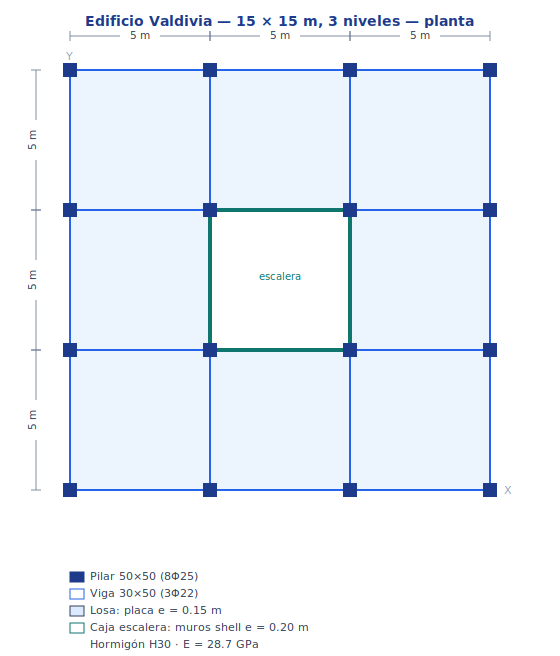
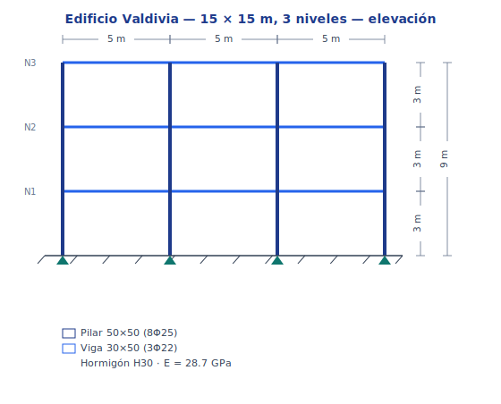
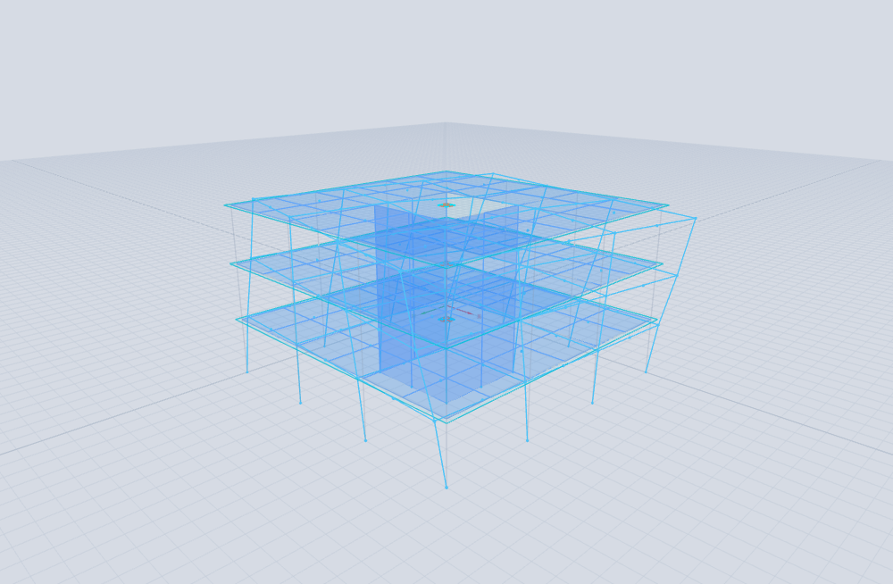
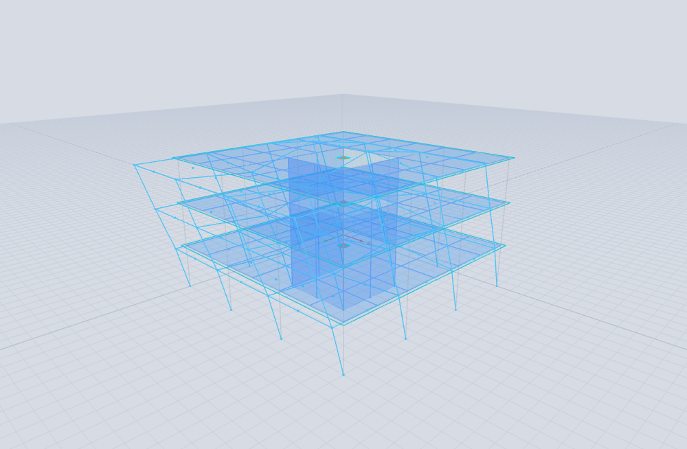

# Tutorial 1 — Edificio de 3 niveles en Valdivia (NCh433)

### portico-core — análisis y diseño de un edificio de hormigón armado con caja de escalera, suelo D

**portico-core · v0.2.0 · 2026-07-18**

[English](01-valdivia-nch433.md) · **Español**

<!-- pagebreak -->

## Qué vas a construir

Un **edificio de hormigón armado de 3 niveles** en **Valdivia, Chile**: planta de 15 × 15 m sobre una
grilla de pilares de 5 m, una **caja de escalera central** construida con elementos de muro **shell**,
**losas** modeladas con elementos **placa**, y **pórticos** (vigas y pilares). Lo analizamos para
gravedad y para el espectro sísmico **NCh433 / DS61** en **suelo D**, luego diseñamos las vigas y
pilares según **ACI 318-19** y verificamos la deriva de entrepiso contra el límite NCh433.

| Propiedad | Valor |
| --- | --- |
| Planta | 15 × 15 m, grilla de pilares 5 m (4 × 4 pilares) |
| Niveles | 3 (altura 3 m → techo en +9 m) |
| Caja de escalera | central 5 × 5 m, muros **shell**, en **C** (abierta un lado para acceso), t = 0.20 m |
| Losas | elementos **placa**, t = 0.15 m, vano de escalera al centro |
| Pilares / vigas | 50 × 50 cm (8Φ25) / 30 × 50 cm (3Φ22 sup+inf) |
| Hormigón | H30 (E = 28.7 GPa) |
| Sismo | NCh433 / DS61 — **suelo D**, zona 3 (Valdivia, costa), categoría II |
| Cargas | peso propio + 2.0 kN/m² permanente + 2.0 kN/m² sobrecarga |

El modelo se entrega como [`examples/tutorial1_valdivia.s3d`](../../examples/tutorial1_valdivia.s3d) y
es reproducible con [`tools/examples/build_valdivia.mjs`](../../tools/examples/build_valdivia.mjs).
Cada paso muestra el estado final en el visor.



*Planta — la grilla de pilares de 3 × 5 m, la caja de escalera central, y las secciones y el material.*



*Elevación — los tres niveles de 3 m, pilares y vigas, y las bases empotradas.*

<!-- pagebreak -->

## Paso 1 — Abrir el modelo

**Archivo → Abrir** y elige `examples/tutorial1_valdivia.s3d`. Activa la vista extruida de secciones
(el botón *extruido* de la barra) para ver los miembros como sólidos. Obtienes la estructura desnuda:
16 pilares, las vigas de piso, las tres losas placa (con el vano central de la escalera) y la caja
shell.


*Figura 1. El modelo — pórticos, losas placa y la caja de escalera central shell.*

## Paso 2 — Revisar las cargas de gravedad

Selecciona el caso de carga **CM** (permanente sobreimpuesta) en el selector de casos y activa las
flechas de carga. La carga de piso de 2.0 kN/m² se aplica a los nodos de la losa por área tributaria;
el caso de sobrecarga **CV** lleva otros 2.0 kN/m². El peso propio se maneja automáticamente desde la
densidad del hormigón (el caso **PP**).


*Figura 2. Las cargas de gravedad sobre las losas.*

El peso propio total es de unos **5 100 kN** (≈ 7.5 kN/m²) más la carga permanente sobreimpuesta —
unos ~9.3 kN/m² típicos de un edificio de hormigón armado.

<!-- pagebreak -->

## Paso 3 — Análisis modal (F6)

Corre **Análisis → Modal** (F6). Como la caja de escalera está **abierta en un lado** (una C para la
puerta de acceso), su centro de rigidez se desplaza del centro de masa — la planta es **excéntrica en
Y**. Esa excentricidad **acopla** la traslación X con la torsión, así que los modos salen mezclados:

| Modo | Período | Ux | Uy | Rz | Forma |
| --- | --- | --- | --- | --- | --- |
| 1 | **0.273 s** | 23 % | — | 57 % | **acoplado lateral (X) – torsión** |
| 2 | **0.136 s** | 55 % | — | 29 % | traslación X (acoplada con torsión) |
| 3 | **0.128 s** | — | 76 % | — | traslación Y (casi pura) |

Dos cosas valen la pena — y ambas importan en un edificio de aspecto simétrico. Primero, los modos
**no** son X / Y / torsión puros: la excentricidad en Y del núcleo abierto acopla X con la rotación,
así que los modos 1 y 2 mezclan desplazamiento y giro, mientras que el modo Y (modo 3) queda casi puro
porque su movimiento va por el eje de simetría que queda. Segundo, el primer modo es **dominado por
torsión** con un período mucho mayor (0.273 s vs ~0.13 s de traslación): el núcleo central abierto
concentra la rigidez lateral cerca del centro y, siendo una sección *abierta*, es torsionalmente
flexible. Esto es una **irregularidad torsional** — justo lo que NCh433 pide vigilar — y el §7 muestra
su efecto en la deriva.

> Si el núcleo fuera una caja cerrada (cuatro muros), la planta sería doblemente simétrica y los modos
> se desacoplarían en traslación y torsión puras; que la torsión siga siendo fundamental dependería
> solo de la razón de rigidez torsional-vs-traslacional. Abrir un muro es realista (la escalera
> necesita puerta) *y* hace explícito el acoplamiento.



*Figura 3. Modo 1 (T = 0.273 s) — acoplado lateral (X)–torsional.*



*Figura 4. Modo 3 (T = 0.128 s) — traslación Y (desacoplada).*

<!-- pagebreak -->

## Paso 4 — Análisis de gravedad (F5)

Corre el análisis estático (F5). En la pestaña **RESULTADOS** selecciona la combinación de gravedad
**1.2·CM + 1.6·CV** y el tipo de resultado *deformada*. Las losas placa muestran su campo de flexión —
máximo al centro de cada paño entre pilares, mínimo en los pilares y alrededor de la caja rígida.


*Figura 5. Deformada de gravedad y flexión de las losas.*

## Paso 5 — Espectro de respuesta NCh433 (suelo D)

Corre **Análisis → Espectro** (F7). Usa el botón **NCh433** para construir el espectro de diseño para
**suelo D**, **zona 3** (Valdivia está en la costa) y **categoría II**. El motor lee el período
fundamental para calcular el factor de reducción:

```
Sa(T) = S · Ao · I · α(T) / R*                    (NCh433 / DS61)
suelo D: S = 1.20, To = 0.75 s     zona 3: Ao = 0.40 g     categoría II: I = 1.0
R* = 1 + T* / (0.10·To + T*/Ro)  = 2.5     (T* = 0.13 s, Ro = 11)
Sa(0) = S·Ao·I / R* = 1.20·0.40·1.0 / 2.5 = 0.19 g
```

El factor de reducción `R* = 2.5` es **bajo a propósito**: el edificio es rígido (`T* = 0.13 s`, muy
por debajo de `To = 0.75 s`), así que NCh433 le concede poca reducción — las estructuras de período
corto atraen más fuerza. El espectro se combina por **CQC** (ζ = 5 %) en ambas direcciones. Por el
acoplamiento torsional del §3, la respuesta sísmica es marcadamente mayor en **X** que en **Y** — lo
que mostrará la verificación de deriva.


*Figura 6. Respuesta espectral NCh433, dirección X.*

<!-- pagebreak -->

## Paso 6 — Diseño de vigas y pilares

Abre la pestaña **DISEÑO**. El motor verifica cada miembro de pórtico según **ACI 318-19** sobre las
combinaciones de ELU, tomando en cuenta la armadura de la sección (pilares 8Φ25, vigas 3Φ22 sup+inf),
y reporta la razón demanda/capacidad (D/C):

| Miembro | Sección · armadura | cantidad | max D/C | Gobierna | Estado |
| --- | --- | --- | --- | --- | --- |
| Pilares | 50 × 50 · 8Φ25 | 48 | **0.40** | interacción P–M | ✓ cumple |
| Vigas | 30 × 50 · 3Φ22 | 72 | **0.18** | corte | ✓ cumple |

Todos los miembros están por debajo de su capacidad (pilares D/C ≤ 0.40 en interacción axial–flexión,
vigas ≤ 0.18 en corte). El mapa de color es uniformemente verde — todas las vigas y pilares cumplen.
Los pilares trabajan más en interacción P–M bajo las combinaciones sísmicas: la respuesta torsional
del §3 sube la demanda en los pórticos X, pero aún con margen cómodo.


*Figura 7. Mapa demanda/capacidad — vigas y pilares holgadamente dentro de capacidad.*

## Paso 7 — Deriva de entrepiso

Por último, verifica la deriva contra el límite NCh433 **Δ/h ≤ 0.002** (en el centro de masa):

| Piso | Δ/h (X) | % del límite | Δ/h (Y) | % del límite |
| --- | --- | --- | --- | --- |
| 1 | 0.00083 | 41 % | 0.00016 | 8 % |
| 2 | **0.00126** | **63 %** | 0.00022 | 11 % |
| 3 | 0.00103 | 51 % | 0.00021 | 10 % |

Todos los pisos cumplen (`Δ/h < 0.002`), pero las dos direcciones son **muy distintas**: la deriva en
X es 5–6× la de Y y llega al **63 %** del límite, mientras que Y ronda el 10 %. Esa asimetría es el
**acoplamiento torsional** del núcleo abierto excéntrico (§3) en acción — un edificio de aspecto
simétrico en planta se desplaza mucho más en X que en Y. Igual cumple, pero un diseñador marcaría la
irregularidad torsional y consideraría cerrar o simetrizar el núcleo.

## Qué aprendimos

- Una **caja de escalera central abierta (en C)** pone el centro de rigidez fuera del centro de masa,
  así que la planta es excéntrica y los modos son **acoplados lateral-torsionales**: el primer modo
  (T = 0.273 s) es dominado por torsión, y las dos direcciones se comportan muy distinto.
- Esa flexibilidad torsional aparece directo en la **deriva**: X llega al 63 % del límite NCh433
  mientras Y ronda el 10 %. Ambas cumplen, pero la asimetría es una **irregularidad torsional** que
  conviene diseñar contra — cerrar o simetrizar el núcleo, o rigidizar los pórticos perimetrales.
- En **suelo D** con un edificio de período corto, el `R*` de NCh433 es bajo (2.5 aquí): la rigidez no
  compra una fuerza sísmica pequeña. Los miembros aún cumplen cómodamente (pilares D/C ≤ 0.40 en
  interacción P–M, vigas ≤ 0.18 en corte).

<sub>Modelo: `examples/tutorial1_valdivia.s3d` (construido por `tools/examples/build_valdivia.mjs`). Ver
el [Manual de Análisis](../analysis-reference.es.md) para la teoría y el
[Manual de Verificación](../verification-manual.es.md) para la validación del motor.</sub>
