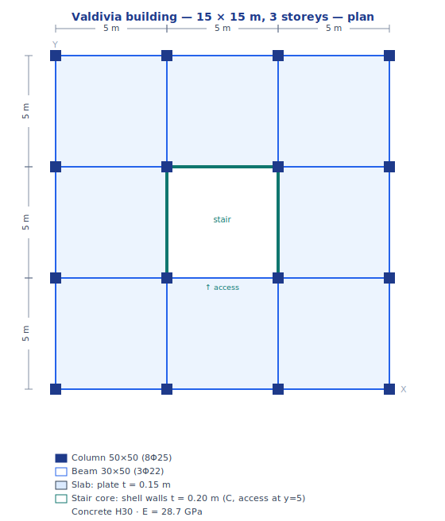
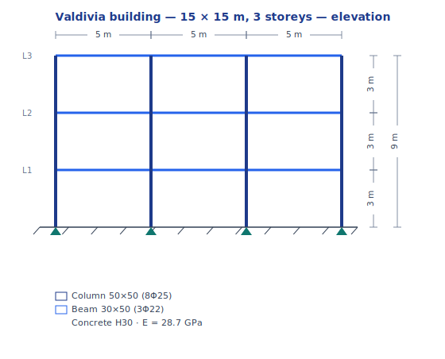

# Tutorial 1 — 3-storey building in Valdivia (NCh433)

### portico-core — analysis and design of an RC building with a stair core, soil D

**portico-core · v0.2.0 · 2026-07-18**

**English** · [Español](01-valdivia-nch433.es.md)

<!-- pagebreak -->

## What you will build

A **3-storey reinforced-concrete building** in **Valdivia, Chile**: a 15 × 15 m plan on a 5 m column
grid, a **central stair core** built with **shell** wall elements, floor **slabs** modelled with
**plate** elements, and moment **frames** (beams and columns). We analyse it for gravity and for the
**NCh433 / DS61** seismic spectrum on **soil D**, then design the beams and columns to **ACI 318-19**
and check the interstorey drift against the NCh433 limit.

| Property | Value |
| --- | --- |
| Plan | 15 × 15 m, 5 m column grid (4 × 4 columns) |
| Storeys | 3 (heights 3 m → top at +9 m) |
| Stair core | central 5 × 5 m, **shell** walls, **C-shape** (open one side for access), t = 0.20 m |
| Slabs | **plate** elements, t = 0.15 m, stairwell opening in the middle |
| Columns / beams | 50 × 50 cm (8Φ25) / 30 × 50 cm (3Φ22 top+bottom) |
| Concrete | H30 (E = 28.7 GPa) |
| Seismic | NCh433 / DS61 — **soil D**, zone 3 (Valdivia, coastal), category II |
| Loads | self-weight + 2.0 kN/m² dead + 2.0 kN/m² live |

The model is provided as [`examples/tutorial1_valdivia.s3d`](../../examples/tutorial1_valdivia.s3d) and
is reproducible with [`tools/examples/build_valdivia.mjs`](../../tools/examples/build_valdivia.mjs).
Each step below shows the final state in the viewer.



*Plan — the 3 × 5 m column grid, the central stair core, and the member sections and material.*



*Elevation — the three 3 m storeys, columns and beams, and the fixed bases.*

<!-- pagebreak -->

## Step 1 — Open the model

**File → Open** and pick `examples/tutorial1_valdivia.s3d`. Turn on the extruded-section view
(the toolbar's *extruded* button) to see the members as solids. You get the bare structure: 16
columns, the floor beams, the three plate slabs (with the central stairwell opening) and the shell
stair core.


*Figure 1. The model — moment frames, plate slabs and the central shell stair core.*

## Step 2 — Review the gravity loads

Select the **CM** (superimposed dead) load case in the case selector and toggle the load arrows.
The 2.0 kN/m² floor load is applied to the slab nodes by tributary area; the live case **CV** carries
another 2.0 kN/m². Self-weight is handled automatically from the concrete density (the **PP** case).


*Figure 2. The gravity loads on the floor slabs.*

The total dead weight is about **5 100 kN of self-weight** (≈ 7.5 kN/m²) plus the superimposed dead
load — a typical ~9.3 kN/m² for a reinforced-concrete building.

<!-- pagebreak -->

## Step 3 — Modal analysis (F6)

Run **Analysis → Modal** (F6). Because the stair core is **open on one side** (a C-shape for the
access door), its centre of rigidity is offset from the centre of mass — the plan is **eccentric in
Y**. That eccentricity **couples** the X-translation with torsion, so the modes come out mixed:

| Mode | Period | Ux | Uy | Rz | Shape |
| --- | --- | --- | --- | --- | --- |
| 1 | **0.273 s** | 23 % | — | 57 % | **coupled lateral (X) – torsion** |
| 2 | **0.136 s** | 55 % | — | 29 % | X-translation (coupled with torsion) |
| 3 | **0.128 s** | — | 76 % | — | Y-translation (nearly pure) |

Two things are worth noticing — and both matter for a symmetric-looking building. First, the modes are
**not** pure X / Y / torsion: the Y-eccentricity of the open core couples X with rotation, so modes 1
and 2 mix sway and twist, while the Y-mode (mode 3) stays nearly pure because its motion runs along the
remaining axis of symmetry. Second, the first mode is **torsion-dominant** with a much longer period
(0.273 s vs ~0.13 s for translation): the open central core concentrates lateral stiffness near the
centre and, being an *open* section, is torsionally flexible. This is a **torsional irregularity** —
exactly what NCh433 asks you to watch for — and §7 shows its effect on the drift.

> If the core were a closed box (four walls), the plan would be doubly symmetric and the modes would
> decouple into pure translation and torsion; whether torsion is still fundamental would then depend
> only on the torsional-vs-translational stiffness ratio. Opening one wall is realistic (the stair
> needs a door) *and* makes the coupling explicit.


*Figure 3. Mode 1 (T = 0.273 s) — coupled lateral (X)–torsional.*


*Figure 4. Mode 3 (T = 0.128 s) — Y-translation (uncoupled).*

<!-- pagebreak -->

## Step 4 — Gravity analysis (F5)

Run the static analysis (F5). In the **RESULTS** tab select the gravity combination
**1.2·CM + 1.6·CV** and the *deformed* result type. The plate slabs show their bending field — largest
in the middle of each bay between columns, smallest at the columns and around the stiff core.


*Figure 5. Gravity deformed shape and slab bending.*

## Step 5 — NCh433 response spectrum (soil D)

Run **Analysis → Spectrum** (F7). Use the **NCh433** button to build the design spectrum for
**soil D**, **zone 3** (Valdivia is on the coast) and **category II**. The engine reads the
fundamental period back to compute the reduction factor:

```
Sa(T) = S · Ao · I · α(T) / R*                    (NCh433 / DS61)
soil D: S = 1.20, To = 0.75 s     zone 3: Ao = 0.40 g     category II: I = 1.0
R* = 1 + T* / (0.10·To + T*/Ro)  = 2.5     (T* = 0.13 s, Ro = 11)
Sa(0) = S·Ao·I / R* = 1.20·0.40·1.0 / 2.5 = 0.19 g
```

The reduction factor `R* = 2.5` is **low on purpose**: the building is stiff (`T* = 0.13 s`, far below
`To = 0.75 s`), so NCh433 grants it little reduction — short-period structures attract more force. The
spectrum is combined by **CQC** (ζ = 5 %) in both directions. Because of the torsional coupling of §3,
the seismic response is markedly larger in **X** than in **Y** — which the drift check will show.


*Figure 6. NCh433 spectral response, direction X.*

<!-- pagebreak -->

## Step 6 — Design of beams and columns

Open the **DESIGN** tab. The engine checks every frame member to **ACI 318-19** over the ULS
combinations, taking the section reinforcement (columns 8Φ25, beams 3Φ22 top+bottom) into account,
and reports the demand/capacity ratio (D/C):

| Member | Section · rebar | count | max D/C | Governs | Status |
| --- | --- | --- | --- | --- | --- |
| Columns | 50 × 50 · 8Φ25 | 48 | **0.40** | P–M interaction | ✓ passes |
| Beams | 30 × 50 · 3Φ22 | 72 | **0.18** | shear | ✓ passes |

Every member is below its capacity (columns D/C ≤ 0.40 in axial–flexural interaction, beams ≤ 0.18 in
shear). The colour map is uniformly green — all beams and columns pass. The columns work hardest in
P–M interaction under the seismic combinations: the torsional response of §3 raises the demand in the
X-frames, but there is still a comfortable margin.


*Figure 7. Demand/capacity map — beams and columns comfortably within capacity.*

## Step 7 — Interstorey drift

Finally, check the drift against the NCh433 limit **Δ/h ≤ 0.002** (at the centre of mass):

| Storey | Δ/h (X) | % of limit | Δ/h (Y) | % of limit |
| --- | --- | --- | --- | --- |
| 1 | 0.00083 | 41 % | 0.00016 | 8 % |
| 2 | **0.00126** | **63 %** | 0.00022 | 11 % |
| 3 | 0.00103 | 51 % | 0.00021 | 10 % |

Every storey passes (`Δ/h < 0.002`), but the two directions are **very different**: the X-drift is
5–6× the Y-drift and reaches **63 %** of the limit, while Y stays near 10 %. That asymmetry is the
**torsional coupling** from the eccentric open core (§3) at work — a building that looks symmetric in
plan drifts far more in X than in Y. It still passes, but a designer would flag the torsional
irregularity and consider closing or symmetrising the core.

## What we learned

- An **open (C-shaped) central stair core** puts the centre of rigidity off the centre of mass, so the
  plan is eccentric and the modes are **coupled lateral–torsional**: the first mode (T = 0.273 s) is
  torsion-dominant, and the two directions behave very differently.
- That torsional flexibility shows up directly in the **drift**: X reaches 63 % of the NCh433 limit
  while Y stays near 10 %. Both pass, but the asymmetry is a **torsional irregularity** worth designing
  against — closing or symmetrising the core, or stiffening the perimeter frames.
- On **soil D** with a short-period building, NCh433's `R*` is low (2.5 here): stiffness does not buy a
  small seismic force. The frame members still pass comfortably (columns D/C ≤ 0.40 in P–M interaction,
  beams ≤ 0.18 in shear).

<sub>Model: `examples/tutorial1_valdivia.s3d` (built by `tools/examples/build_valdivia.mjs`). See the
[Analysis Reference Manual](../analysis-reference.md) for the theory and the
[Verification Manual](../verification-manual.md) for the engine's validation.</sub>
