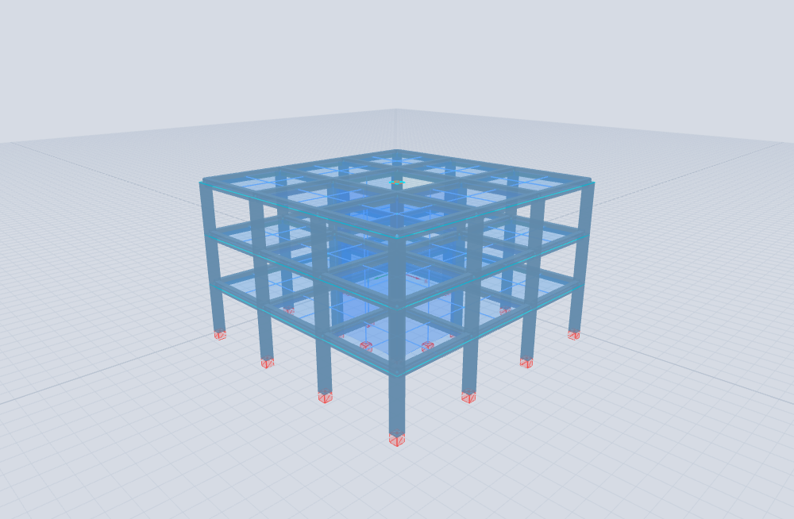
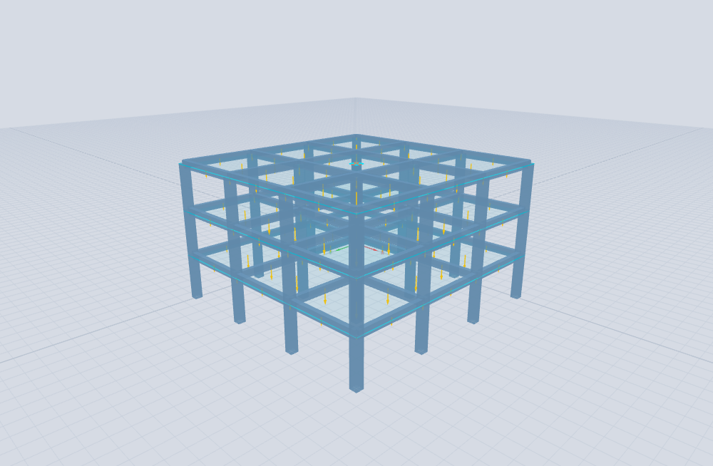
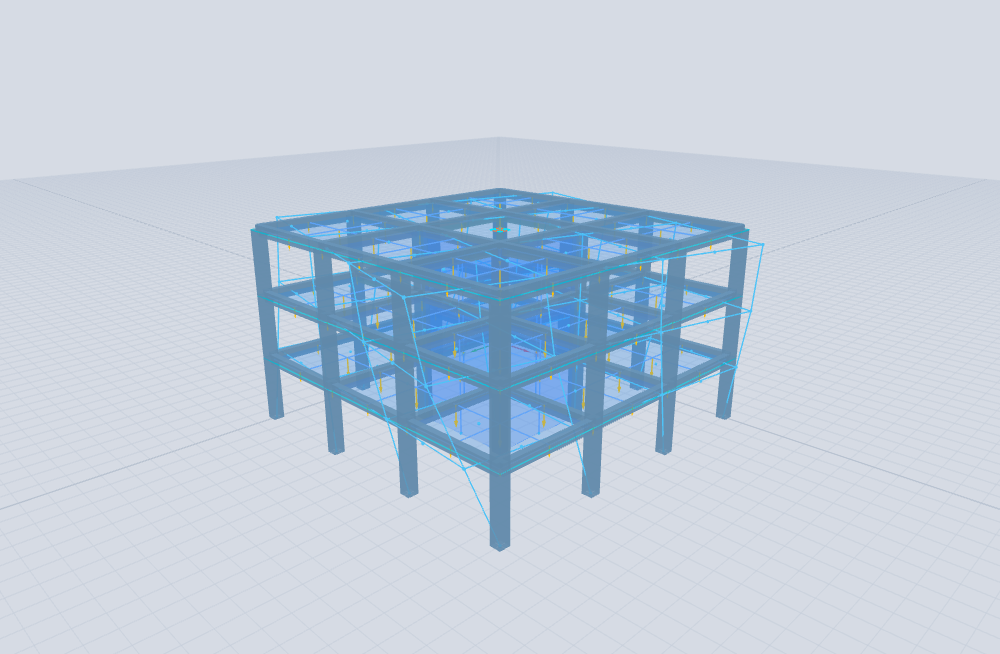
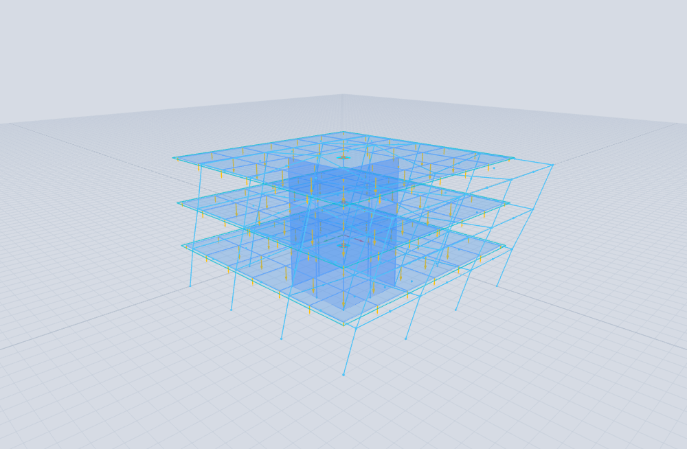
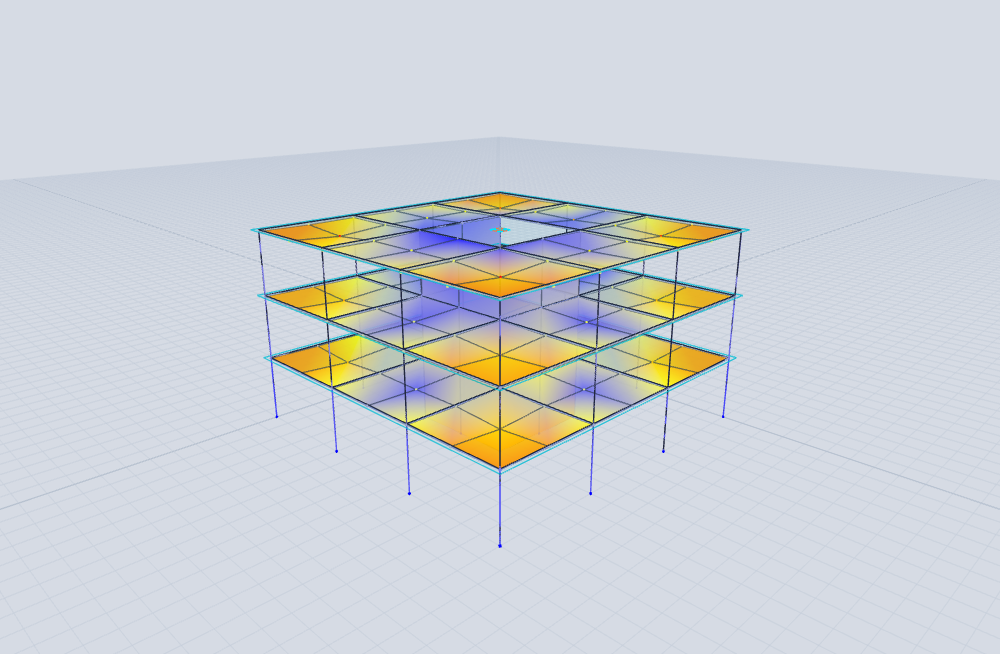
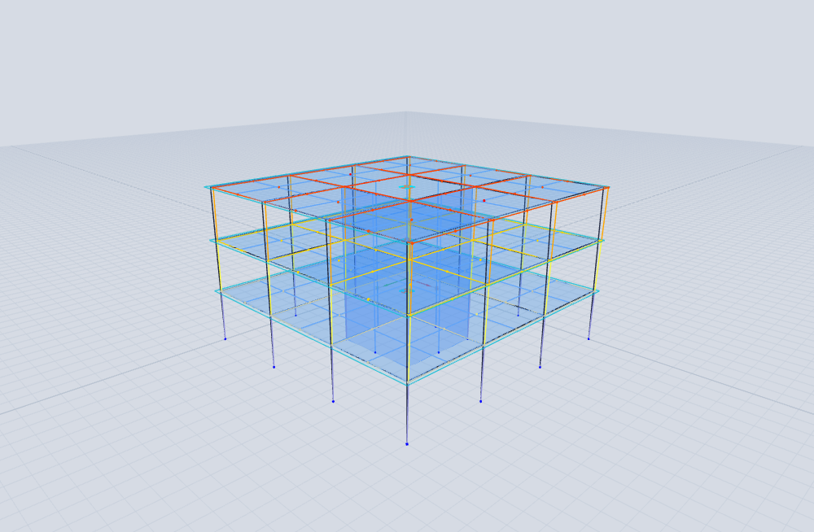
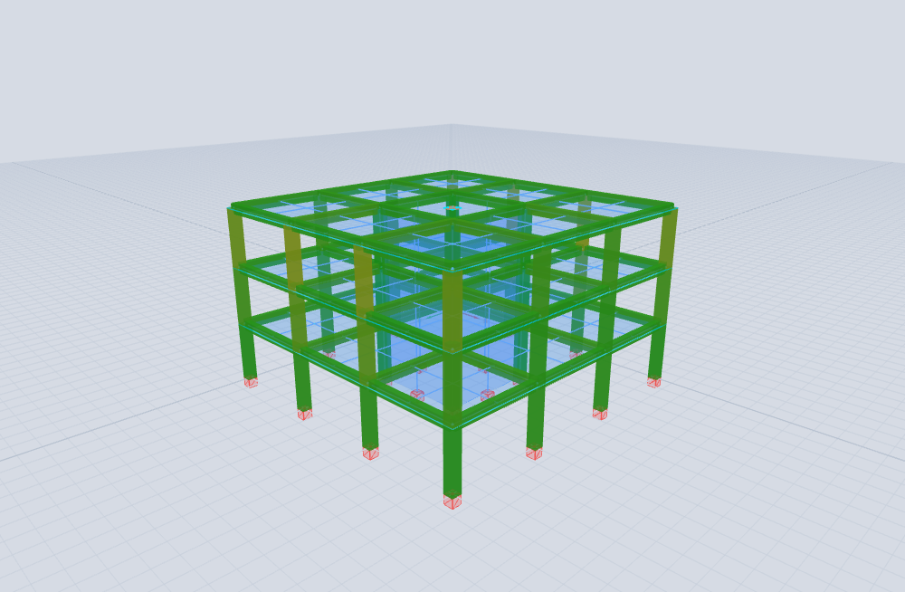

# Tutorial 1 — 3-storey building in Valdivia (NCh433)

### portico-core — analysis and design of an RC building with a stair core, soil D

**portico-core · v0.2.0 · 2026-07-18**

**English** · [Español](01-valdivia-nch433.es.md)

<!-- pagebreak -->

## What you will build

A **3-storey reinforced-concrete building** in **Valdivia, Chile**: a 15 × 15 m plan on a 5 m column
grid, a **central stair core** built with **shell** wall elements, floor **slabs** modelled with
**plate** elements, and moment **frames** (beams and columns). We analyse it for gravity and for the
**NCh433 / DS61** seismic spectrum on **soil D**, then design the beams and columns to **ACI 318-19**
and check the interstorey drift against the NCh433 limit.

| Property | Value |
| --- | --- |
| Plan | 15 × 15 m, 5 m column grid (4 × 4 columns) |
| Storeys | 3 (heights 3 m → top at +9 m) |
| Stair core | central 5 × 5 m box, **shell** walls, t = 0.20 m |
| Slabs | **plate** elements, t = 0.15 m, stairwell opening in the middle |
| Columns / beams | 50 × 50 cm (8Φ25) / 30 × 50 cm (3Φ22 top+bottom) |
| Concrete | H30 (E = 28.7 GPa) |
| Seismic | NCh433 / DS61 — **soil D**, zone 3 (Valdivia, coastal), category II |
| Loads | self-weight + 2.0 kN/m² dead + 2.0 kN/m² live |

The model is provided as [`examples/tutorial1_valdivia.s3d`](../../examples/tutorial1_valdivia.s3d) and
is reproducible with [`tools/examples/build_valdivia.mjs`](../../tools/examples/build_valdivia.mjs).
Each step below shows the final state in the viewer.

<!-- pagebreak -->

## Step 1 — Open the model

**File → Open** and pick `examples/tutorial1_valdivia.s3d`. Turn on the extruded-section view
(the toolbar's *extruded* button) to see the members as solids. You get the bare structure: 16
columns, the floor beams, the three plate slabs (with the central stairwell opening) and the shell
stair core.



*Figure 1. The model — moment frames, plate slabs and the central shell stair core.*

## Step 2 — Review the gravity loads

Select the **CM** (superimposed dead) load case in the case selector and toggle the load arrows.
The 2.0 kN/m² floor load is applied to the slab nodes by tributary area; the live case **CV** carries
another 2.0 kN/m². Self-weight is handled automatically from the concrete density (the **PP** case).



*Figure 2. The gravity loads on the floor slabs.*

The total dead weight is about **5 300 kN of self-weight** (≈ 7.85 kN/m²) plus the superimposed dead
load — a typical ~9.6 kN/m² for a reinforced-concrete building.

<!-- pagebreak -->

## Step 3 — Modal analysis (F6)

Run **Analysis → Modal** (F6). The building is stiff — dominated by the shell core — so the periods
are short:

| Mode | Period | Frequency | Shape |
| --- | --- | --- | --- |
| 1 | **0.160 s** | 6.26 Hz | **torsion** (89.6 % of the torsional mass) |
| 2, 3 | **0.120 s** | 8.34 Hz | translation X, Y |

The **fundamental mode is torsional**. That is the signature of a **central-core** building: the core
gives it enormous *translational* stiffness (its walls sit near the centre, so it barely resists
twist), while the *torsional* resistance is left to the perimeter frames — which are softer. It is
worth being aware of when you design for torsion.



*Figure 3. Mode 1 (T = 0.160 s) — torsion.*



*Figure 4. Mode 2 (T = 0.120 s) — lateral translation.*

<!-- pagebreak -->

## Step 4 — Gravity analysis (F5)

Run the static analysis (F5). In the **RESULTS** tab select the gravity combination
**1.2·CM + 1.6·CV** and the *deformed* result type. The plate slabs show their bending field — largest
in the middle of each bay between columns, smallest at the columns and around the stiff core.



*Figure 5. Gravity deformed shape and slab bending.*

## Step 5 — NCh433 response spectrum (soil D)

Run **Analysis → Spectrum** (F7). Use the **NCh433** button to build the design spectrum for
**soil D**, **zone 3** (Valdivia is on the coast) and **category II**. The engine reads the
fundamental period back to compute the reduction factor:

```
Sa(T) = S · Ao · I · α(T) / R*                    (NCh433 / DS61)
soil D: S = 1.20, To = 0.75 s     zone 3: Ao = 0.40 g     category II: I = 1.0
R* = 1 + T* / (0.10·To + T*/Ro)  = 2.4     (T* = 0.12 s, Ro = 11)
Sa(0) = S·Ao·I / R* = 1.20·0.40·1.0 / 2.4 = 0.20 g
```

The reduction factor `R* = 2.4` is **low on purpose**: the building is so stiff (`T* = 0.12 s`, far
below `To = 0.75 s`) that NCh433 grants it little reduction — short-period structures attract more
force. Even so, the spectral roof displacement is only **1.6 mm**, because the core keeps the building
very stiff. The spectrum is combined by **CQC** (ζ = 5 %) in both directions.



*Figure 6. NCh433 spectral response, direction X.*

<!-- pagebreak -->

## Step 6 — Design of beams and columns

Open the **DESIGN** tab. The engine checks every frame member to **ACI 318-19** over the ULS
combinations, taking the section reinforcement (columns 8Φ25, beams 3Φ22 top+bottom) into account,
and reports the demand/capacity ratio (D/C):

| Member | Section · rebar | count | max D/C | Governs | Status |
| --- | --- | --- | --- | --- | --- |
| Columns | 50 × 50 · 8Φ25 | 48 | **0.34** | P–M interaction | ✓ passes |
| Beams | 30 × 50 · 3Φ22 | 72 | **0.17** | shear | ✓ passes |

Every member is well below its capacity (columns D/C ≤ 0.34 in axial–flexural interaction, beams ≤ 0.17
in shear). The colour map is uniformly green — all beams and columns pass comfortably. The stiff core
keeps the seismic demand small, so the demands are dominated by gravity.



*Figure 7. Demand/capacity map — beams and columns comfortably within capacity.*

## Step 7 — Interstorey drift

Finally, check the drift against the NCh433 limit **Δ/h ≤ 0.002** (at the centre of mass):

| Storey | Δ/h (X) | % of the 0.002 limit | Status |
| --- | --- | --- | --- |
| 1 | 0.00015 | 7.7 % | ✓ |
| 2 | 0.00020 | 10.0 % | ✓ |
| 3 | 0.00017 | 8.3 % | ✓ |

All storeys pass with a wide margin (about 10 % of the limit) — again, the consequence of a stiff
core-wall building.

## What we learned

- A **central stair core** makes an RC building **translationally very stiff** but **torsionally
  softer**, so the *fundamental mode is torsion*. The design must account for that torsion even when
  the translational drifts are tiny.
- On **soil D** with a short-period building, NCh433's `R*` is low (2.4 here): stiffness does not
  automatically mean a small seismic force, but here the displacements stay small anyway.
- The frame members are comfortably designed (columns D/C ≤ 0.34 in P–M interaction, beams ≤ 0.17 in
  shear) and the drifts are ~10 % of the NCh433 limit.

<sub>Model: `examples/tutorial1_valdivia.s3d` (built by `tools/examples/build_valdivia.mjs`). See the
[Analysis Reference Manual](../analysis-reference.md) for the theory and the
[Verification Manual](../verification-manual.md) for the engine's validation.</sub>
