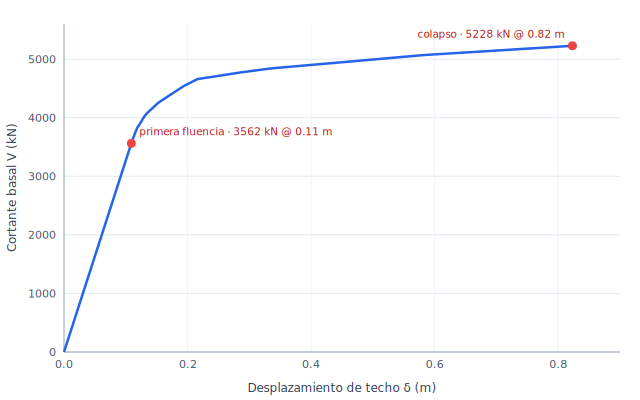

# Tutorial 2 — Pushover a colapso (pórtico de acero de 5 pisos)

### portico-core — pushover estático no lineal de un pórtico de acero hasta su mecanismo de colapso

**portico-core · v0.2.0 · 2026-07-18**

[English](02-pushover-collapse.md) · **Español**

<!-- pagebreak -->

## Qué vas a construir

Un **pórtico de acero de 20 × 20 m y 5 pisos** (práctica de EE.UU., **AISC / A992**), empujado
lateralmente con una carga creciente hasta que forma un **mecanismo de colapso**. Usamos el solver de
**rótulas plásticas evento-a-evento** de portico: aumenta la carga lateral, inserta una rótula plástica
cada vez que un extremo de miembro alcanza su momento plástico `Mp`, y redistribuye — hasta que se
forman suficientes rótulas para convertir el pórtico en un mecanismo.

| Propiedad | Valor |
| --- | --- |
| Planta | 20 × 20 m, 3 vanos por lado (4 líneas de pilares) |
| Pisos | 5 (altura 3.5 m → techo en +17.5 m) |
| Acero | A992, Fy = 345 MPa |
| Pilares | clase W14, `Mp = 897 kN·m` |
| Vigas | clase W18, `Mp = 449 kN·m` (más débiles que los pilares) |
| Patrón lateral | triángulo invertido (fuerza ∝ altura) en +X |

Los pilares son deliberadamente **más fuertes que las vigas** (pilar-fuerte / viga-débil), así que el
pórtico debería fallar en un **mecanismo dúctil de viga** — el deseable. El modelo es
[`examples/tutorial2_pushover.s3d`](../../examples/tutorial2_pushover.s3d), construido por
[`tools/examples/build_pushover.mjs`](../../tools/examples/build_pushover.mjs).

*Planta — la grilla de pilares de 3 × 6.67 m y las secciones y el material.*

*Elevación — los cinco pisos de 3.5 m, pilares y vigas, y las bases empotradas.*

<!-- pagebreak -->

## Paso 1 — El modelo

Abre `examples/tutorial2_pushover.s3d`. Es un pórtico lateral desnudo — solo pilares y vigas (la
gravedad de piso se concentra en los nudos, y un patrón lateral de triángulo invertido **Push X** guía
la pushover). Sus dos modos más bajos son una traslación Y (**T = 0.375 s**) y una traslación X
(**T = 0.295 s**): las columnas W presentan su eje mayor a X, así que el pórtico es algo más rígido en
esa dirección. Como empujamos en **X**, el período que importa aquí — y en la evaluación por desempeño
del Tutorial 3 — es **0.295 s**, no el fundamental (Y).

*Figura 1. El pórtico de acero.*

## Paso 2 — Correr la pushover

Activa el análisis no lineal (**Configuración → NL-lite**), luego corre **Análisis → Rótulas plásticas**
con el patrón **Push X**. Dale a los miembros sus momentos plásticos (pilares 897, vigas 449 kN·m). El
solver traza la respuesta **evento a evento**:

- escala el patrón lateral por un factor `λ` hasta que el primer extremo de miembro alcanza `Mp` — la
  **primera rótula**;
- inserta esa rótula (una liberación), re-resuelve, y halla el siguiente `λ` en que otro extremo fluye;
- repite, con el cortante basal subiendo a medida que la carga se redistribuye, hasta que las rótulas
  acumuladas vuelven el pórtico un **mecanismo** (la matriz de rigidez se vuelve singular) —
  **colapso**.

La **primera rótula se forma en una viga** (`λ = 35.6`), confirmando el comportamiento de viga-débil
buscado; el pórtico colapsa luego en `λ = 52.3` tras **136 rótulas**.

## Paso 3 — La curva de capacidad

Graficando el cortante basal `V = λ · 100 kN` contra el desplazamiento de techo `δ` se obtiene la
**curva de capacidad**:

*Figura 2. La curva de capacidad del pushover.*

| Punto | Desplazamiento de techo δ | Cortante basal V | V / W |
| --- | --- | --- | --- |
| Primera fluencia | 0.11 m | 3 562 kN | 0.32 |
| Colapso | 0.82 m | 5 228 kN | 0.47 |

De ahí leemos las propiedades no lineales clave del pórtico:

- **Sobre-resistencia** `Ω = V_colapso / V_fluencia = 5228 / 3562 ≈ 1.5` — la carga se redistribuye
  más allá de la primera fluencia antes de completarse el mecanismo.
- **Ductilidad de desplazamiento** `μ = δ_colapso / δ_fluencia = 0.82 / 0.11 ≈ 7.5` — una respuesta
  muy dúctil.
- **Deriva de techo en el colapso** `≈ 0.82 / 17.5 = 4.7 %`.

<!-- pagebreak -->

## Paso 4 — El mecanismo de colapso

La deformada en el colapso muestra las rótulas, coloreadas por el orden en que se formaron
(amarillo = tempranas, rojo = tardías). Se concentran en los **extremos de las vigas** y en las
**bases de los pilares** — un **mecanismo de viga**, el modo de falla dúctil que un pórtico diseñado
por capacidad debe desarrollar.

*Figura 3. El mecanismo de colapso de viga.*

## Qué aprendimos

- La pushover de **rótulas plásticas evento-a-evento** de portico traza la respuesta estática no lineal
  completa de un pórtico desde la primera fluencia hasta un mecanismo de colapso, dando directamente la
  **curva de capacidad** y la **secuencia de rótulas**.
- Con **pilares fuertes y vigas débiles**, el pórtico desarrolla el **mecanismo dúctil de viga**
  buscado: la primera rótula está en una viga y las rótulas se propagan por los extremos de vigas antes
  de que cedan los pilares.
- El pórtico muestra una **sobre-resistencia de ~1.5** y una **ductilidad de desplazamiento de ~7.5** —
  los números que una evaluación por desempeño (Tutorial 3) compara luego contra una demanda sísmica.

Modelo: `examples/tutorial2_pushover.s3d` (construido por `tools/examples/build_pushover.mjs`); curva
de capacidad por `tools/examples/capacity_curve.mjs`. Teoría: el
[Manual de Análisis](../analysis-reference.es.md), §5.1 (pushover plástico evento-a-evento).
