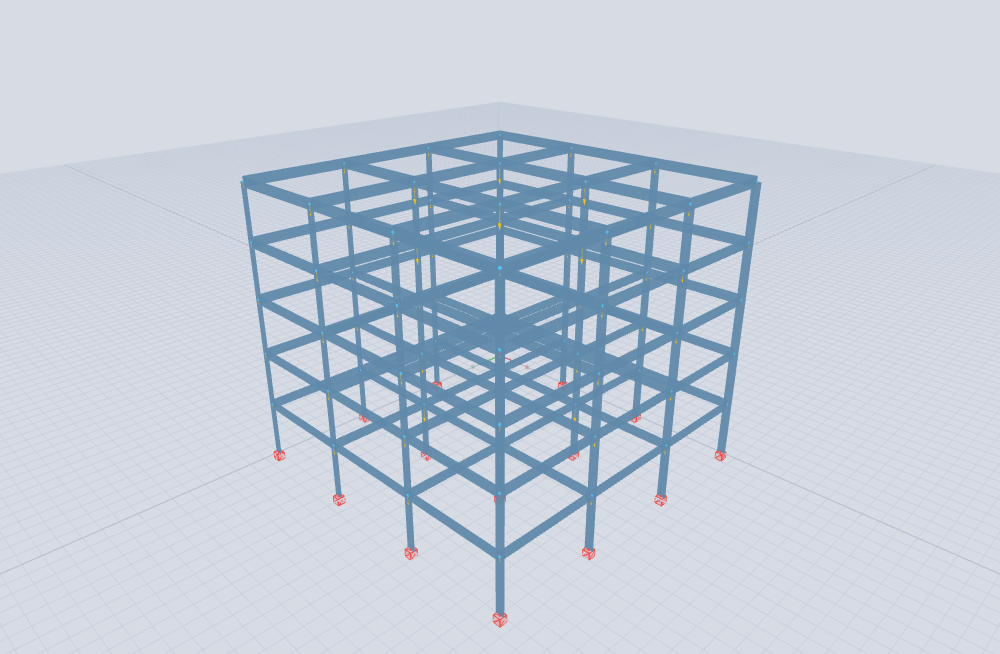
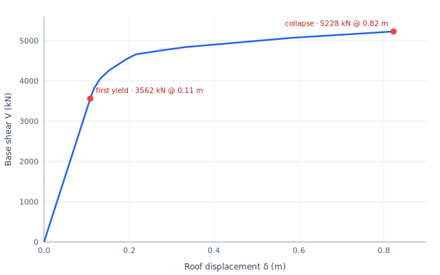
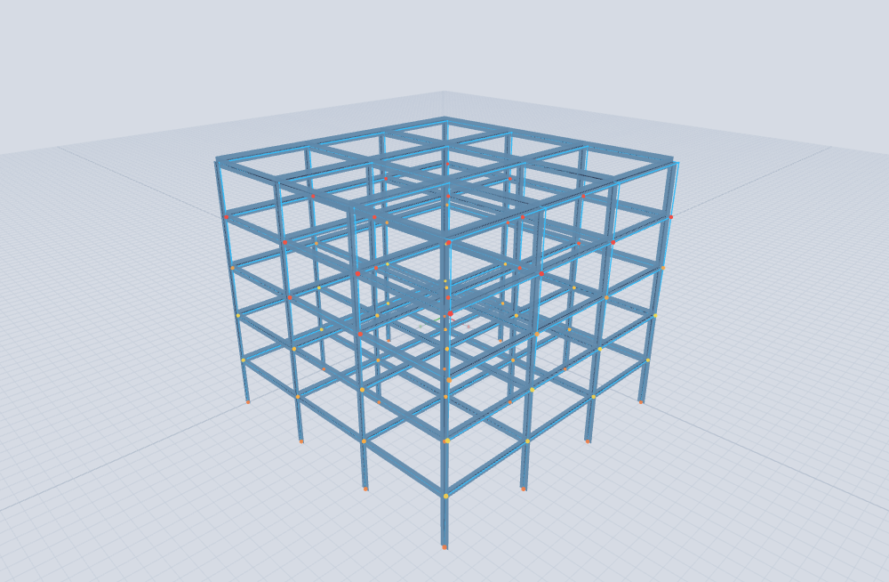

# Tutorial 2 — Pushover to collapse (5-storey steel frame)

### portico-core — nonlinear static pushover of a steel moment frame to its collapse mechanism

**portico-core · v0.2.0 · 2026-07-18**

**English** · [Español](02-pushover-collapse.es.md)

<!-- pagebreak -->

## What you will build

A **20 × 20 m, 5-storey steel moment frame** (US practice, **AISC / A992**), pushed sideways with an
increasing lateral load until it forms a **collapse mechanism**. We use portico's **event-to-event
plastic-hinge** solver: it grows the lateral load, inserts a plastic hinge each time a member end
reaches its plastic moment `Mp`, and redistributes — until enough hinges form to turn the frame into a
mechanism.

| Property | Value |
| --- | --- |
| Plan | 20 × 20 m, 3 bays each way (4 column lines) |
| Storeys | 5 (heights 3.5 m → top at +17.5 m) |
| Steel | A992, Fy = 345 MPa |
| Columns | W14-class, `Mp = 897 kN·m` |
| Beams | W18-class, `Mp = 449 kN·m` (weaker than the columns) |
| Lateral pattern | inverted triangle (force ∝ height) in +X |

The columns are deliberately **stronger than the beams** (strong-column / weak-beam), so the frame
should fail in a **ductile beam-sway** mechanism — the desirable one. The model is
[`examples/tutorial2_pushover.s3d`](../../examples/tutorial2_pushover.s3d), built by
[`tools/examples/build_pushover.mjs`](../../tools/examples/build_pushover.mjs).

<!-- pagebreak -->

## Step 1 — The model

Open `examples/tutorial2_pushover.s3d`. It is a bare lateral frame — columns and beams only (the floor
gravity is lumped at the joints, and an inverted-triangle lateral pattern **Push X** drives the
pushover). Its elastic fundamental period is **T = 0.375 s**.

*Figure 1. The steel moment frame.*

## Step 2 — Run the pushover

Enable nonlinear analysis (**Settings → NL-lite**), then run **Analysis → Plastic hinges** with the
**Push X** pattern. Give the members their plastic moments (columns 897, beams 449 kN·m). The solver
traces the response **event by event**:

- it scales the lateral pattern by a factor `λ` until the first member end reaches `Mp` — the **first
  hinge**;
- it inserts that hinge (a release), re-solves, and finds the next `λ` at which another end yields;
- it repeats, the base shear climbing as the load redistributes, until the accumulated hinges make the
  frame a **mechanism** (the stiffness matrix becomes singular) — **collapse**.

The **first hinge forms in a beam** (`λ = 35.6`), confirming the intended weak-beam behaviour; the
frame then collapses at `λ = 52.3` after **136 hinges**.

## Step 3 — The capacity curve

Plotting the base shear `V = λ · 100 kN` against the roof displacement `δ` gives the **capacity curve**:

*Figure 2. The pushover capacity curve.*

| Point | Roof displacement δ | Base shear V | V / W |
| --- | --- | --- | --- |
| First yield | 0.11 m | 3 562 kN | 0.34 |
| Collapse | 0.82 m | 5 228 kN | 0.50 |

From these we read the frame's key nonlinear properties:

- **Overstrength** `Ω = V_collapse / V_yield = 5228 / 3562 ≈ 1.5` — the load redistributes past first
  yield before the mechanism completes.
- **Displacement ductility** `μ = δ_collapse / δ_yield = 0.82 / 0.11 ≈ 7.5` — a very ductile response.
- **Roof drift at collapse** `≈ 0.82 / 17.5 = 4.7 %`.

<!-- pagebreak -->

## Step 4 — The collapse mechanism

The deformed shape at collapse shows the hinges, coloured by the order in which they formed
(yellow = early, red = late). They cluster at the **beam ends** and the **column bases** — a
**beam-sway mechanism**, the ductile failure mode a capacity-designed frame is meant to develop.

*Figure 3. The beam-sway collapse mechanism.*

## What we learned

- portico's **event-to-event plastic-hinge** pushover traces the full nonlinear static response of a
  frame from first yield to a collapse mechanism, giving the **capacity curve** and the **hinge
  sequence** directly.
- With **strong columns and weak beams**, the frame develops the intended **ductile beam-sway**
  mechanism: the first hinge is in a beam and the hinges spread through the beam ends before the
  columns give way.
- The frame shows an **overstrength of ~1.5** and a **displacement ductility of ~7.5** — the numbers a
  performance-based assessment (Tutorial 3) then compares against a seismic demand.

Model: `examples/tutorial2_pushover.s3d` (built by `tools/examples/build_pushover.mjs`); capacity
curve by `tools/examples/capacity_curve.mjs`. Theory: the
[Analysis Reference Manual](../analysis-reference.md), §5.1 (event-to-event plastic pushover).
