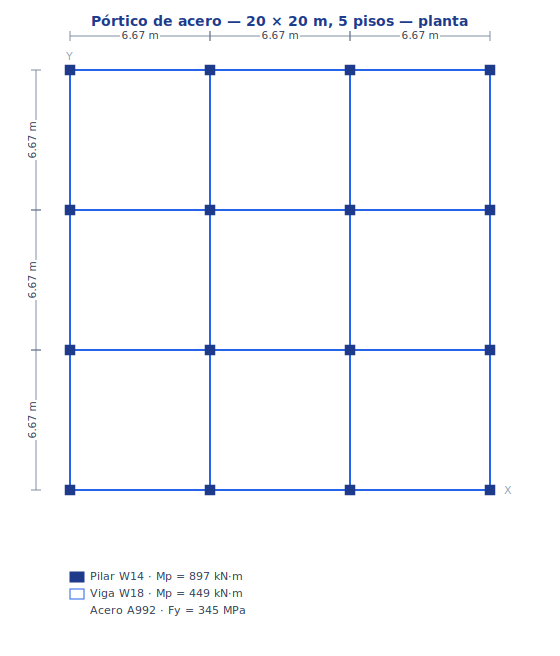
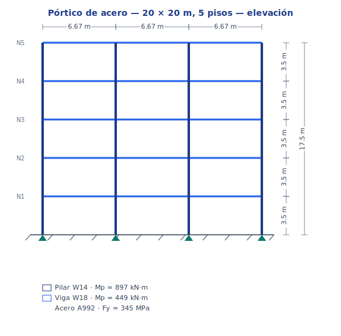
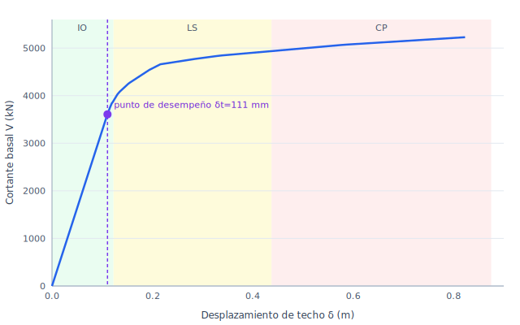

# Tutorial 3 — Evaluación por desempeño (pórtico de acero)

### portico-core — desplazamiento objetivo y nivel de desempeño desde la curva de capacidad del pushover

**portico-core · v0.2.0 · 2026-07-18**

[English](03-performance-based.md) · **Español**

<!-- pagebreak -->

## Qué vas a hacer

Toma el **mismo pórtico de acero de 5 pisos** y su **curva de capacidad** del
[Tutorial 2](02-pushover-collapse.es.md), y conviértelo en una **evaluación por desempeño**: estima el
desplazamiento de techo que el pórtico alcanza bajo un sismo de diseño (el **desplazamiento objetivo**),
ubica ese **punto de desempeño** en la curva de capacidad, y lee el **nivel de desempeño** — Ocupación
Inmediata (IO), Seguridad de Vida (LS) o Prevención de Colapso (CP).

> portico produce la **curva de capacidad** (el motor no lineal del Tutorial 2). La evaluación por
> desempeño en sí — el **método de los coeficientes de ASCE 41-17 / FEMA 440** — se aplica *sobre* esa
> curva; portico no lo automatiza, así que este tutorial muestra el cálculo explícito. Es reproducible
> con [`tools/examples/performance_point.mjs`](../../tools/examples/performance_point.mjs).

Modelo: [`examples/tutorial2_pushover.s3d`](../../examples/tutorial2_pushover.s3d) (el pórtico del
Tutorial 2).



*Planta — la grilla de pilares de 3 × 6.67 m y las secciones y el material.*



*Elevación — los cinco pisos de 3.5 m, pilares y vigas, y las bases empotradas.*

<!-- pagebreak -->

## Paso 1 — La curva de capacidad como bilineal

Del Tutorial 2 tenemos la curva de capacidad y su punto de fluencia idealizado:

| Magnitud | Valor |
| --- | --- |
| Peso sísmico `W` (peso propio + permanente) | 11 170 kN |
| Período efectivo `Te` (modal de traslación X — la dirección de empuje) | 0.30 s |
| Cortante de fluencia `Vy` | 3 562 kN |
| Desplazamiento de fluencia `δy` | 0.11 m |
| Colapso | 5 228 kN @ 0.82 m |

## Paso 2 — La demanda sísmica

Evaluamos contra un **espectro de diseño de alta sismicidad de EE.UU.** (ASCE 7), `SDS = 1.5 g`,
`SD1 = 0.9 g`. El período de esquina es `Ts = SD1 / SDS = 0.60 s`; como `Te = 0.30 s < Ts`, la
aceleración espectral de diseño está en la meseta:

```
Sa = SDS = 1.5 g               (Te ≤ Ts)
```

## Paso 3 — Desplazamiento objetivo (método de los coeficientes)

El método de los coeficientes de ASCE 41-17 estima el desplazamiento de techo inelástico como

```
δt = C0 · C1 · C2 · Sa · Te² / (4π²) · g
```

con los coeficientes de modificación:

| Coeficiente | Significado | Valor |
| --- | --- | --- |
| `C0` | SDOF → techo (5 pisos) | 1.40 |
| `C1` | desplazamiento inelástico vs elástico | 1.40 |
| `C2` | estrangulamiento / degradación | 1.14 |
| — | razón de resistencia `R = Sa/(Vy/W)·Cm` | 4.2 |

El desplazamiento espectral elástico del SDOF es `Sa·g·(Te/2π)² = 1.5·9.81·(0.30/2π)² = 0.034 m`, así
que

```
δt = 1.40 · 1.40 · 1.14 · 0.034 = 0.075 m   (deriva de techo 0.43 %)
```

El período más corto (el correcto) actúa en dos sentidos: baja el desplazamiento espectral elástico
(0.034 m vs 0.060 m) pero sube los coeficientes inelásticos `C1`, `C2` (las estructuras de período corto
se desplazan más respecto de la estimación elástica). El desplazamiento objetivo neto es **0.075 m**.

## Paso 4 — Punto de desempeño y nivel

Ubicando `δt = 75 mm` en la curva de capacidad — con los límites de deriva de techo del pórtico de
acero **IO ≈ 0.7 %**, **LS ≈ 2.5 %**, **CP ≈ 5 %** sombreados — el punto de desempeño cae **por debajo
de la primera fluencia** (`δy ≈ 0.11 m`): el pórtico queda esencialmente elástico, holgadamente dentro
de la banda **IO**:



*Figura 1. Punto de desempeño (δt = 75 mm) sobre la curva de capacidad — bajo el codo de fluencia, en la banda de Ocupación Inmediata.*

| Nivel de desempeño | Límite de deriva de techo | Desplazamiento | δt = 0.075 m |
| --- | --- | --- | --- |
| Ocupación Inmediata | 0.7 % | 0.12 m | **muy por debajo → cumple** |
| Seguridad de Vida | 2.5 % | 0.44 m | amplia reserva |
| Prevención de Colapso | 5.0 % | 0.82 m | amplia reserva |

## Paso 5 — El edificio en el punto de desempeño

El objetivo `δt = 75 mm` queda **por debajo** del desplazamiento de primera fluencia (`δy ≈ 0.11 m`):
bajo el sismo de diseño el pórtico no alcanza del todo su primera rótula plástica. La figura muestra ese
**inicio de fluencia** — los primeros extremos de viga (amarillo) en `δy` — que la demanda no llega a
alcanzar. Esa es la imagen física de la **Ocupación Inmediata**: la estructura responde esencialmente
elástica.


*Figura 2. Inicio de fluencia en δy ≈ 0.11 m — la demanda del sismo de diseño (δt = 75 mm) se queda justo por debajo, así que el pórtico permanece elástico (IO).*

<!-- pagebreak -->

## Qué aprendimos

- Una **evaluación por desempeño** superpone una **demanda sísmica** sobre la **curva de capacidad**: el
  método de los coeficientes da un desplazamiento objetivo `δt`, y dónde cae ese punto entre las bandas
  IO/LS/CP es el nivel de desempeño.
- Para este pórtico, incluso ante un **sismo de diseño de alta sismicidad** (`SDS = 1.5 g`),
  `δt = 75 mm` (deriva de techo 0.43 %) queda **por debajo de la primera fluencia → Ocupación
  Inmediata** (el pórtico responde esencialmente elástico), con amplia reserva hacia Seguridad de Vida
  (0.44 m) y Prevención de Colapso (0.82 m). El pórtico pilar-fuerte/viga-débil es holgadamente seguro.
- Usa el período **en la dirección en que empujas**. El modo fundamental del pórtico es una traslación
  Y (0.375 s), pero la evaluación corre en X (0.295 s); tomar el equivocado habría sobrestimado `δt` en
  ~50 %.
- El flujo es general: cambia las capacidades de sección (Tutorial 2) o la demanda (`SDS`, `Te`) y el
  punto de desempeño se mueve por la misma curva de capacidad — la esencia de diseñar *para un objetivo
  de desempeño* en vez de a un único nivel de fuerza.

<sub>Curva de capacidad de `tools/examples/build_pushover.mjs`; punto de desempeño y figura por
`tools/examples/performance_point.mjs` (método de los coeficientes ASCE 41-17). Ver el
[Tutorial 2](02-pushover-collapse.es.md) para la pushover y el
[Manual de Análisis](../analysis-reference.es.md) §5.1 para la teoría.</sub>
