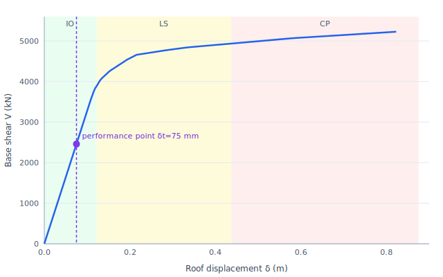
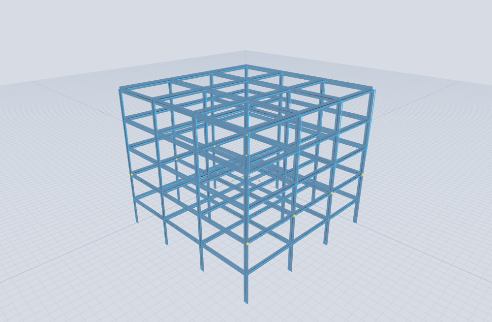

# Tutorial 3 — Performance-based assessment (steel frame)

### portico-core — target displacement and performance level from the pushover capacity curve

**portico-core · v0.2.0 · 2026-07-18**

**English** · [Español](03-performance-based.es.md)

<!-- pagebreak -->

## What you will do

Take the **same 5-storey steel frame** and its **pushover capacity curve** from
[Tutorial 2](02-pushover-collapse.md), and turn it into a **performance-based assessment**: estimate
the roof displacement the frame reaches under a design earthquake (the **target displacement**), place
that **performance point** on the capacity curve, and read off the **performance level** — Immediate
Occupancy (IO), Life Safety (LS) or Collapse Prevention (CP).

> portico produces the **capacity curve** (the nonlinear engine of Tutorial 2). The performance
> assessment itself — the **ASCE 41-17 / FEMA 440 coefficient method** — is applied *on top* of that
> curve; portico does not automate it, so this tutorial shows the calculation explicitly. It is
> reproducible with [`tools/examples/performance_point.mjs`](../../tools/examples/performance_point.mjs).

Model: [`examples/tutorial2_pushover.s3d`](../../examples/tutorial2_pushover.s3d) (the Tutorial 2 frame).

<!-- pagebreak -->

## Step 1 — The capacity curve as a bilinear

From Tutorial 2 we have the capacity curve and its idealized yield point:

| Quantity | Value |
| --- | --- |
| Seismic weight `W` (self-weight + dead) | 11 170 kN |
| Effective period `Te` (≈ elastic modal) | 0.40 s |
| Yield base shear `Vy` | 3 562 kN |
| Yield roof displacement `δy` | 0.11 m |
| Collapse | 5 228 kN @ 0.82 m |

## Step 2 — The seismic demand

We assess against a **high-seismic US design spectrum** (ASCE 7), `SDS = 1.5 g`, `SD1 = 0.9 g`. The
corner period is `Ts = SD1 / SDS = 0.60 s`; since `Te = 0.40 s < Ts`, the design spectral acceleration
is on the plateau:

```
Sa = SDS = 1.5 g               (Te ≤ Ts)
```

## Step 3 — Target displacement (coefficient method)

The ASCE 41-17 coefficient method estimates the inelastic roof displacement as

```
δt = C0 · C1 · C2 · Sa · Te² / (4π²) · g
```

with the modification coefficients:

| Coefficient | Meaning | Value |
| --- | --- | --- |
| `C0` | SDOF → roof (5 storeys) | 1.40 |
| `C1` | inelastic vs elastic displacement | 1.23 |
| `C2` | pinching / degradation | 1.08 |
| — | strength ratio `R = Sa/(Vy/W)·Cm` | 4.2 |

The elastic SDOF spectral displacement is `Sa·g·(Te/2π)² = 1.5·9.81·(0.40/2π)² = 0.060 m`, so

```
δt = 1.40 · 1.23 · 1.08 · 0.060 = 0.111 m   (roof drift 0.63 %)
```

## Step 4 — Performance point and level

Placing `δt = 111 mm` on the capacity curve — with the steel-frame roof-drift limits **IO ≈ 0.7 %**,
**LS ≈ 2.5 %**, **CP ≈ 5 %** shaded — the performance point lands **right at the yield knee**, inside
the **IO** band:



*Figure 1. Performance point (δt = 111 mm) on the capacity curve, in the Immediate-Occupancy band.*

| Performance level | Roof-drift limit | Displacement | δt = 0.111 m |
| --- | --- | --- | --- |
| Immediate Occupancy | 0.7 % | 0.12 m | **just below → satisfied** |
| Life Safety | 2.5 % | 0.44 m | large reserve |
| Collapse Prevention | 5.0 % | 0.82 m | large reserve |

## Step 5 — The building at the performance point

The pushover state at `δt` shows only a **handful of plastic hinges** (the first beam ends, yellow) —
the frame is barely at yield. This is the physical picture of **Immediate Occupancy**: the structure
is essentially elastic under the design earthquake.



*Figure 2. The frame at the performance point — incipient yielding (IO).*

<!-- pagebreak -->

## What we learned

- A **performance-based assessment** overlays a **seismic demand** on the **capacity curve**: the
  coefficient method gives a target displacement `δt`, and where that point falls among the IO/LS/CP
  bands is the performance level.
- For this frame, even at a **high-seismic design earthquake** (`SDS = 1.5 g`), `δt = 111 mm` (roof
  drift 0.63 %) lands at the **yield knee → Immediate Occupancy**, with a wide reserve to Life Safety
  (0.44 m) and Collapse Prevention (0.82 m). The strong-column/weak-beam frame is comfortably safe.
- The workflow is general: change the section capacities (Tutorial 2) or the demand (`SDS`, `Te`) and
  the performance point moves along the same capacity curve — the essence of designing *for a
  performance objective* rather than to a single force level.

<sub>Capacity curve from `tools/examples/build_pushover.mjs`; performance point and figure by
`tools/examples/performance_point.mjs` (ASCE 41-17 coefficient method). See
[Tutorial 2](02-pushover-collapse.md) for the pushover and the
[Analysis Reference Manual](../analysis-reference.md) §5.1 for the theory.</sub>
