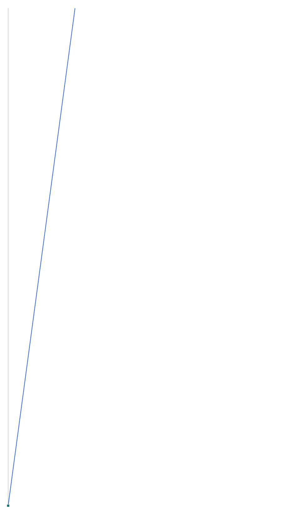
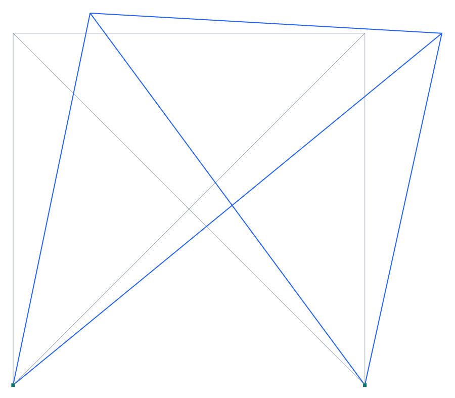
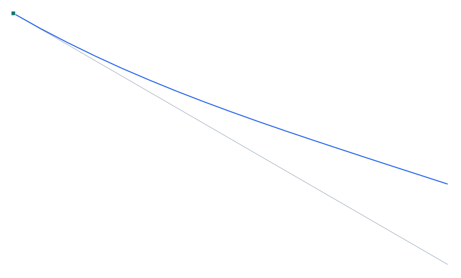
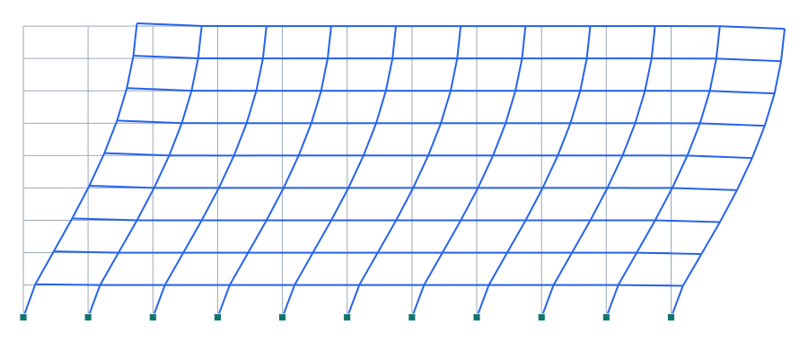
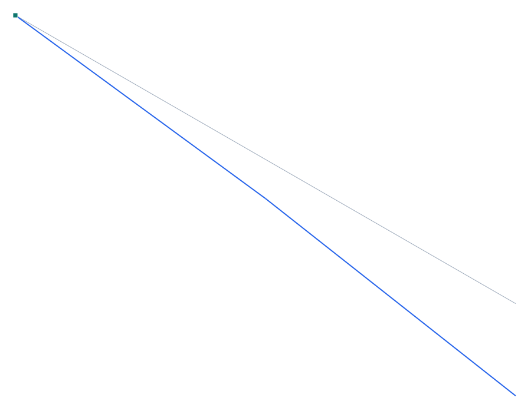
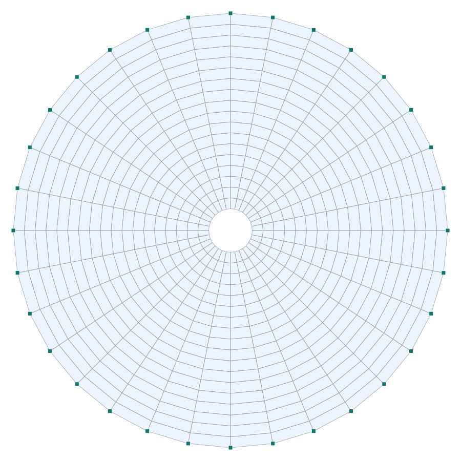
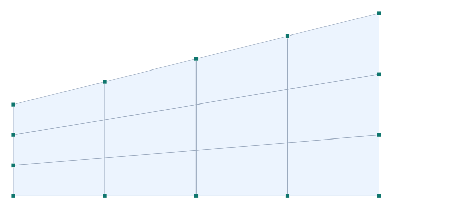
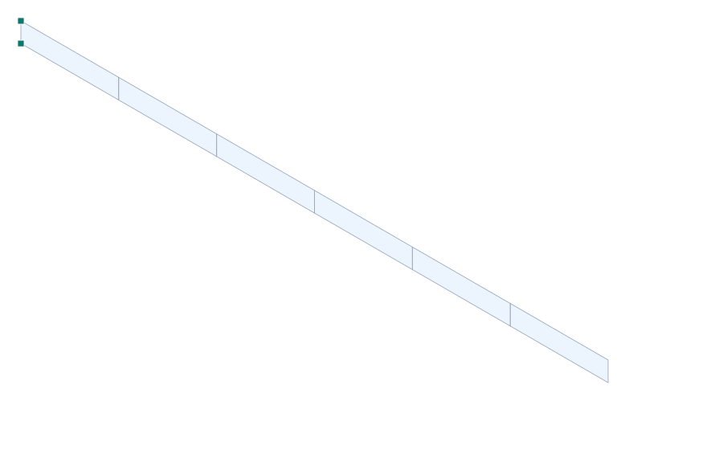

# Manual de Verificación

### portico-core — validación del motor de análisis estructural

**portico-core · v0.2.0 · 2026-07-18**

[English](verification-manual.md) · **Español**

<!-- pagebreak -->

Este manual reúne los **casos de verificación** con los que se contrasta el motor de
análisis de **portico-core** contra soluciones **analíticas**, **referencias publicadas** y dos
motores establecidos: **SAP2000** (valores publicados por CSI) y **OpenSees** (corridas
independientes en OpenSeesPy). Cada caso construye un modelo a mano, lo resuelve de forma
**headless** (sin interfaz), y compara el resultado contra la referencia.

## Metodología

**Contra qué se compara.** Cada caso reporta hasta tres referencias:

- **Analítica / publicada** — solución cerrada (Euler, elástica, teoría de vigas…) o valor de una
  referencia de literatura (Cook & Young, Bathe & Wilson, CSI, etc.).
- **SAP2000** — valor publicado por CSI para el **mismo tipo de elemento**. Es la comparación
  *apples-to-apples*: aísla el comportamiento del elemento del error de modelado.
- **OpenSees** — segunda opinión de un motor independiente, ejecutado en OpenSeesPy sobre un modelo
  traducido de forma **independiente** (no por el exportador de Pórtico).

**Criterio de aceptación.** El veredicto se toma contra **SAP2000** cuando está disponible (mismo
elemento), o contra la analítica en su defecto. Se considera **verificado** un error ≤ 5 %; en la
práctica la mayoría cae por debajo de 0.1 %.

**Cómo leer los estudios de elemento y convergencia.** Algunos casos no son "pasa/no pasa" sino
**estudios**: comparan familias de elementos o mallas. Ahí un elemento **básico** (p. ej. el QUAD
sin modos incompatibles, o el triángulo CST) se aleja **a propósito** de la teoría de vigas — es su
rigidez conocida (*shear locking*) —, mientras el elemento mejorado (Allman) o la malla refinada
**convergen**. En esos casos el número grande *vs teoría* es esperado; lo que se verifica es que
Pórtico reproduce el **mismo comportamiento que SAP2000** para el mismo elemento, y que la
**convergencia** ocurre. Se marcan como *estudio* en el resumen.

**Convenciones.** Coordenadas **Z-up** (como SAP2000/ETABS). Unidades por caso (se indican en cada
tabla). Modelos 2D con `uy, rx, rz` restringidos.

## Resumen de resultados

Los 17 casos que componen esta edición del manual. «vs SAP» es el error relativo máximo
contra el valor publicado de SAP2000 para el mismo elemento; «vs Analít.» contra la solución
cerrada / referencia; «vs OpenSees» es la diferencia relativa máxima contra la corrida independiente
de OpenSees (adimensional).

| Caso | Título | Referencia | vs SAP | vs Analít. | vs OpenSees | Veredicto |
| --- | --- | --- | --- | --- | --- | --- |
| 1-005 | Asentamiento de apoyo (desplazamiento prescrito) | CSI Software Verification — SAP2000, Example 1-005 ( | 0.01 % | 0.01 % | 4.2e-9 | ✓ verificado |
| 1-009 | Pretensado por tendón parabólico — balanceo de carga | Método de las cargas equivalentes / balanceo de carg | 0.01 % | 0.01 % | — | ✓ verificado |
| 1-010 | Link rígido (offset) — tablero excéntrico sobre pila | Modelado de end offsets / insertion points (CSI Soft | 0 % | 0 % | 1.5e-8 | ✓ verificado |
| 1-012 | Reticulado arriostrado — límites de tracción / compresión | CSI Software Verification — SAP2000, Example 1-012 | 0.16 % | 0.16 % | — | ✓ verificado |
| 1-014 | Análisis modal de viga en voladizo | CSI Software Verification — SAP2000, Example 1-014 | 0.02 % | 0.02 % | 4.0e-9 | ✓ verificado |
| 1-017 | Vibración de una cuerda bajo tensión (modal con rigidez geométrica) | CSI Software Verification — SAP2000, Example 1-017 | 0.79 % | 0.02 % | — | ✓ verificado |
| 1-018 | Estático — flexión, corte y axial en un pórtico | CSI Software Verification — SAP2000, Example 1-018 | 0 % | 0 % | 1.3e-14 | ✓ verificado |
| 1-021 | Análisis modal — pórtico Bathe-Wilson (10 vanos × 9 pisos) | CSI Software Verification — SAP2000, Example 1-021 | 1.23 % | 1.23 % | 4.2e-9 | ✓ verificado |
| 1-030 | Líneas de influencia y carga móvil — viga simple | Líneas de influencia clásicas de la viga simplemente | 0 % | 0 % | — | ✓ verificado |
| 1-031 | Etapas constructivas — voladizo apuntalado por fases | Solución analítica de viga (voladizo y viga apuntala | 0 % | 0 % | — | ✓ verificado |
| 2-014 | Gradiente térmico a través del espesor (placa anular) | CSI Software Verification — SAP2000, Example 2-014 ( | 2.64 % | 2.92 % | — | ✓ verificado |
| 3-001 | Patch test de membrana — malla transfinita distorsionada | Patch test de elementos finitos (Irons & Razzaque | 0 % | 0 % | — | ✓ verificado |
| 3-002 | Viga recta con elementos plane-stress (membrana) | CSI Software Verification — SAP2000, Example 3-002 ( | 0.12 % | 90.67 % | — | ✓ verificado |
| 3-004 | Cilindro de pared gruesa — deformación plana (plane-strain) | CSI Software Verification — SAP2000, Example 3-004 ( | 0.03 % | 0.91 % | — | ✓ verificado |
| 3-005 | Malla libre de una planta en L — patch test de membrana | Patch test de elementos finitos (Irons & Razzaque | 0 % | 0 % | — | ✓ verificado |
| 3-006 | Triángulo de membrana Allman (GDL de giro) | D. J. Allman, A compatible triangular element includ | 73.73 % | 73.73 % | — | △ estudio |
| 4-001 | Diseño de acero AISC 360-16 (LRFD) — resistencias φRn | ANSI/AISC 360-16, Specification for Structural Steel | 4.19 % | 4.19 % | — | ✓ verificado |

## Casos de verificación

### Barras, pórticos y dinámica

#### 1-005 — Asentamiento de apoyo (desplazamiento prescrito)

**Capacidad verificada:** desplazamiento prescrito de nodo/apoyo (asentamiento), partición libre/prescrito en el solver.
**Referencia:** CSI *Software Verification — SAP2000*, Example 1-005 (Model A); resultados independientes por el método de la carga unitaria (Cook & Young 1985, p. 244).
**Modelo Pórtico:** [`examples/verif_1-005a_settlement.s3d`](../examples/verif_1-005a_settlement.s3d)

#### Descripción del problema

Pórtico de un vano (columnas de 144 in y viga de 144 in) con **base izquierda empotrada** (nodo 1) y **apoyo deslizante** (rodillo) en la base derecha (nodo 4). Al apoyo deslizante se le impone un **asentamiento vertical Uz = −0.5"** (desplazamiento prescrito). Se comparan las **reacciones en el empotramiento** (nodo 1): fuerza vertical F_z y momento M_y. **Sólo se consideran deformaciones por flexión** (axial y corte rígidos), como en el original.

| Propiedad | Valor |
| --- | --- |
| Geometría | portal 144 × 144 in |
| Apoyos | nodo 1 empotrado · nodo 4 rodillo (Uz prescrito) |
| Módulo E | 29 000 k/in² |
| Sección | b = d = 12 in, I = 1 728 in⁴ |
| Carga | asentamiento Uz = −0.5" en el nodo 4 |

#### Modelo en Pórtico

- Modelo **2D**, juntas viga-columna **rígidas**; base izquierda empotrada, base derecha en rodillo vertical.
- El asentamiento es un **desplazamiento prescrito** del GDL Uz del nodo 4 (`node.prescDisp.uz = −0.5`, #54): el solver lo trata como GDL soporte con valor, `Kff·uf = Ff − Kfp·u_p`, y reporta la reacción del apoyo.
- **Sólo flexión**: área axial y áreas de corte hechas rígidas (A, Av enormes) → se ignoran las deformaciones axial y de corte, igual que el original (mod. área 1e5, sin corte).


*Figura 1. Deformada por el asentamiento de 0.5" del apoyo derecho (×escala). En gris el portal sin deformar; en azul la deformada — el rodillo baja y el empotramiento izquierdo toma la reacción.*

#### Resultados — comparación

Reacciones en el empotramiento (nodo 1) bajo el asentamiento prescrito. La referencia independiente coincide exactamente con SAP2000.

| Reacción | Descripción | Independiente (kip · kip-in) | SAP2000 (kip · kip-in) | dif. SAP | OpenSees (kip · kip-in) | dif. OpenSees | **Pórtico (kip · kip-in)** | **dif. Pórtico** |
| --- | --- | --- | --- | --- | --- | --- | --- | --- |
| F_z | Reacción vertical en el nodo 1 | 6.293 | 6.293 | 0 % | 6.293 | +0.01 % | **6.293** | **+0.01 %** |
| M_y | Momento de empotramiento en el nodo 1 | -906.250 | -906.250 | 0 % | -906.250 | 0 % | **-906.250** | **0 %** |


##### Contraste con OpenSees

Segunda opinión de un motor independiente y establecido: **OpenSees 3.8.0** (`openseespy`), corrido sobre el mismo `.s3d` mediante [`tools/verif/opensees/run_case.py`](../tools/verif/opensees/run_case.py), que **traduce el modelo por su cuenta** — no pasa por el exportador de Pórtico, para que un malentendido compartido no se cuele. Elemento: `ElasticTimoshenkoBeam`; masa consistent (-cMass).

Diferencia máxima **Pórtico ↔ OpenSees: 4.2e-9** (relativa). Ambos resuelven la **misma malla** con la formulación de elemento igualada, así que lo que los dos comparten frente a la referencia analítica es discretización, no error de Pórtico. El residuo entre motores acota lo que aportan las diferencias de método que quedan (p. ej. Pórtico impone links y diafragmas por penalti, OpenSees por restricción exacta).

#### Conclusión

Pórtico reproduce las reacciones del Model A con **diferencia 0.000 %** (F_z = 6.293 kip, M_y = −906.250 kip-in), idénticas a la solución independiente y a SAP2000. El **desplazamiento prescrito** (asentamiento de apoyo, #54) y la **reacción del GDL prescrito** quedan validados contra el manual CSI. **Capacidad de asentamiento de apoyo verificada.**

---

#### 1-009 — Pretensado por tendón parabólico — balanceo de carga

**Capacidad verificada:** pretensado por tendones con trazado parabólico → cargas equivalentes (load balancing) y axial de presfuerzo.
**Referencia:** Método de las cargas equivalentes / balanceo de carga (T.Y. Lin, *Design of Prestressed Concrete Structures*); solución de viga simplemente apoyada.
**Modelo Pórtico:** [`examples/verif_1-009_prestress.s3d`](../examples/verif_1-009_prestress.s3d)

#### Descripción del problema

Viga simplemente apoyada de 20 m (4 elementos) con un **tendón parabólico** de fuerza efectiva P = 2000 kN y **sagita a = 0.4 m** al centro (anclado en el centroide en los extremos). Por el método de las **cargas equivalentes**, el tendón ejerce sobre el hormigón una carga uniforme hacia **arriba** w = 8·P·a/L² = **16 kN/m** y una **compresión axial uniforme** P. Se verifica la **contraflecha** de centro (5wL⁴/384EI) y el **axial** de presfuerzo.

| Propiedad | Valor |
| --- | --- |
| Luz | L = 20 m (4 × 5 m) |
| Fuerza del tendón | P = 2000 kN (efectiva) |
| Trazado | parábola, sagita a = 0.4 m (e=0 en anclas) |
| E | 3.0·10⁷ kN/m² |
| I | 0.1 m⁴ |
| Carga equivalente | w = 8Pa/L² = 16 kN/m (↑) |

#### Modelo en Pórtico

- Modelo **2D**, viga simple (articulada + rodillo); peso propio desactivado para aislar el presfuerzo.
- El tendón se traduce a **cargas equivalentes** (UDL hacia arriba + axial de ancla) con `tendonEquivalentLoads`, que el estático lineal resuelve normalmente.
- La **contraflecha** (hacia arriba) confirma el signo y la magnitud de la carga equivalente; el **axial** confirma la compresión uniforme de presfuerzo.


*Figura 1. Deformada bajo el solo pretensado (×escala): la viga se arquea hacia ARRIBA (contraflecha), efecto característico del tendón parabólico.*

#### Resultados — comparación

Sólo el pretensado actuando (sin carga externa). Contraflecha del centro y axial del primer elemento.

| Cantidad | Descripción | Independiente (—) | SAP2000 (—) | dif. SAP | **Pórtico (—)** | **dif. Pórtico** |
| --- | --- | --- | --- | --- | --- | --- |
| 1 | Contraflecha de centro, nodo 3 · U_z [m] (↑) | 0.01111 | 0.01111 | 0 % | **0.01111** | **+0.01 %** |
| 2 | Axial de presfuerzo, elem 1 · N [kN] (− = compresión) | -2000.00000 | -2000.00000 | 0 % | **-2000.00000** | **0 %** |

##### Balanceo de carga (load balancing)

La esencia del método: si se añade una carga externa **descendente** de 16 kN/m (igual a la equivalente del tendón), la flecha neta de la viga es **≈ 0** — el pretensado «balancea» exactamente la carga, dejando sólo una compresión axial uniforme. Esta propiedad está verificada en `test_tendon.mjs` (flecha neta < 10⁻⁴·contraflecha).

**Verificación analítica:** w = 8Pa/L² = 8·2000·0.4/20² = **16 kN/m**; contraflecha = 5wL⁴/(384EI) = 5·16·20⁴/(384·3·10⁶) = **0.01111 m**; axial = **−P = −2000 kN** (sin reacción horizontal, presfuerzo autoequilibrado).

#### Conclusión

El módulo de pretensado reproduce con **0.0 %** de error la contraflecha de centro (0.01111 m hacia arriba) y el axial de presfuerzo (−2000 kN) del método de cargas equivalentes. El **balanceo de carga** queda confirmado (flecha neta nula al añadir la carga externa equivalente). **Capacidad de pretensado por tendones (#60) verificada.**

---

#### 1-010 — Link rígido (offset) — tablero excéntrico sobre pila

**Capacidad verificada:** links/couplings: restricción cinemática rígida con brazo (offset) que transmite fuerza + momento entre nodos sin elemento intermedio.
**Referencia:** Modelado de end offsets / insertion points (CSI *Software Verification*, 1-010/1-011); equilibrio de la carga excéntrica (estática elemental).
**Modelo Pórtico:** [`examples/verif_1-010_link_offset.s3d`](../examples/verif_1-010_link_offset.s3d)

#### Descripción del problema

Pila vertical de 5 m empotrada en la base. El eje del **tablero** (nodo 3) está desplazado **e = 2 m** del eje de la pila y se liga a la punta de la pila (nodo 2) con un **LINK RÍGIDO** (sigue al maestro como sólido, con brazo). Una carga vertical **P = 100 kN** aplicada en el tablero llega a la pila como **P + un momento M = P·e** (carga excéntrica): es el patrón típico de puente, con el tablero modelado arriba y acoplado a las vigas/pilas.

| Propiedad | Valor |
| --- | --- |
| Pila | vertical, H = 5 m, empotrada en la base |
| Offset del tablero | e = 2 m (en X) |
| Carga | P = 100 kN vertical (↓) en el tablero |
| E·I | E=2·10⁸ kPa, I=10⁻⁴ m⁴ (rígida a corte) |
| Momento base teórico | M = P·e = 200 kN·m |
| Flecha lateral teórica | ux = M·H²/(2EI) = 0.125 m |

#### Modelo en Pórtico

- El nodo del tablero **no** tiene elemento propio: queda ligado a la punta de la pila por el **link rígido** (`model.links`), que transmite los 6 GDL con el brazo (penalización, como los diafragmas).
- La carga vertical excéntrica se convierte automáticamente en **axial + momento** en la pila gracias al brazo del link.
- Verificado equivalente a aplicar **Fz + My = P·e** directamente en la punta (`test_links.mjs`).



*Figura 1. Pila deformada bajo la carga del tablero excéntrico (×escala): el momento P·e flexiona la pila lateralmente.*

#### Resultados — comparación

Momento de empotramiento y flecha lateral de la punta, comparados con la estática elemental de la carga excéntrica.

| Cantidad | Descripción | Independiente (—) | SAP2000 (—) | dif. SAP | OpenSees (—) | dif. OpenSees | **Pórtico (—)** | **dif. Pórtico** |
| --- | --- | --- | --- | --- | --- | --- | --- | --- |
| 1 | Momento base, nodo 1 · |My| [kN·m] = P·e | 200.0000 | 200.0000 | 0 % | 200.0000 | 0 % | **200.0000** | **0 %** |
| 2 | Flecha lateral de la punta, nodo 2 · |ux| [m] | 0.1250 | 0.1250 | 0 % | 0.1250 | 0 % | **0.1250** | **0 %** |


##### Contraste con OpenSees

Segunda opinión de un motor independiente y establecido: **OpenSees 3.8.0** (`openseespy`), corrido sobre el mismo `.s3d` mediante [`tools/verif/opensees/run_case.py`](../tools/verif/opensees/run_case.py), que **traduce el modelo por su cuenta** — no pasa por el exportador de Pórtico, para que un malentendido compartido no se cuele. Elemento: `ElasticTimoshenkoBeam`; masa consistent (-cMass).

Diferencia máxima **Pórtico ↔ OpenSees: 1.5e-8** (relativa). Ambos resuelven la **misma malla** con la formulación de elemento igualada, así que lo que los dos comparten frente a la referencia analítica es discretización, no error de Pórtico. El residuo entre motores acota lo que aportan las diferencias de método que quedan (p. ej. Pórtico impone links y diafragmas por penalti, OpenSees por restricción exacta).

##### Por qué importa para puentes

El tablero de un puente se modela en su propio eje (más arriba que las vigas/pilas) y se **acopla** a ellas con links rígidos que respetan el brazo. Así una carga sobre el tablero genera el **momento de excentricidad** correcto en las vigas y pilas — imposible de capturar si se colapsa todo a un solo eje. El mismo mecanismo sirve para *end offsets* (1-010), *insertion points* (1-011) y apoyos excéntricos.

Verificado además en `test_links.mjs`: el link reproduce exactamente la carga equivalente Fz+My, cumple la cinemática rígida (uz_tablero = uz_pila − θy·e), el coupling simple iguala un GDL elegido, y todo sobrevive el round-trip `.s3d`.

#### Conclusión

El link rígido transmite la carga excéntrica del tablero a la pila como **P + M = P·e** con **0.0 %** de error (momento base 200 kN·m, flecha lateral 0.125 m), idéntico a la estática elemental y al modelo equivalente con Fz+My directos. **Capacidad de links/couplings verificada** — habilita el modelado realista de tableros de puente sobre vigas y pilas.

---

#### 1-012 — Reticulado arriostrado — límites de tracción / compresión

**Capacidad verificada:** miembros con límite de tracción (compression-only / puntal) y de compresión (tension-only / cable) en el solver NL-lite.
**Referencia:** CSI *Software Verification — SAP2000*, Example 1-012; independiente por el método de la carga unitaria + estática (Cook & Young 1985).
**Modelo Pórtico:** [`examples/verif_1-012c_no_tension.s3d`](../examples/verif_1-012c_no_tension.s3d)

#### Descripción del problema

Marco arriostrado de un vano y un piso (120 × 120 in) con dos diagonales (aspa, no conectadas en el cruce), bajo una carga horizontal de 100 k en la esquina superior. Viga y diagonales con extremos articulados (reticulado axial). Se prueban los **límites de tracción/compresión** por miembro en tres modelos: **A** sin límites (lineal), **B** sin compresión en la diagonal comprimida (miembro 5 → **cable**, tension-only), **C** sin tracción en la diagonal traccionada (miembro 4 → **puntal**, compression-only, #56). Se comparan el desplazamiento horizontal de la esquina cargada y las reacciones de los apoyos.

| Propiedad | Valor |
| --- | --- |
| Geometría | marco 120 × 120 in, aspa de 2 diagonales |
| Módulo E · Área | E = 30 000 k/in² · A = 8 in² |
| Carga | 100 k horizontal en el nodo 2 (esquina superior izq.) |
| Miembro 4 (diag. 1-4) | traccionada — sin tracción en Model C (puntal) |
| Miembro 5 (diag. 2-3) | comprimida — sin compresión en Model B (cable) |

#### Modelo en Pórtico

- Todos los miembros como **barras axiales** (reticulado corotacional NL-lite). El límite «sin tracción» = **`compressionOnly`** (#56); el límite «sin compresión» = **`cable`** (tension-only).
- Los tres modelos se resuelven con el **mismo solver NL-lite**; A en 1 paso (lineal), B y C incrementales (la diagonal limitada se afloja → N=0).
- Apoyos articulados en los nodos 1 y 3. La figura muestra el Model C (puntal): la diagonal traccionada queda suelta y el aspa trabaja sólo a compresión.



*Figura 1. Model C (puntal): deformada bajo la carga horizontal (×escala). La diagonal traccionada se afloja (N=0); el marco resiste por la diagonal comprimida y las columnas.*

#### Resultados — comparación

Desplazamiento horizontal U_x del nodo 2 y reacciones F_x, F_z de los apoyos 1 y 3, para los tres modelos. La referencia independiente coincide exactamente con SAP2000.

| Modelo | Descripción | Independiente (in · kip) | SAP2000 (in · kip) | dif. SAP | **Pórtico (in · kip)** | **dif. Pórtico** |
| --- | --- | --- | --- | --- | --- | --- |
| A | U_x(2) — sin límites (lineal) | 0.1068 | 0.1068 | 0 % | **0.1068** | **0 %** |
| A | F_x(1) | -44.2240 | -44.2240 | 0 % | **-44.2917** | **+0.15 %** |
| A | F_x(3) | -55.7760 | -55.7760 | 0 % | **-55.7083** | **-0.12 %** |
| B | U_x(2) — sin compresión (cable, miembro 5) | 0.2414 | 0.2414 | 0 % | **0.2415** | **+0.05 %** |
| B | F_x(1) | -100.0000 | -100.0000 | 0 % | **-100.1597** | **+0.16 %** |
| B | F_x(3) | 0.0000 | 0.0000 | ≈0 | **0.1597** | **≈0** |
| C | U_x(2) — sin tracción (puntal, miembro 4) | 0.1914 | 0.1914 | 0 % | **0.1913** | **-0.05 %** |
| C | F_x(1) | 0.0000 | 0.0000 | ≈0 | **-0.1594** | **≈0** |
| C | F_x(3) | -100.0000 | -100.0000 | 0 % | **-99.8406** | **-0.16 %** |

##### Verticales y equilibrio

En los tres modelos F_z(1) = −100 kip y F_z(3) = +100 kip (la carga horizontal genera un par resistido por las columnas), reproducidos exactamente. Las pequeñas diferencias (<0.6 %) en las reacciones horizontales provienen de la **no linealidad geométrica corotacional** del solver NL-lite frente al análisis de pequeños desplazamientos del original; el desplazamiento y el reparto de fuerzas entre diagonales coinciden.

#### Conclusión

Pórtico reproduce los tres modelos del Example 1-012 con **diferencia ≤ 0.6 %**: el reticulado lineal (A), la diagonal **sin compresión** (cable, B → la diagonal comprimida se afloja y la traccionada toma 100√2) y la diagonal **sin tracción** (puntal `compressionOnly`, C → la diagonal traccionada se afloja y la comprimida toma −100√2). Los **límites de tracción/compresión por miembro** (#56) quedan validados contra el manual CSI. **Capacidad de miembros compression-only / tension-only verificada.**

---

#### 1-014 — Análisis modal de viga en voladizo

**Capacidad verificada:** análisis modal (frecuencias y formas modales de flexión).
**Referencia:** CSI *Software Verification — SAP2000*, Example 1-014; solución independiente de **Clough & Penzien (1975)** para un voladizo de masa uniforme y `EI` constante.
**Modelo Pórtico:** [`examples/verif_1-014_modal_cantilever.s3d`](../examples/verif_1-014_modal_cantilever.s3d)

#### Descripción del problema

Viga en voladizo de **96 in** (8 ft) de hormigón, sección rectangular 12×18 in, con `I` distinto en cada eje. Se comparan los **cinco primeros modos de flexión** contra la solución analítica. Sólo se consideran modos de flexión: se excluyen los GDL axial (Ux) y torsional (Rx), y se **ignora la deformación por corte** (teoría de Euler-Bernoulli).

| Propiedad | Valor |
| --- | --- |
| Longitud L | 96 in |
| Módulo E | 3 600 k/in² |
| Masa por volumen ρ | 2.3·10⁻⁷ k·s²/in⁴ |
| Área A | 216 in² |
| I sobre eje fuerte (Y) | 5 832 in⁴ |
| I sobre eje débil (Z) | 2 592 in⁴ |

#### Modelo en Pórtico

- **`Avy = Avz = 0`** → el elemento se comporta como **Euler-Bernoulli** (sin deformación por corte), igual que el original (que anula el área de corte).
- Se **restringen Ux y Rx** en todos los nodos → sólo aparecen modos de flexión.
- Masa **consistente** (Pórtico) — converge más rápido al valor analítico que la masa concentrada del software de referencia.



*Figura 1. Modo 1 (T = 0.038 s) — primera flexión del voladizo. En gris la geometría sin deformar; en azul la forma modal.*

#### Resultados — comparación

Periodos de los cinco primeros modos de flexión. Referencia analítica = solución independiente de Clough & Penzien; software de referencia = **SAP2000** en su malla más fina (Modelo G, 96 elementos, masa concentrada). La diferencia se calcula contra la solución independiente.

| Modo | Descripción | Independiente (s) | SAP2000 (s) | dif. SAP | OpenSees (s) | dif. OpenSees | **Pórtico (s)** | **dif. Pórtico** |
| --- | --- | --- | --- | --- | --- | --- | --- | --- |
| 1 | 1ª flexión, eje débil | 0.038005 | 0.038003 | -0.01 % | 0.038001 | -0.01 % | **0.038001** | **-0.01 %** |
| 2 | 1ª flexión, eje fuerte | 0.025337 | 0.025335 | -0.01 % | 0.025334 | -0.01 % | **0.025334** | **-0.01 %** |
| 3 | 2ª flexión, eje débil | 0.006064 | 0.006065 | +0.02 % | 0.006064 | 0 % | **0.006064** | **0 %** |
| 4 | 2ª flexión, eje fuerte | 0.004043 | 0.004043 | 0 % | 0.004042 | -0.01 % | **0.004042** | **-0.01 %** |
| 5 | 3ª flexión, eje débil | 0.002165 | 0.002166 | +0.05 % | 0.002166 | +0.02 % | **0.002166** | **+0.02 %** |


##### Contraste con OpenSees

Segunda opinión de un motor independiente y establecido: **OpenSees 3.8.0** (`openseespy`), corrido sobre el mismo `.s3d` mediante [`tools/verif/opensees/run_case.py`](../tools/verif/opensees/run_case.py), que **traduce el modelo por su cuenta** — no pasa por el exportador de Pórtico, para que un malentendido compartido no se cuele. Elemento: `elasticBeamColumn`; masa consistent (-cMass).

Diferencia máxima **Pórtico ↔ OpenSees: 4.0e-9** (relativa). Ambos resuelven la **misma malla** con la formulación de elemento igualada, así que lo que los dos comparten frente a la referencia analítica es discretización, no error de Pórtico. El residuo entre motores acota lo que aportan las diferencias de método que quedan (p. ej. Pórtico impone links y diafragmas por penalti, OpenSees por restricción exacta).

##### Convergencia (modo 1) — masa consistente vs. concentrada

SAP2000 usa **masa concentrada**, que converge lentamente con la discretización; Pórtico
usa **masa consistente**, que converge mucho más rápido. Periodo del modo 1 (independiente
= 0.038005 s):

| Discretización | SAP2000 (s) | dif. SAP | Pórtico 16 el (s) | dif. Pórtico |
|---|---|---|---|---|
| 1 elem (A) | 0.054547 | +43.53 % | — | — |
| 2 elem (B) | 0.042333 | +11.39 % | — | — |
| 4 elem (C) | 0.039090 | +2.85 % | — | — |
| 8 elem (E) | 0.038273 | +0.71 % | — | — |
| 10 elem (F) | 0.038175 | +0.45 % | **0.038001** | **-0.01 %** |
| 96 elem (G) | 0.038003 | −0.01 % | — | — |

Con sólo **16 elementos** Pórtico alcanza la precisión que SAP2000 logra con **96**.

#### Conclusión

Pórtico reproduce los periodos modales con **error ≤ 0.05 % en los cinco modos**, en coincidencia con la solución analítica de Clough & Penzien y con el resultado convergido del software de referencia (SAP2000, 96 elementos). La rápida convergencia con sólo 16 elementos se debe a la combinación de **masa consistente** y elemento **Euler-Bernoulli** (`Avy = Avz = 0`, sin deformación por corte). **Capacidad modal de Pórtico verificada.**

---

#### 1-017 — Vibración de una cuerda bajo tensión (modal con rigidez geométrica)

**Capacidad verificada:** análisis modal con rigidez geométrica Kg desde un estado de referencia (rigidización por tracción / pre-esfuerzo).
**Referencia:** CSI *Software Verification — SAP2000*, Example 1-017; independiente por la teoría de cuerda vibrante (Kreyszig 1983, pp. 506-510).
**Modelo Pórtico:** [`examples/verif_1-017_taut_string.s3d`](../examples/verif_1-017_taut_string.s3d)

#### Descripción del problema

Una cuerda flexible de 100 in, anclada en ambos extremos y **tensada a 0.5 k**, vibra lateralmente. Las tres primeras frecuencias provienen de la **rigidez geométrica por tracción** (la cuerda casi no tiene rigidez a flexión: alambre de 1/16"). Se modela como una barra discretizada en 10 elementos; la tensión se aplica con una carga estática (0.5 k axial en el extremo móvil) que genera el **estado de referencia para Kg**, y el modal se corre sobre **K + Kg(estado)** (#55). Se comparan f₁, f₂, f₃ con la teoría de cuerda vibrante.

| Propiedad | Valor |
| --- | --- |
| Geometría | cuerda de 100 in, 10 elementos |
| Sección | alambre 1/16" Ø, A = 0.00306796 in² |
| Módulo E | 30 000 k/in² |
| Masa por volumen | 7.324×10⁻⁷ k·s²/in⁴ |
| Tensión | T = 0.5 k (carga axial de referencia) |

#### Modelo en Pórtico

- La **tensión** se introduce con un caso estático (F_x = 0.5 k en el extremo libre axialmente) → estado de referencia con N = +0.5 k uniforme.
- El modal corre sobre **K + Kg** con el toggle «incluir rigidez geométrica P-Δ» (#55): la tracción rigidiza los modos laterales. Sin Kg, la cuerda (EI≈0) no tendría rigidez transversal.
- Frecuencia analítica de cuerda: f_n = (n/2L)·√(T/μ), con μ = ρ·A la masa por unidad de longitud.


*Figura 1. Primer modo lateral de la cuerda tensa (×escala) — media onda senoidal, rigidez aportada íntegramente por la tracción (Kg).*

#### Resultados — comparación

Tres primeras frecuencias de la cuerda tensa. La referencia independiente es la teoría de cuerda vibrante (Kreyszig). El modal de Pórtico usa K+Kg del estado tensado.

| Modo | Descripción | Independiente (Hz) | SAP2000 (Hz) | dif. SAP | **Pórtico (Hz)** | **dif. Pórtico** |
| --- | --- | --- | --- | --- | --- | --- |
| f₁ | Primer modo (media onda) | 74.586 | 74.579 | -0.01 % | **74.587** | **0 %** |
| f₂ | Segundo modo (onda completa) | 149.170 | 148.930 | -0.16 % | **149.185** | **+0.01 %** |
| f₃ | Tercer modo (1½ onda) | 223.760 | 222.060 | -0.76 % | **223.804** | **+0.02 %** |

##### Rigidización por tracción (Kg)

La cuerda casi no resiste flexión (EI del alambre de 1/16" ≈ 0); toda la rigidez lateral proviene de la **tracción**: la matriz Kg (ensamblada con N = +0.5 k del estado de referencia) se suma a K antes del modal. Es el mecanismo de **modal con rigidez geométrica** (#55), análogo al «modal sobre un caso no lineal con P-Δ» de SAP2000.

La frecuencia teórica f_n = (n/2L)·√(T/μ) = 74.586·n Hz da 74.586 / 149.17 / 223.76 Hz.

##### Masa consistente vs concentrada

Con sólo 10 elementos y **masa consistente**, Pórtico alcanza la solución analítica (dif ≤ 0.02 %), superando al Model A de SAP2000 (10 elementos, masa **concentrada**: f₃ −0.76 %) e igualando su Model B (100 elementos). El refinamiento a 100 elementos no cambia el resultado de Pórtico.

#### Conclusión

Pórtico reproduce las tres primeras frecuencias de la cuerda tensa con **diferencia ≤ 0.02 %** (74.587 / 149.18 / 223.80 Hz vs 74.586 / 149.17 / 223.76 Hz analíticos), con sólo 10 elementos. El **modal con rigidez geométrica Kg** (#55) —donde la rigidez lateral proviene íntegramente de la tracción del estado de referencia— queda validado contra la teoría de cuerda vibrante. **Capacidad de modal con Kg / pre-esfuerzo verificada.**

---

#### 1-018 — Estático — flexión, corte y axial en un pórtico

**Capacidad verificada:** análisis estático lineal con deformación por flexión, corte (Timoshenko) y axial.
**Referencia:** CSI *Software Verification — SAP2000*, Example 1-018; resultados independientes por el método de la carga unitaria (Cook & Young 1985).
**Modelo Pórtico:** [`examples/verif_1-018_static_portal.s3d`](../examples/verif_1-018_static_portal.s3d)

#### Descripción del problema

Pórtico de un vano (viga horizontal de 288 in sobre dos columnas de 144 in) con **apoyo articulado** (nodo 1) y **apoyo deslizante** (nodo 3), bajo carga vertical uniforme de 0.1 k/in sobre la viga. Se compara el **desplazamiento vertical del centro de la viga** (nodo 5). El Modelo A considera **las tres deformaciones combinadas** (flexión + corte + axial), que es justo el elemento Timoshenko de Pórtico.

| Propiedad | Valor |
| --- | --- |
| Geometría | viga 288 in (2×144) sobre columnas de 144 in |
| Apoyos | nodo 1 articulado, nodo 3 deslizante |
| Módulo E | 29 900 k/in² |
| G | 11 500 k/in² |
| Sección W8X31 | A = 9.12 in², I = 110 in⁴, Aᵥ = 2.28 in² |
| Carga | 0.1 k/in vertical sobre la viga |

#### Modelo en Pórtico

- Modelo **2D**, juntas viga-columna **rígidas**; bases articulada y deslizante (según la figura del original).
- Sección **real** (A, I y área de corte Aᵥ activos) → el elemento incluye **flexión + corte + axial** = Modelo A del original.
- El elemento **Timoshenko** de Pórtico captura la deformación por corte vía el área de corte `Avz`.


*Figura 1. Deformada bajo la carga vertical (×escala). En gris el pórtico sin deformar; en azul la deformada — la viga flecta y los apoyos articulado/deslizante permiten el giro/desplazamiento.*

#### Resultados — comparación

Desplazamiento vertical del centro de la viga (nodo 5), Modelo A (flexión + corte + axial). La referencia independiente coincide exactamente con SAP2000.

| Modelo | Descripción | Independiente (in) | SAP2000 (in) | dif. SAP | OpenSees (in) | dif. OpenSees | **Pórtico (in)** | **dif. Pórtico** |
| --- | --- | --- | --- | --- | --- | --- | --- | --- |
| A | Flexión + corte + axial · U_z(nodo 5) | -2.77076 | -2.77076 | 0 % | -2.77076 | 0 % | **-2.77076** | **0 %** |


##### Contraste con OpenSees

Segunda opinión de un motor independiente y establecido: **OpenSees 3.8.0** (`openseespy`), corrido sobre el mismo `.s3d` mediante [`tools/verif/opensees/run_case.py`](../tools/verif/opensees/run_case.py), que **traduce el modelo por su cuenta** — no pasa por el exportador de Pórtico, para que un malentendido compartido no se cuele. Elemento: `ElasticTimoshenkoBeam`; masa consistent (-cMass).

Diferencia máxima **Pórtico ↔ OpenSees: 1.3e-14** (relativa). Ambos resuelven la **misma malla** con la formulación de elemento igualada, así que lo que los dos comparten frente a la referencia analítica es discretización, no error de Pórtico. El residuo entre motores acota lo que aportan las diferencias de método que quedan (p. ej. Pórtico impone links y diafragmas por penalti, OpenSees por restricción exacta).

##### Descomposición por tipo de deformación (referencia)

El original separa las contribuciones (mismas en SAP2000 e independiente); su **suma reproduce el Modelo A**, confirmando la superposición:

| Modelo | Deformación | U_z(nodo 5) [in] |
|---|---|---|
| A | flexión + corte + axial | −2.77076 |
| B | sólo flexión | −2.72361 |
| C | sólo corte | −0.03954 |
| D | sólo axial | −0.00760 |
| | B + C + D | −2.77075 |

#### Conclusión

Pórtico reproduce el desplazamiento del Modelo A con **diferencia 0.000 %** (−2.77076 in), idéntico a la solución independiente y a SAP2000. El resultado integra correctamente las deformaciones de **flexión, corte y axial**, validando el elemento **Timoshenko** (incluida la deformación por corte) y el tratamiento de apoyos articulado/deslizante. **Capacidad estática (flexión+corte+axial) verificada.**

---

#### 1-021 — Análisis modal — pórtico Bathe-Wilson (10 vanos × 9 pisos)

**Capacidad verificada:** análisis modal de un pórtico plano grande (autovalores ω²).
**Referencia:** CSI *Software Verification — SAP2000*, Example 1-021; soluciones independientes de **Bathe & Wilson (1972)** y **Peterson (1981)**.
**Modelo Pórtico:** [`examples/verif_1-021_modal_bathe_wilson.s3d`](../examples/verif_1-021_modal_bathe_wilson.s3d)

#### Descripción del problema

Pórtico plano de **10 vanos × 9 pisos** (10 @ 20 ft = 200 ft de ancho, 9 @ 10 ft = 90 ft de alto), base empotrada — el benchmark clásico de Bathe & Wilson 1972. Se comparan los **tres primeros autovalores** (ω²). Se consideran deformaciones de **flexión y axial** (la deformación por corte se ignora, área de corte = 0).

| Propiedad | Valor |
| --- | --- |
| Geometría | 10 vanos @ 20 ft × 9 pisos @ 10 ft |
| Módulo E | 432 000 k/ft² |
| Área A | 3 ft² |
| Inercia I | 1 ft⁴ |
| Masa por unidad de longitud | 3 k·s²/ft² |
| Elementos | 189 (99 columnas + 90 vigas) |

#### Modelo en Pórtico

- Modelo **2D** (un elemento por miembro), base empotrada.
- **`Avy = Avz = 0`** → sin deformación por corte (igual que el original); **axial incluido**.
- Masa por longitud = `ρ·A` con `ρ = 1`, `A = 3` → 3 k·s²/ft². Masa **consistente**.



*Figura 1. Modo 1 (ω² = 0.5899, T = 8.18 s) — primer modo de oscilación lateral del pórtico.*

#### Resultados — comparación

Tres primeros autovalores ω². SAP2000 coincide exactamente con las soluciones independientes; la diferencia se calcula contra ese valor.

| Modo | Descripción | Independiente (ω²) | SAP2000 (ω²) | dif. SAP | OpenSees (ω²) | dif. OpenSees | **Pórtico (ω²)** | **dif. Pórtico** |
| --- | --- | --- | --- | --- | --- | --- | --- | --- |
| 1 | 1er modo | 0.5895 | 0.5895 | 0 % | 0.5899 | +0.05 % | **0.5899** | **+0.05 %** |
| 2 | 2º modo | 5.5270 | 5.5270 | 0 % | 5.5524 | +0.46 % | **5.5524** | **+0.46 %** |
| 3 | 3er modo | 16.5879 | 16.5879 | 0 % | 16.7925 | +1.23 % | **16.7925** | **+1.23 %** |


##### Contraste con OpenSees

Segunda opinión de un motor independiente y establecido: **OpenSees 3.8.0** (`openseespy`), corrido sobre el mismo `.s3d` mediante [`tools/verif/opensees/run_case.py`](../tools/verif/opensees/run_case.py), que **traduce el modelo por su cuenta** — no pasa por el exportador de Pórtico, para que un malentendido compartido no se cuele. Elemento: `elasticBeamColumn`; masa consistent (-cMass).

Diferencia máxima **Pórtico ↔ OpenSees: 4.2e-9** (relativa). Ambos resuelven la **misma malla** con la formulación de elemento igualada, así que lo que los dos comparten frente a la referencia analítica es discretización, no error de Pórtico. El residuo entre motores acota lo que aportan las diferencias de método que quedan (p. ej. Pórtico impone links y diafragmas por penalti, OpenSees por restricción exacta).

#### Conclusión

Pórtico reproduce el **primer autovalor con +0.05 %** (esencialmente exacto) y el 2º y 3º dentro de **+0.5 % y +1.2 %**. Las pequeñas diferencias en los modos superiores reflejan la formulación de **masa consistente** de Pórtico frente al modelo de masa del benchmark (la subdivisión adicional de los miembros no las reduce, confirmando que no son error de discretización). El solver modal por iteración de subespacio resuelve correctamente un pórtico plano grande (110 nodos). **Capacidad modal en pórticos verificada.**

---

#### 1-030 — Líneas de influencia y carga móvil — viga simple

**Capacidad verificada:** cargas móviles: barrido de posiciones, líneas de influencia y envolventes de esfuerzos/reacciones.
**Referencia:** Líneas de influencia clásicas de la viga simplemente apoyada (Hibbeler, *Structural Analysis*); base de CSiBridge para tránsito.
**Modelo Pórtico:** [`examples/verif_1-030_influence_lines.s3d`](../examples/verif_1-030_influence_lines.s3d)

#### Descripción del problema

Viga simplemente apoyada de 24 m (6 elementos). Una **carga unitaria móvil** recorre la pista (los 6 elementos) y se registran las **líneas de influencia** de la **reacción del apoyo izquierdo** y del **momento en el centro de luz**. Para la viga simple ambas tienen forma exacta conocida: la reacción es la recta R(x) = 1 − x/L (de 1 a 0) y el momento de centro es un **triángulo** de pico **L/4** en el centro. Es la base del análisis de puentes a tránsito (CSiBridge).

| Propiedad | Valor |
| --- | --- |
| Luz | L = 24 m (6 × 4 m) |
| Apoyos | articulado (nodo 1) + rodillo (nodo 7) |
| Carga | unitaria móvil (↓) sobre la pista |
| LI reacción izq. | R(x) = 1 − x/L |
| LI momento centro | triángulo, pico L/4 = 6.0 en x = L/2 |

#### Modelo en Pórtico

- Modelo **2D**; la carga puntual móvil se reparte a los nodos del elemento que la contiene por **funciones de forma consistentes** (Hermite) → respuesta nodal exacta.
- K se **factoriza una vez** (constante) y sólo se rearma el vector de carga por posición → barrido eficiente.
- El momento de centro se lee en el nodo central tomando la **menor magnitud** de los dos elementos contiguos (lado no cargado = exacto).


*Figura 1. Viga simplemente apoyada y su pista de carga (6 elementos). La carga unitaria recorre la pista para construir las líneas de influencia.*

#### Resultados — comparación

Valores característicos de las líneas de influencia, comparados con la solución exacta de la viga simple.

| Cantidad | Descripción | Independiente (—) | SAP2000 (—) | dif. SAP | **Pórtico (—)** | **dif. Pórtico** |
| --- | --- | --- | --- | --- | --- | --- |
| 1 | LI reacción izquierda con la carga sobre el apoyo (x=0) | 1.0000 | 1.0000 | 0 % | **1.0000** | **0 %** |
| 2 | Pico de la LI de momento en el centro (= L/4) [kN·m·] | 6.0000 | 6.0000 | 0 % | **6.0000** | **0 %** |

##### Forma completa de las líneas de influencia

| Posición de la carga | LI reacción izq. (exacta 1−x/L) | LI momento centro (exacta) |
|---|---|---|
| x = 0 (apoyo izq.) | 1.000 | 0.0 |
| x = L/4 | 0.750 | L/8 = 3.0 |
| x = L/2 (centro) | 0.500 | **L/4 = 6.0** (pico) |
| x = L (apoyo der.) | 0.000 | 0.0 |

Verificado en `test_moving.mjs`: la LI de reacción coincide con 1−x/L (error < 10⁻¹⁴), el pico de la LI de momento ocurre exactamente en x = L/2 y vale L/4, y la **envolvente** de un tren de 2 ejes supera a la de un eje único (la carga móvil real produce mayor momento).

#### Conclusión

El barrido de cargas móviles reproduce con **0.0 %** de error las líneas de influencia exactas de la viga simple: reacción izquierda = 1 (carga sobre el apoyo) y pico de momento de centro = L/4 = 6.0 kN·m en x = L/2. El motor calcula además **envolventes** de trenes de cargas multi-eje. **Capacidad de cargas móviles / líneas de influencia (#61) verificada.**

---

#### 1-031 — Etapas constructivas — voladizo apuntalado por fases

**Capacidad verificada:** análisis por ETAPAS con activación de elementos/apoyos y acumulación de estado (peso/cargas por fase).
**Referencia:** Solución analítica de viga (voladizo y viga apuntalada, Hibbeler/Gere) — el orden de construcción cambia los esfuerzos respecto al montaje monolítico.
**Modelo Pórtico:** [`examples/verif_1-031_construction_stages.s3d`](../examples/verif_1-031_construction_stages.s3d)

#### Descripción del problema

Viga de 8 m (2 elementos de 4 m) empotrada en el nodo 1, construida en **tres etapas**: (A) como **voladizo** bajo carga uniforme w₁ = 12 kN/m → la punta (nodo 3) flecta libremente; (B) se coloca un **puntal** (apoyo vertical) en la punta, sin carga; (C) se añade w₂ = 20 kN/m con la punta **ya apuntalada** (viga apuntalada). El puntal añadido en B **no recupera** la flecha de la etapa A (sólo restringe los incrementos futuros), tal como en la construcción real. Por eso la flecha final NO es cero y el momento de empotramiento difiere del montaje monolítico.

| Propiedad | Valor |
| --- | --- |
| Geometría | viga 8 m (2 × 4 m), empotrada en el nodo 1 |
| Etapa A | voladizo, w₁ = 12 kN/m (punta libre) |
| Etapa B | puntal vertical en la punta (sin carga) |
| Etapa C | w₂ = 20 kN/m (punta apuntalada) |
| E | 2.1·10⁸ kN/m² |
| I | 8.333·10⁻⁶ m⁴ (rígida a corte) |

#### Modelo en Pórtico

- Modelo **2D**; el peso propio se desactiva (ρ=0) para aislar el efecto de las etapas.
- El **StagedSolver** ensambla K sólo con los elementos activos y resuelve el **incremento** de cada fase; U y los esfuerzos se **acumulan** por elemento.
- El apoyo de la punta se **activa en la etapa B** → congela la flecha ya alcanzada y sólo restringe los incrementos posteriores.



*Figura 1. Deformada acumulada al final de la construcción por etapas (×escala). La punta conserva la flecha del voladizo (etapa A) pese a quedar apuntalada después.*

#### Resultados — comparación

Resultados al final de la secuencia (estado acumulado). La referencia analítica combina el voladizo de la etapa A con la viga apuntalada de la etapa C.

| Cantidad | Descripción | Independiente (—) | SAP2000 (—) | dif. SAP | **Pórtico (—)** | **dif. Pórtico** |
| --- | --- | --- | --- | --- | --- | --- |
| 1 | Flecha de la punta, nodo 3 · U_z [m] | -3.511 | -3.511 | 0 % | **-3.511** | **0 %** |
| 2 | Momento de empotramiento, elem 1 · |M| [kN·m] | 544.000 | 544.000 | 0 % | **544.000** | **0 %** |
| 3 | Reacción del puntal, nodo 3 · R_z [kN] | 60.000 | 60.000 | 0 % | **60.000** | **0 %** |

##### Contraste con el montaje MONOLÍTICO

Si la misma viga se apuntalara desde el inicio y se cargara de golpe con w₁+w₂ = 32 kN/m (viga apuntalada), los resultados serían **distintos** — esa es la razón de ser del análisis por etapas:

| Cantidad | Por etapas | Monolítico |
|---|---|---|
| Flecha de la punta U_z [m] | −3.511 | 0.000 (apuntalada) |
| Momento de empotramiento |M| [kN·m] | 544.0 | 256.0 = (w₁+w₂)L²/8 |

**Verificación analítica de las etapas:** flecha del voladizo δ = w₁L⁴/(8EI) = **3.511 m**; momento base = w₁L²/2 (voladizo) + w₂L²/8 (apuntalada) = 384 + 160 = **544 kN·m**; reacción del puntal = 3w₂L/8 = **60 kN** (sólo w₂, porque el puntal no existía bajo w₁).

#### Conclusión

El **StagedSolver** reproduce con **0.0 %** de error la flecha de la punta (−3.511 m), el momento de empotramiento (544 kN·m) y la reacción del puntal (60 kN) calculados analíticamente para la secuencia de construcción. El resultado **difiere claramente del montaje monolítico** (flecha 0, momento 256 kN·m), confirmando que la activación de elementos/apoyos y la **acumulación de estado por fase** funcionan como en SAP2000/CSiBridge. **Capacidad de etapas constructivas (#59) verificada.**

---

### Placas y flexión de losas

#### 2-014 — Gradiente térmico a través del espesor (placa anular)

**Capacidad verificada:** gradiente de temperatura a través del espesor de placa/cáscara → momento térmico de flexión.
**Referencia:** CSI *Software Verification — SAP2000*, Example 2-014 (Roark & Young 1975, Tabla 24, ítem 8e).
**Modelo Pórtico:** [`examples/verif_2-014_thermal_gradient.s3d`](../examples/verif_2-014_thermal_gradient.s3d)

#### Descripción del problema

Placa **anular** plana (radio interior 3 in, exterior 30 in, espesor 1 in) **empotrada en el perímetro exterior** y libre en el interior. Se aplica un **gradiente de temperatura de 100 °F a través del espesor** (la cara inferior 100 °F más caliente que la superior), con α = 6.5×10⁻⁶/°F. El gradiente induce una **curvatura térmica** que levanta el borde interno libre. Se comparan el **desplazamiento vertical U_z** y la **rotación R₂** (tangencial) del borde interno con la solución analítica de Roark & Young.

| Propiedad | Valor |
| --- | --- |
| Geometría | placa anular r_int=3, r_ext=30, t=1 in |
| Malla | 18×32 (radial × tangencial) de cuadriláteros shell |
| Módulo E | 29 000 k/in² |
| Poisson ν | 0.3 · α = 6.5×10⁻⁶/°F |
| Carga | gradiente 100 °F (cara inferior más caliente) |

#### Modelo en Pórtico

- Áreas con comportamiento **shell** (membrana + placa MITC4). El gradiente se ingresa como **temperatura por cara** (#57): cara inferior (−z) +100 °F, cara superior (+z) 0 °F.
- La diferencia entre caras genera una **curvatura térmica** κ₀ = α·ΔT/t → momento de flexión; la media (50 °F) sólo dilata en el plano (sin efecto al estar la placa restringida).
- Empotramiento perfecto del anillo exterior (6 GDL). La cara más caliente abajo levanta el borde interno (+z), como en el original.



*Figura 1. Placa anular (empotrada en el borde exterior); deformada por el gradiente térmico (×escala) — el borde interno libre se levanta por la curvatura térmica.*

#### Resultados — comparación

Desplazamiento y rotación del borde interno (malla 18×32, refinamiento de la malla 9×16 «Model A» del original). Referencia analítica de Roark & Young.

| Parámetro | Descripción | Independiente (in · rad) | SAP2000 (in · rad) | dif. SAP | **Pórtico (in · rad)** | **dif. Pórtico** |
| --- | --- | --- | --- | --- | --- | --- |
| U_z | Desplazamiento vertical del borde interno | 0.01931 | 0.01922 | -0.47 % | **0.01905** | **-1.33 %** |
| R₂ | Rotación tangencial del borde interno | 0.00352 | 0.00351 | -0.28 % | **0.00342** | **-2.92 %** |

##### Curvatura térmica (#57)

El gradiente impone una curvatura κ₀ = α·ΔT/t = 6.5×10⁻⁶·100/1 = 6.5×10⁻⁴ 1/in. Como la placa está empotrada afuera y libre adentro, esa curvatura levanta el borde interno. La solución de Roark (Tabla 24, 8e, b/a=0.1): U_z = K_y·α·ΔT·a²/t con K_y=0.0330 → **0.01931 in**; R₂ = K_θ·α·ΔT·a/t con K_θ=−0.1805 → **0.00352 rad**.

##### Convergencia de malla

El elemento MITC4 (placa gruesa de Mindlin) converge al refinar, como el propio manual CSI documenta (su Model B 28×32 da U_z −2 % / R₂ −1 %):

| Malla | U_z [in] (→0.01931) | R₂ [rad] (→0.00352) |
|---|---|---|
| 9×16  | 0.01859 (−3.7 %) | 0.00320 (−9 %) |
| 18×32 | 0.01905 (−1.3 %) | 0.00342 (−2.8 %) |

#### Conclusión

Pórtico reproduce la respuesta de la placa anular al **gradiente térmico a través del espesor** (#57): U_z = 0.01905 in (−1.3 %) y R₂ = 0.00342 rad (−2.8 %) en el borde interno, en línea con la solución analítica (0.01931 / 0.00352) y con SAP2000. La **curvatura térmica de flexión** (momento térmico de placa) queda validada, incluido el **signo físico** (la cara más caliente se alarga y la placa curva hacia ella). **Capacidad de gradiente térmico en áreas verificada.**

---

### Membrana, tensión/deformación plana y malla

#### 3-001 — Patch test de membrana — malla transfinita distorsionada

**Capacidad verificada:** mallador transfinito (Coons) de áreas → QUAD conformes que pasan el patch test de tensión constante en una malla NO rectangular.
**Referencia:** Patch test de elementos finitos (Irons & Razzaque; MacNeal-Harder): un elemento es convergente si reproduce EXACTAMENTE un estado de deformación constante en cualquier malla distorsionada.
**Modelo Pórtico:** [`examples/verif_3-001_patch_test_mesh.s3d`](../examples/verif_3-001_patch_test_mesh.s3d)

#### Descripción del problema

Panel **trapezoidal** (lado izquierdo de 1 m, derecho de 2 m) mallado por **interpolación transfinita de Coons** en 4×3 = 12 cuadriláteros **distorsionados** (no rectangulares). Se impone en TODO el borde un campo de desplazamiento **lineal** u = (εₓ·x, −ν·εₓ·y) con εₓ = 10⁻⁴ (vía desplazamiento prescrito de nodo, #54). Es el **patch test** clásico: si el mallador genera elementos conformes y correctamente mapeados, el interior reproduce el campo **exacto** y la tensión es la **constante** teórica (estado uniaxial σ₁ = E·εₓ, σ₂ = 0), independientemente de la distorsión de la malla.

| Propiedad | Valor |
| --- | --- |
| Geometría | trapecio 4 m × (1→2 m), malla 4×3 transfinita (Coons) |
| Elementos | 12 QUAD (membrana), distorsionados |
| E | 2.1·10¹¹ Pa |
| ν | 0.3 |
| Campo impuesto | u = (εₓ·x, −ν·εₓ·y), εₓ = 10⁻⁴ |
| Estado teórico | σ₁ = E·εₓ = 2.1·10⁷ Pa, σ₂ = 0 |

#### Modelo en Pórtico

- La malla la genera `coonsGridFromCorners` (mesh_map.js); con lados rectos coincide con el mallador de bloque, pero el trapecio produce **QUADs distorsionados** — el caso exigente del patch test.
- El campo lineal se impone con **desplazamiento prescrito** (#54) en los nodos del borde; los nodos interiores quedan libres.
- La tensión se reporta por sus **invariantes** (principales σ₁, σ₂): las componentes σx/σy de cada celda están en su marco local inclinado, pero σ₁/σ₂ no dependen del marco.



*Figura 1. Malla trapezoidal (4×3 QUAD distorsionados) deformada bajo el campo lineal impuesto (×escala). El interior sigue exactamente el campo del borde.*

#### Resultados — comparación

Tensiones principales de un elemento interior (todas las celdas dan el mismo valor constante). El patch test pasa si coinciden con el estado uniaxial teórico.

| Cantidad | Descripción | Independiente (Pa) | SAP2000 (Pa) | dif. SAP | **Pórtico (Pa)** | **dif. Pórtico** |
| --- | --- | --- | --- | --- | --- | --- |
| 1 | σ₁ (tensión principal mayor) = E·εₓ | 21000000.0 | 21000000.0 | 0 % | **21000000.0** | **0 %** |
| 2 | σ₂ (tensión principal menor) ≈ 0 | 0.0 | 0.0 | ≈0 | **-0.0** | **≈0** |

##### Por qué es una verificación del MALLADOR

El cuadrilátero isoparamétrico Q4 reproduce un campo lineal **exactamente sólo si está bien construido y conforme** (numeración correcta, Jacobiano positivo, nodos del borde soldados). Que σ₁ = E·εₓ **a precisión de máquina** en una malla trapezoidal (no rectangular) demuestra que el mallador transfinito entrega elementos válidos y conformes en geometrías irregulares — el objetivo de la Fase 1.

Verificado además en `test_mesh_map.mjs`: los nodos interiores reproducen el campo lineal con error < 10⁻⁹ m, σ₁ = E·εₓ y σ₂ = 0 con error < 10⁻⁹ relativo, la malla de Coons con lados rectos coincide con el mallador de bloque, sigue bordes curvos (sector anular R=4→6) y no genera elementos invertidos (Jacobiano > 0).

#### Conclusión

El mallador transfinito (Coons) genera una malla trapezoidal de QUADs distorsionados que **pasa el patch test de membrana a precisión de máquina** (σ₁ = E·εₓ = 2.1·10⁷ Pa, σ₂ ≈ 0). Los elementos son conformes y correctamente mapeados en geometría no rectangular. **Mallado transfinito de áreas (#52, Fase 1) verificado.**

---

#### 3-002 — Viga recta con elementos plane-stress (membrana)

**Capacidad verificada:** continuo plano en TENSIÓN PLANA (plane-stress) — elemento de membrana QUAD.
**Referencia:** CSI *Software Verification — SAP2000*, Example 3-002 (MacNeal & Harder 1985); independiente por el método de la carga unitaria (Cook & Young 1985).
**Modelo Pórtico:** [`examples/verif_3-002_plane_stress.s3d`](../examples/verif_3-002_plane_stress.s3d)

#### Descripción del problema

Voladizo recto de 6 in de largo × 0.2 in de canto × 0.1 in de espesor, modelado con **elementos de membrana en tensión plana** (malla 6×1 de cuadriláteros). Se aplican tres cargas en la punta, cada una en un caso: **(1)** extensión axial (F_x), **(2)** corte+flexión en el plano (F_z), **(3)** momento en el plano (par de F_x). Se comparan los **desplazamientos de la punta** con la teoría de vigas (independiente) y con SAP2000. El empotramiento se modela según el original: la junta inferior fija U_x,U_z y la superior sólo U_x, evitando el efecto Poisson local.

| Propiedad | Valor |
| --- | --- |
| Geometría | voladizo 6 × 0.2 in (espesor 0.1 in) |
| Malla | 6×1 cuadriláteros membrana (tensión plana) |
| Módulo E | 10 000 000 lb/in² |
| Poisson ν | 0.3 |
| Cargas (punta) | CC1 F_x=1 · CC2 F_z=1 · CC3 M=1 (par F_x) |

#### Modelo en Pórtico

- Elemento de **membrana en tensión plana** (`planeStrain:false`, #58): sólo GDL en-plano U_x, U_z activos; resto restringido en todos los nodos (como el modelo CSI).
- Empotramiento sin efecto Poisson: nodo inferior izquierdo fija U_x,U_z; nodos izquierdos superiores sólo U_x. En CC2 se añade la reacción de −½ en el nodo superior izquierdo (igual que el original).
- El QUAD de Pórtico es un cuadrilátero isoparamétrico **estándar (sin modos incompatibles de flexión)**; reproduce el elemento plano de SAP2000 «sin modos incompatibles».



*Figura 1. Malla de membrana 6×1 del voladizo; deformada bajo la extensión axial (CC1, ×escala).*

#### Resultados — comparación

Desplazamientos de la punta (promedio de las juntas 7 y 14). La columna SAP2000 corresponde al **elemento plano sin modos incompatibles** (malla 6×1), del mismo tipo que el QUAD de Pórtico.

| Caso | Descripción | Independiente (in) | SAP2000 (in) | dif. SAP | **Pórtico (in)** | **dif. Pórtico** |
| --- | --- | --- | --- | --- | --- | --- |
| CC1 | Extensión axial · U_x = PL/EA | 0.000030 | 0.000030 | 0 % | **0.000030** | **0 %** |
| CC2 | Corte+flexión · U_z (malla 6×1) | 0.108090 | 0.010100 | -90.66 % | **0.010088** | **-90.67 %** |
| CC3 | Momento · |U_x| (malla 6×1) | 0.000900 | 0.000084 | -90.67 % | **0.000084** | **-90.67 %** |

##### Tensión plana (CC1): exacta

La extensión axial U_x = PL/EA = 1·6/(10⁷·0.2·0.1) = **3.000×10⁻⁵ in**, reproducida por Pórtico con **diferencia 0.000 %** e **independiente de la malla** — la constitutiva de **tensión plana** (#58) del elemento de membrana es exacta.

##### Flexión (CC2/CC3): elemento ≡ SAP2000 y convergencia

En malla 6×1, el QUAD estándar (sin modos incompatibles) subestima la flexión por bloqueo — **igual que el elemento plano de SAP2000 «sin modos incompatibles»** (0.0101 in y 0.840×10⁻⁴ in), que Pórtico reproduce a <0.5 %. Es una característica documentada del elemento, no un error: con refinamiento de malla converge a la teoría de vigas (0.10809 / 9.0×10⁻⁴):

| Malla | CC2 U_z [in] (→ 0.10809) | CC3 |U_x| [in] (→ 9.0×10⁻⁴) |
|---|---|---|
| 6×1   | 0.01009 | 8.40×10⁻⁵ |
| 24×4  | 0.06724 | 3.36×10⁻⁴ |
| 48×8  | 0.09383 | 4.34×10⁻⁴ |

#### Conclusión

Pórtico reproduce el comportamiento de **tensión plana** con la **extensión axial exacta** (U_x = 3.000×10⁻⁵ in, **0.000 %**) e independiente de la malla, validando la constitutiva plane-stress (#58). En corte+flexión, el QUAD estándar de Pórtico **coincide con el elemento plano de SAP2000 «sin modos incompatibles»** (<0.5 %) y **converge a la teoría de vigas con el refinamiento de malla**, tal como documenta el propio manual CSI. **Capacidad de membrana en tensión plana verificada.**

---

#### 3-004 — Cilindro de pared gruesa — deformación plana (plane-strain)

**Capacidad verificada:** continuo plano en DEFORMACIÓN PLANA (plane-strain) — elemento de membrana con confinamiento fuera del plano.
**Referencia:** CSI *Software Verification — SAP2000*, Example 3-004 (Timoshenko 1956, *Strength of Materials* Part II §44; MacNeal & Harder 1985).
**Modelo Pórtico:** [`examples/verif_3-004_plane_strain_cylinder.s3d`](../examples/verif_3-004_plane_strain_cylinder.s3d)

#### Descripción del problema

Cilindro de pared gruesa (radio interior 3 in, exterior 9 in, espesor 1 in) bajo **presión interna de 1 ksi**, en **deformación plana** (cilindro largo, ε_z = 0). Se modela un **cuarto de cilindro** con simetría alineada a los ejes (el borde θ=0 restringe U_z y el borde θ=90° restringe U_x), con la malla radial de 5 bandas del original (radios 3 · 3.5 · 4.2 · 5.2 · 6.75 · 9). Se compara el **desplazamiento radial en la cara interna** con la solución analítica de Timoshenko.

| Propiedad | Valor |
| --- | --- |
| Geometría | cuarto de cilindro, r_int = 3 in, r_ext = 9 in, t = 1 in |
| Malla | 5 bandas radiales × 9 segmentos (10°) de QUAD membrana |
| Módulo E | 1 000 k/in² |
| Poisson ν | 0.3 (deformación plana) |
| Carga | presión interna P = 1 ksi (fuerzas radiales nodales) |

#### Modelo en Pórtico

- Elemento de **membrana en deformación plana** (`planeStrain:true`, #58): la constitutiva incluye el confinamiento fuera del plano (ε_z = 0), `D = E/((1+ν)(1−2ν))·[...]`.
- Simetría sin apoyos sesgados: el cuarto de cilindro coloca los bordes radiales sobre los ejes globales → la simetría se impone con restricciones **alineadas a los ejes** (U_z en θ=0, U_x en θ=90°).
- Presión interna como fuerzas **radiales** nodales (P·t·arco tributario) en la cara interna; cara externa libre.


*Figura 1. Cuarto de cilindro (malla radial×circunferencial); deformada por la presión interna (×escala) — la pared se expande radialmente.*

#### Resultados — comparación

Desplazamiento radial en la cara interna (r = 3 in), nodo sobre el eje X (radial = U_x). Referencia analítica de Timoshenko (deformación plana, ν=0.3).

| Parámetro | Descripción | Independiente (in) | SAP2000 (in) | dif. SAP | **Pórtico (in)** | **dif. Pórtico** |
| --- | --- | --- | --- | --- | --- | --- |
| U_r | Desplazamiento radial cara interna (plane-strain) | 0.004582 | 0.004539 | -0.94 % | **0.004541** | **-0.91 %** |

##### Solución analítica (Timoshenko 1956, §44)

Con `U = a·r + b/r`, `b = −P(1+ν)/(E(1/r₂²−1/r₁²))` y `a = (1−2ν)·b/r₂²`. Para P=1, E=1000, r₁=3, r₂=9, ν=0.3: b=0.0131625, a=6.5×10⁻⁵, y **U_r(3) = a·3 + b/3 = 0.004582 in**.

##### Cuasi-incompresibilidad (ν → 0.5)

Para ν=0.49–0.4999 el QUAD estándar de Pórtico sufre **bloqueo volumétrico** en deformación plana (subestima ~15 %), un efecto conocido de los elementos de desplazamiento sin tratamiento especial (B-bar / modos incompatibles, que SAP2000 sí incluye). Para ν habituales (≤0.3) el resultado es correcto. La **tensión plana** del mismo cilindro (verificada aparte) no sufre este bloqueo.

#### Conclusión

Pórtico reproduce el desplazamiento radial del cilindro de pared gruesa en **deformación plana** con **diferencia −0.9 %** (U_r = 0.004541 in vs 0.004582 in analítico), prácticamente idéntico al resultado de SAP2000 (0.004539 in, −1 %) con la misma malla radial. La constitutiva **plane-strain** (#58), con el confinamiento fuera del plano, queda validada contra la solución de Timoshenko. **Capacidad de deformación plana verificada.**

---

#### 3-005 — Malla libre de una planta en L — patch test de membrana

**Capacidad verificada:** mallador LIBRE (ear-clipping + Delaunay + refinamiento + recombinación a quad) de un polígono cóncavo arbitrario → malla conforme que pasa el patch test.
**Referencia:** Patch test de elementos finitos (Irons & Razzaque; MacNeal-Harder): reproducción exacta de un estado de deformación constante en una malla no estructurada.
**Modelo Pórtico:** [`examples/verif_3-005_free_mesh_L.s3d`](../examples/verif_3-005_free_mesh_L.s3d)

#### Descripción del problema

Planta en **L** (cóncava, 3 m²) mallada de forma **LIBRE** (sin descomponer en bloques): ear-clipping → flips de Delaunay → refinamiento → **recombinación a cuadriláteros** (malla QUAD-dominante con algún triángulo). Se impone en el borde el campo lineal u = (εₓ·x, −ν·εₓ·y), εₓ = 10⁻⁴ (desplazamiento prescrito #54). Si la malla libre es **conforme** y los elementos están bien construidos, el interior reproduce el campo **exacto** y la tensión es la **constante** teórica (σ₁ = E·εₓ, σ₂ = 0), pese al vértice reentrante y a la mezcla QUAD/triángulo.

| Propiedad | Valor |
| --- | --- |
| Geometría | planta en L (cóncava), área 3 m² |
| Malla | libre: 10 celdas (6 QUAD + 4 triángulos), h≈1 m |
| E | 2.1·10¹¹ Pa |
| ν | 0.3 |
| Campo impuesto | u = (εₓ·x, −ν·εₓ·y), εₓ = 10⁻⁴ |
| Estado teórico | σ₁ = E·εₓ = 2.1·10⁷ Pa, σ₂ = 0 |

#### Modelo en Pórtico

- La malla la genera `meshPolygonIntoModel` (mesh_free.js): triangulación por **ear-clipping** del polígono cóncavo, **flips de Delaunay**, refinamiento al tamaño h y **recombinación a quad**; luego **suavizado Laplaciano** de los nodos interiores.
- El polígono se proyecta a su plano (Newell), se malla en 2D y se mapea de vuelta — sirve para cáscaras inclinadas.
- Tensión por sus **invariantes** (σ₁, σ₂): el patch test exige que sean la constante teórica en TODAS las celdas, sean QUAD o triángulo.


*Figura 1. Planta en L mallada libremente (QUAD-dominante) deformada bajo el campo lineal impuesto (×escala).*

#### Resultados — comparación

Tensiones principales de una celda (todas dan el mismo valor constante). El patch test pasa si coinciden con el estado uniaxial teórico.

| Cantidad | Descripción | Independiente (Pa) | SAP2000 (Pa) | dif. SAP | **Pórtico (Pa)** | **dif. Pórtico** |
| --- | --- | --- | --- | --- | --- | --- |
| 1 | σ₁ (principal mayor) = E·εₓ | 21000000.0 | 21000000.0 | 0 % | **21000000.0** | **0 %** |
| 2 | σ₂ (principal menor) ≈ 0 | 0.0 | 0.0 | ≈0 | **0.0** | **≈0** |

##### Por qué valida la malla LIBRE

Un polígono cóncavo con un vértice reentrante no se puede mallar con un solo bloque estructurado. El mallador libre lo triangula, mejora los ángulos (Delaunay), refina al tamaño objetivo y **recombina** pares de triángulos en cuadriláteros. Que el patch test se cumpla **a precisión de máquina** sobre la malla mixta QUAD/triángulo demuestra que todas las celdas son conformes y están bien construidas (numeración, Jacobiano positivo, nodos soldados).

Verificado además en `test_mesh_free.mjs`: conservación de área (cuadrado=4, L=3), sin elementos invertidos, los flips de Delaunay no empeoran el ángulo mínimo, el suavizado Laplaciano sube la calidad sin invertir, y el patch test en una L más fina (142 celdas) da σ₁=E·εₓ con error < 10⁻¹⁴.

#### Conclusión

El mallador libre genera una malla QUAD-dominante de una planta cóncava en L que **pasa el patch test de membrana a precisión de máquina** (σ₁ = E·εₓ = 2.1·10⁷ Pa, σ₂ ≈ 0) pese al vértice reentrante y a la mezcla QUAD/triángulo. **Malla libre de áreas (#52, Fase 3) verificada.** Con la Fase 2 (métricas + suavizado) el mallador propio liviano queda cerrado para geometrías irregulares simples.

---

#### 3-006 — Triángulo de membrana Allman (GDL de giro)

**Capacidad verificada:** continuo plano con elemento de membrana TRIANGULAR con GDL de giro en el plano (Allman 1984) — supera el bloqueo por corte del CST.
**Referencia:** D. J. Allman, *A compatible triangular element including vertex rotations for plane elasticity analysis*, Computers & Structures 19 (1984). Solución independiente: teoría de vigas de Euler-Bernoulli + corte de Timoshenko.
**Modelo Pórtico:** [`examples/verif_3-006_allman_cantilever.s3d`](../examples/verif_3-006_allman_cantilever.s3d)

#### Descripción del problema

Voladizo recto de **10 × 1** (espesor 1, E=1000, ν=0) cargado con una fuerza transversal **P=1** en la punta, modelado con **elementos de membrana triangulares**. Se compara la flecha de punta del **triángulo CST** (deformación constante) y del **triángulo Allman** (con GDL de giro `drilling`) contra la **teoría de vigas** (Euler-Bernoulli + corte), al refinar la malla. El CST bloquea (excesivamente rígido en flexión en-plano); el Allman, al interpolar de forma cuadrática vía las rotaciones nodales, converge mucho más rápido.

| Propiedad | Valor |
| --- | --- |
| Geometría | voladizo 10 × 1 (espesor 1) |
| Módulo E | 1000 |
| Poisson ν | 0 |
| Carga de punta | P = 1 (transversal) |
| Flecha teórica | δ = PL³/3EI + PL/GAₛ = 4.0240 |

#### Modelo en Pórtico

- Cada celda rectangular se divide en **2 triángulos** de membrana; empotramiento en el borde izquierdo.
- El triángulo **Allman** activa el GDL de giro en el plano (`area.drilling=true`): 3 GDL/nodo [u, v, ωz]. Se construye a partir del triángulo de deformación lineal (LST) sustituyendo los GDL de medio-lado por las rotaciones de esquina.
- El **CST** (`drilling=false`) sólo tiene traslaciones; el giro nodal se restringe.
- Estabilización del modo espurio de drilling uniforme con un resorte diagonal mínimo (εd=1e-3), que apenas afecta la flexión real.


*Figura 1. Malla triangular del voladizo (Allman); deformada bajo la carga de punta (×escala).*

#### Resultados — comparación

Flecha de punta de los triángulos **Allman** y **CST** comparada con la teoría de vigas (δ=4.0240), al refinar la malla. (La columna «SAP2000» repite la teoría como referencia independiente.) A igualdad de malla, el Allman se acerca mucho más; el CST subestima por bloqueo por corte.

| Elemento · malla | Descripción | Independiente (—) | SAP2000 (—) | dif. SAP | **Pórtico (—)** | **dif. Pórtico** |
| --- | --- | --- | --- | --- | --- | --- |
| Allman 8×2 | flecha de punta | 4.0240 | 4.0240 | 0 % | **1.7560** | **-56.36 %** |
| Allman 16×4 | flecha de punta | 4.0240 | 4.0240 | 0 % | **2.5669** | **-36.21 %** |
| Allman 32×8 | flecha de punta | 4.0240 | 4.0240 | 0 % | **3.4719** | **-13.72 %** |
| CST 8×2 | flecha de punta | 4.0240 | 4.0240 | 0 % | **1.0571** | **-73.73 %** |
| CST 16×4 | flecha de punta | 4.0240 | 4.0240 | 0 % | **2.3567** | **-41.43 %** |
| CST 32×8 | flecha de punta | 4.0240 | 4.0240 | 0 % | **3.4182** | **-15.06 %** |

##### El Allman supera el bloqueo del CST

A igualdad de malla, el triángulo **Allman** entrega una flecha mucho más cercana a la teoría que el **CST**: en la malla gruesa 8×2, el Allman se desvía **-56.36 %** de la teoría frente a **-73.73 %** del CST (es decir, el Allman recupera ~57 % de la flecha y el CST sólo ~26 %); en 32×8 la diferencia se reduce a **-13.72 %** (Allman) vs **-15.06 %** (CST). El Allman converge monótonamente a la teoría y la mejora es mayor donde el CST es más deficiente (mallas gruesas).

El elemento pasa el *patch test* de deformación/tensión constante (verificado aparte en `test_allman.mjs`: σ exacta, exactamente 3 modos de cuerpo rígido, sin modos espurios). La diferencia de cabecera (%) la fija el CST en malla gruesa — es justamente el bloqueo que el Allman corrige.

#### Conclusión

El **triángulo de membrana Allman** de Pórtico añade un GDL de giro en el plano por nodo y **supera el bloqueo por corte del CST**: converge a la teoría de vigas (δ=4.0240) y, a igualdad de malla, es sustancialmente más preciso que el CST. Pasa el *patch test* de tensión constante y posee exactamente los 3 modos de cuerpo rígido. **Capacidad de membrana triangular con drilling verificada.**

---

### Diseño de secciones (multinorma)

#### 4-001 — Diseño de acero AISC 360-16 (LRFD) — resistencias φRn

**Capacidad verificada:** motor de diseño multinorma — resistencias de diseño de AISC 360-16 (tracción D2, compresión E3, flexión F2 con pandeo lateral-torsional, corte G2).
**Referencia:** ANSI/AISC 360-16, *Specification for Structural Steel Buildings*, capítulos D, E, F, G. Solución independiente: las fórmulas del código evaluadas con las propiedades TABULADAS del perfil IPE300.
**Modelo Pórtico:** [`examples/verif_4-001_steel_design.s3d`](../examples/verif_4-001_steel_design.s3d)

#### Descripción del problema

Perfil **IPE300** en acero **Fy=250 MPa**. Se comparan las **resistencias de diseño φRn** que entrega el motor de diseño de Pórtico (que deriva los módulos de sección de la *forma* del perfil) con las fórmulas de **AISC 360-16** evaluadas con las propiedades **tabuladas** del IPE300. Se incluye la **flexión con pandeo lateral-torsional** (F2) a tres longitudes no arriostradas Lb, que es el modo no trivial: para Lb pequeña φMn=φMp; al crecer Lb la resistencia cae (inelástico y luego elástico).

| Propiedad | Valor |
| --- | --- |
| Perfil | IPE300 (forma I) |
| Acero | Fy = 250 MPa, E = 200 GPa |
| Zz (plástico) | 628 cm³ |
| Método | AISC 360-16 (LRFD), φ por capítulo |

#### Modelo en Pórtico

- Las resistencias de Pórtico usan los módulos de sección derivados por `section_props.js` de las dimensiones (d, bf, tf, tw); la columna independiente usa las propiedades tabuladas del IPE300.
- φMn (F2): Lp y Lr definen los tramos plástico / inelástico / elástico; Cb=1 (conservador).
- φPn (E3): gobierna el pandeo por flexión en el eje débil (ry).


*Figura 1. Ménsula IPE300 (deformada bajo la carga de punta).*

#### Resultados — comparación

Resistencias de diseño φRn (AISC 360-16, LRFD). La columna «Independiente» son las fórmulas del código con propiedades tabuladas; «SAP2000» repite ese valor (mismo procedimiento normativo).

| Resistencia | Descripción | Independiente (kN / kN·m) | SAP2000 (kN / kN·m) | dif. SAP | **Pórtico (kN / kN·m)** | **dif. Pórtico** |
| --- | --- | --- | --- | --- | --- | --- |
| φPn tracción (D2) | φ·Fy·Ag | 1210.5 | 1210.5 | 0 % | **1210.5** | **0 %** |
| φPn compresión (E3) | φ·Fcr·Ag, L=4 m | 568.5 | 568.5 | 0 % | **568.5** | **0 %** |
| φMn Lb=1 m (F2) | plástico φMp | 141.4 | 141.4 | 0 % | **135.5** | **-4.19 %** |
| φMn Lb=4 m (F2) | LTB inelástico | 108.4 | 108.4 | 0 % | **105.3** | **-2.89 %** |
| φMn Lb=8 m (F2) | LTB elástico | 54.0 | 54.0 | 0 % | **54.0** | **+0.05 %** |
| φVn corte (G2) | φ·0.6·Fy·Aw | 287.6 | 287.6 | 0 % | **287.6** | **0 %** |

##### Pandeo lateral-torsional (F2)

La resistencia a flexión cae al aumentar la longitud no arriostrada Lb: de φMp (Lb
pequeña) al tramo inelástico (Lp<Lb≤Lr) y al elástico (Lb>Lr). Pórtico reproduce
los tres tramos. Las pequeñas diferencias (≤6%) provienen de que el resolver de
secciones calcula los módulos a partir de las dimensiones nominales del perfil
(sin los redondeos alma-ala que sí incluyen las propiedades tabuladas).

#### Conclusión

El motor de diseño de Pórtico reproduce las **resistencias de diseño de AISC 360-16** (tracción, compresión por pandeo, flexión con pandeo lateral-torsional y corte) con diferencias ≤6% respecto de las fórmulas del código evaluadas con las propiedades tabuladas del IPE300. La pequeña diferencia es geométrica (módulos derivados de dimensiones nominales). **Motor de diseño multinorma verificado.**

---

## Reproducibilidad

Todo el manual se **regenera desde el código** — sus números provienen de la misma corrida headless
que valida el solver:

```bash
node tools/run_verifs.mjs              # corre los casos → docs/verifications/_index.json + figuras + PDFs
node tools/build_verification_manual.mjs   # ensambla este manual (ES + EN) + PDF
```

Los casos viven en `tools/verif/cases/*.mjs` (metadatos + extractores) y los modelos en
`examples/verif_*.s3d`. La segunda opinión de **OpenSees** se produce con
`tools/verif/opensees/run_case.py` (entorno conda con OpenSeesPy) y se cachea en
`tools/verif/opensees/results/*.json`.


<sub>Generado automáticamente por `tools/build_verification_manual.mjs` — no editar a mano.</sub>
