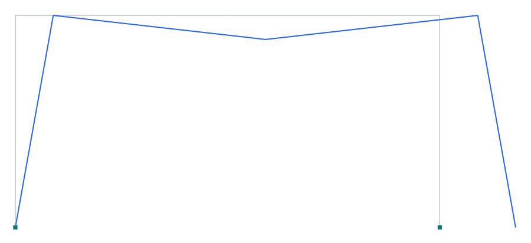

# Verificación 1-018 — Estático — flexión, corte y axial en un pórtico

[English](1-018_static_portal.md) · **Español**

**Capacidad verificada:** análisis estático lineal con deformación por flexión, corte (Timoshenko) y axial.
**Referencia:** CSI *Software Verification — SAP2000*, Example 1-018; resultados independientes por el método de la carga unitaria (Cook & Young 1985).
**Modelo Pórtico:** [`examples/verif_1-018_static_portal.s3d`](../../examples/verif_1-018_static_portal.s3d)

## Descripción del problema

Pórtico de un vano (viga horizontal de 288 in sobre dos columnas de 144 in) con **apoyo articulado** (nodo 1) y **apoyo deslizante** (nodo 3), bajo carga vertical uniforme de 0.1 k/in sobre la viga. Se compara el **desplazamiento vertical del centro de la viga** (nodo 5). El Modelo A considera **las tres deformaciones combinadas** (flexión + corte + axial), que es justo el elemento Timoshenko de Pórtico.

| Propiedad | Valor |
| --- | --- |
| Geometría | viga 288 in (2×144) sobre columnas de 144 in |
| Apoyos | nodo 1 articulado, nodo 3 deslizante |
| Módulo E | 29 900 k/in² |
| G | 11 500 k/in² |
| Sección W8X31 | A = 9.12 in², I = 110 in⁴, Aᵥ = 2.28 in² |
| Carga | 0.1 k/in vertical sobre la viga |

## Modelo en Pórtico

- Modelo **2D**, juntas viga-columna **rígidas**; bases articulada y deslizante (según la figura del original).
- Sección **real** (A, I y área de corte Aᵥ activos) → el elemento incluye **flexión + corte + axial** = Modelo A del original.
- El elemento **Timoshenko** de Pórtico captura la deformación por corte vía el área de corte `Avz`.

*Figura 1. Deformada bajo la carga vertical (×escala). En gris el pórtico sin deformar; en azul la deformada — la viga flecta y los apoyos articulado/deslizante permiten el giro/desplazamiento.*

## Resultados — comparación

Desplazamiento vertical del centro de la viga (nodo 5), Modelo A (flexión + corte + axial). La referencia independiente coincide exactamente con SAP2000.

| Modelo | Descripción | Independiente (in) | SAP2000 (in) | dif. SAP | OpenSees (in) | dif. OpenSees | **Pórtico (in)** | **dif. Pórtico** |
| --- | --- | --- | --- | --- | --- | --- | --- | --- |
| A | Flexión + corte + axial · U_z(nodo 5) | -2.77076 | -2.77076 | 0 % | -2.77076 | 0 % | **-2.77076** | **0 %** |

### Contraste con OpenSees

Segunda opinión de un motor independiente y establecido: **OpenSees 3.8.0** (`openseespy`), corrido sobre el mismo `.s3d` mediante [`tools/verif/opensees/run_case.py`](../../tools/verif/opensees/run_case.py), que **traduce el modelo por su cuenta** — no pasa por el exportador de Pórtico, para que un malentendido compartido no se cuele. Elemento: `ElasticTimoshenkoBeam`; masa consistent (-cMass).

Diferencia máxima **Pórtico ↔ OpenSees: 1.3e-14** (relativa). Ambos resuelven la **misma malla** con la formulación de elemento igualada, así que lo que los dos comparten frente a la referencia analítica es discretización, no error de Pórtico. El residuo entre motores acota lo que aportan las diferencias de método que quedan (p. ej. Pórtico impone links y diafragmas por penalti, OpenSees por restricción exacta).

### Descomposición por tipo de deformación (referencia)

El original separa las contribuciones (mismas en SAP2000 e independiente); su **suma reproduce el Modelo A**, confirmando la superposición:

| Modelo | Deformación | U_z(nodo 5) [in] |
|---|---|---|
| A | flexión + corte + axial | −2.77076 |
| B | sólo flexión | −2.72361 |
| C | sólo corte | −0.03954 |
| D | sólo axial | −0.00760 |
| | B + C + D | −2.77075 |

## Conclusión

Pórtico reproduce el desplazamiento del Modelo A con **diferencia 0.000 %** (−2.77076 in), idéntico a la solución independiente y a SAP2000. El resultado integra correctamente las deformaciones de **flexión, corte y axial**, validando el elemento **Timoshenko** (incluida la deformación por corte) y el tratamiento de apoyos articulado/deslizante. **Capacidad estática (flexión+corte+axial) verificada.**
