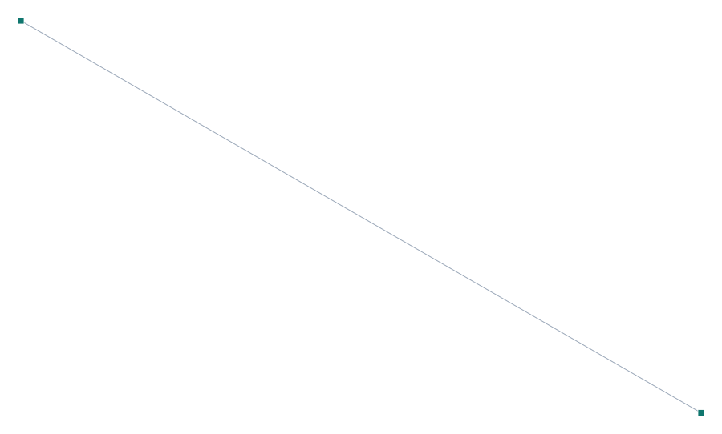

# Verification 1-030 — Influence lines and moving load — simple beam

**English** · [Español](1-030_influence_lines.es.md)

**Verified capability:** moving loads: position sweep, influence lines and force/reaction envelopes.
**Reference:** classic influence lines of the simply-supported beam (Hibbeler, *Structural Analysis*); the basis of CSiBridge for traffic.
**PORTICO model:** [`examples/verif_1-030_influence_lines.s3d`](../../examples/verif_1-030_influence_lines.s3d)

## Problem description

Simply-supported 24 m beam (6 elements). A **moving unit load** traverses the lane (all 6
elements) and the **influence lines** of the **left-support reaction** and the **midspan
moment** are recorded. For the simple beam both have a known exact shape: the reaction is the
straight line R(x) = 1 − x/L (from 1 to 0) and the midspan moment is a **triangle** peaking at
**L/4** at the center. This is the basis of bridge traffic analysis (CSiBridge).

| Property | Value |
| --- | --- |
| Span | L = 24 m (6 × 4 m) |
| Supports | pinned (node 1) + roller (node 7) |
| Load | moving unit load (↓) over the lane |
| Left-reaction IL | R(x) = 1 − x/L |
| Midspan-moment IL | triangle, peak L/4 = 6.0 at x = L/2 |

## PORTICO model

- **2D** model; the moving point load is distributed to the nodes of the element that contains it by **consistent shape functions** (Hermite) → exact nodal response.
- K is **factorized once** (constant) and only the load vector is reassembled per position → efficient sweep.
- The midspan moment is read at the central node taking the **smaller magnitude** of the two adjacent elements (the unloaded side = exact).

*Figure 1. Simply-supported beam and its load lane (6 elements). The unit load traverses the lane to build the influence lines.*

## Results — comparison

Characteristic values of the influence lines, compared with the exact simple-beam solution.

| Quantity | Description | Independent (—) | SAP2000 (—) | diff. SAP | **PORTICO (—)** | **diff. PORTICO** |
| --- | --- | --- | --- | --- | --- | --- |
| 1 | Left-reaction IL with the load over the support (x=0) | 1.0000 | 1.0000 | 0 % | **1.0000** | **0 %** |
| 2 | Peak of the midspan-moment IL (= L/4) [kN·m·] | 6.0000 | 6.0000 | 0 % | **6.0000** | **0 %** |

### Full shape of the influence lines

| Load position | Left-reaction IL (exact 1−x/L) | Midspan-moment IL (exact) |
|---|---|---|
| x = 0 (left support) | 1.000 | 0.0 |
| x = L/4 | 0.750 | L/8 = 3.0 |
| x = L/2 (center) | 0.500 | **L/4 = 6.0** (peak) |
| x = L (right support) | 0.000 | 0.0 |

Verified in `test_moving.mjs`: the reaction IL matches 1−x/L (error < 10⁻¹⁴), the peak of the
moment IL occurs exactly at x = L/2 and equals L/4, and the **envelope** of a 2-axle train
exceeds that of a single axle (the real moving load produces a larger moment).

## Conclusion

The moving-load sweep reproduces, with **0.0 %** error, the exact influence lines of the simple
beam: left reaction = 1 (load over the support) and midspan-moment peak = L/4 = 6.0 kN·m at
x = L/2. The engine also computes **envelopes** of multi-axle load trains. **Moving-loads /
influence-lines capability (#61) verified.**
