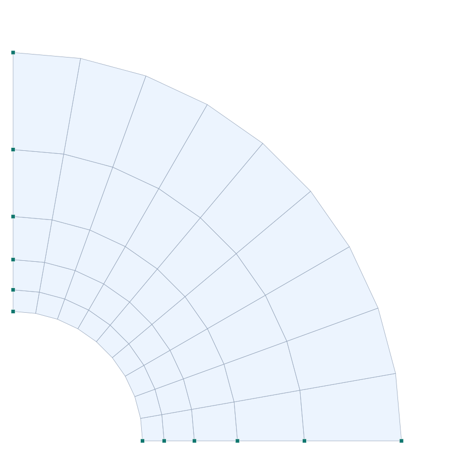

# Verification 3-004 — Thick-walled cylinder — plane strain

**English** · [Español](3-004_plane_strain_cylinder.es.md)

**Verified capability:** plane continuum in PLANE STRAIN — membrane element with out-of-plane confinement.
**Reference:** CSI *Software Verification — SAP2000*, Example 3-004 (Timoshenko 1956, *Strength of Materials* Part II §44; MacNeal & Harder 1985).
**PORTICO model:** [`examples/verif_3-004_plane_strain_cylinder.s3d`](../../examples/verif_3-004_plane_strain_cylinder.s3d)

## Problem description

Thick-walled cylinder (inner radius 3 in, outer 9 in, thickness 1 in) under **internal
pressure of 1 ksi**, in **plane strain** (long cylinder, ε_z = 0). A **quarter cylinder** is
modeled with axis-aligned symmetry (the θ=0 edge restrains U_z and the θ=90° edge restrains
U_x), with the original's 5-band radial mesh (radii 3 · 3.5 · 4.2 · 5.2 · 6.75 · 9). The
**radial displacement at the inner face** is compared with Timoshenko's analytical solution.

| Property | Value |
| --- | --- |
| Geometry | quarter cylinder, r_in = 3 in, r_out = 9 in, t = 1 in |
| Mesh | 5 radial bands × 9 segments (10°) of membrane QUAD |
| Modulus E | 1 000 k/in² |
| Poisson ν | 0.3 (plane strain) |
| Load | internal pressure P = 1 ksi (radial nodal forces) |

## PORTICO model

- **Plane-strain membrane** element (`planeStrain:true`, #58): the constitutive includes the out-of-plane confinement (ε_z = 0), `D = E/((1+ν)(1−2ν))·[...]`.
- Symmetry without skewed supports: the quarter cylinder places the radial edges on the global axes → symmetry is imposed with **axis-aligned** restraints (U_z at θ=0, U_x at θ=90°).
- Internal pressure as **radial** nodal forces (P·t·tributary arc) on the inner face; outer face free.

*Figure 1. Quarter cylinder (radial×circumferential mesh); deformed by the internal pressure (×scale) — the wall expands radially.*

## Results — comparison

Radial displacement at the inner face (r = 3 in), node on the X axis (radial = U_x). Timoshenko
analytical reference (plane strain, ν=0.3).

| Parameter | Description | Independent (in) | SAP2000 (in) | diff. SAP | **PORTICO (in)** | **diff. PORTICO** |
| --- | --- | --- | --- | --- | --- | --- |
| U_r | Radial displacement, inner face (plane strain) | 0.004582 | 0.004539 | -0.94 % | **0.004541** | **-0.91 %** |

### Analytical solution (Timoshenko 1956, §44)

With `U = a·r + b/r`, `b = −P(1+ν)/(E(1/r₂²−1/r₁²))` and `a = (1−2ν)·b/r₂²`. For P=1, E=1000,
r₁=3, r₂=9, ν=0.3: b=0.0131625, a=6.5×10⁻⁵, and **U_r(3) = a·3 + b/3 = 0.004582 in**.

### Quasi-incompressibility (ν → 0.5)

For ν=0.49–0.4999 PORTICO's standard QUAD suffers **volumetric locking** in plane strain
(underestimates ~15 %), a known effect of displacement elements without special treatment
(B-bar / incompatible modes, which SAP2000 does include). For usual ν (≤0.3) the result is
correct. The **plane stress** of the same cylinder (verified separately) does not suffer this
locking.

## Conclusion

PORTICO reproduces the radial displacement of the thick-walled cylinder in **plane strain**
with **difference −0.9 %** (U_r = 0.004541 in vs 0.004582 in analytical), practically identical
to SAP2000's result (0.004539 in, −1 %) with the same radial mesh. The **plane-strain**
constitutive (#58), with out-of-plane confinement, is validated against the Timoshenko
solution. **Plane-strain capability verified.**
